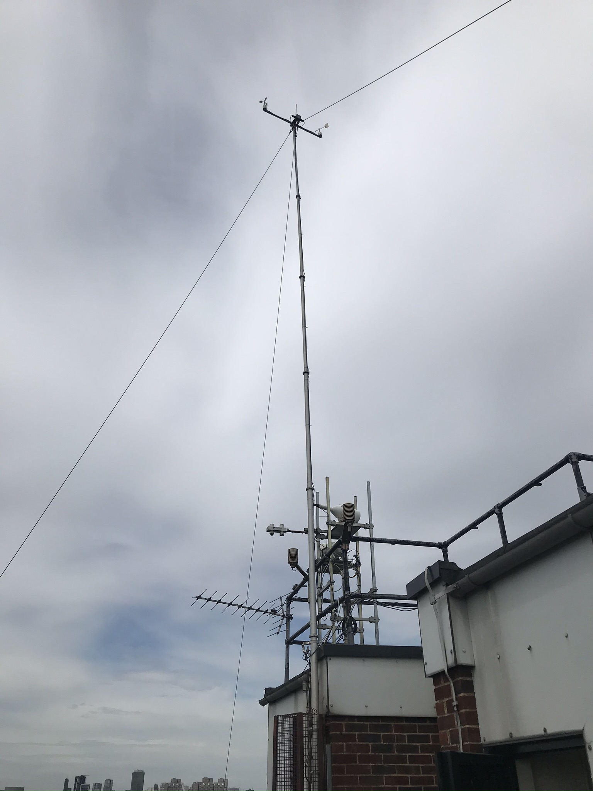
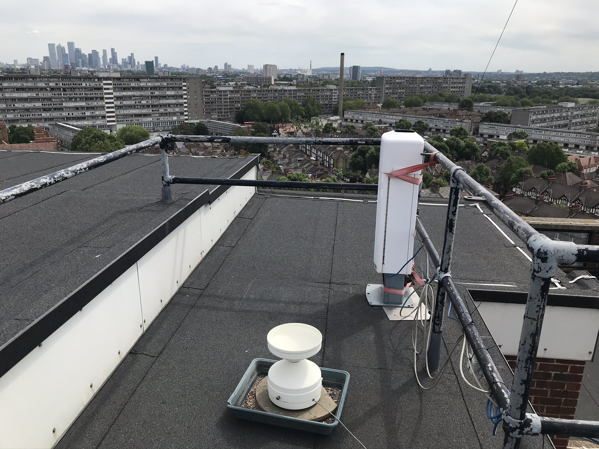
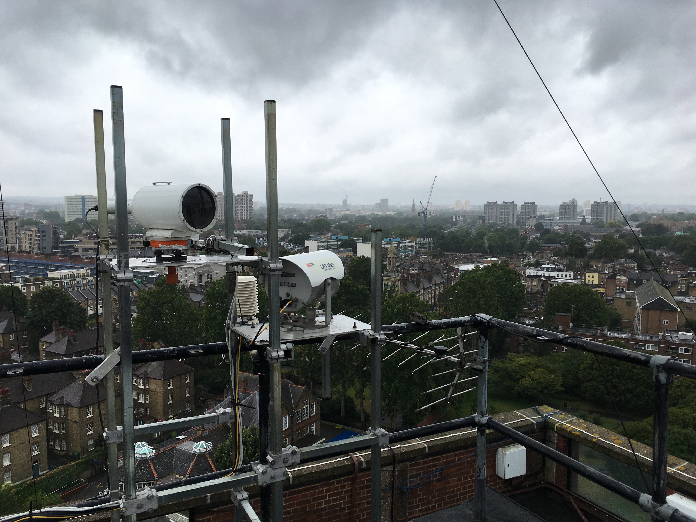

.. _SWT:

***
SWT
***

Introduction
############

.. include:: intros/SWT_intro.rst

Site metadata
#############

.. csv-table::
   :file: meta/SWT_meta.csv
   :stub-columns: 2

Deployments at site
###################

.. csv-table:: All site deployments
   :file: deployments/dates/SWT_deployment_dates.csv
   :header-rows: 2

.. csv-table:: Position of deployments
   :file: deployments/positions/SWT_deployment_positions.csv
   :header-rows: 2

.. csv-table:: Raw files of deployments
   :file: deployments/raw_files/SWT_deployment_raw_files.csv
   :header-rows: 2

.. csv-table:: Metadata specific to scintillometers
   :file: deployments/scint_deployments/SWT_scint_deployments.csv
   :header-rows: 2

Photos
######

.. figure:: photos/SWT/27308473030_79b08b55b1_o.jpg

   View facing NNE 10-06-2016.

.. figure:: photos/SWT/27585485085_3ee6670789_o.jpg

   View facing SSW 10-06-2016.

   View of mast, temperature and humidity sensors, scintillometers and CNR1 23-07-2020.

   ARG100 and CL31 23-07-2020.

   Scintillometers. LAS MkII transmitter to SCT and BLS 900 reciever from IMU 19-07-2019.

Supplementary information
#########################

.. list-table::
   :header-rows: 1

   * - Link
     - Title
     - Description
   * - http://www.urban-climate.net/content/data
     - Southwark Meteorological Data
     - Information and pre-2017 weather data from SWT 
   * - http://data.urban-climate.net/southwark_plots/
     - Southwark Meteorological Station
     - Current weather data visualisation and download 

References
##########

