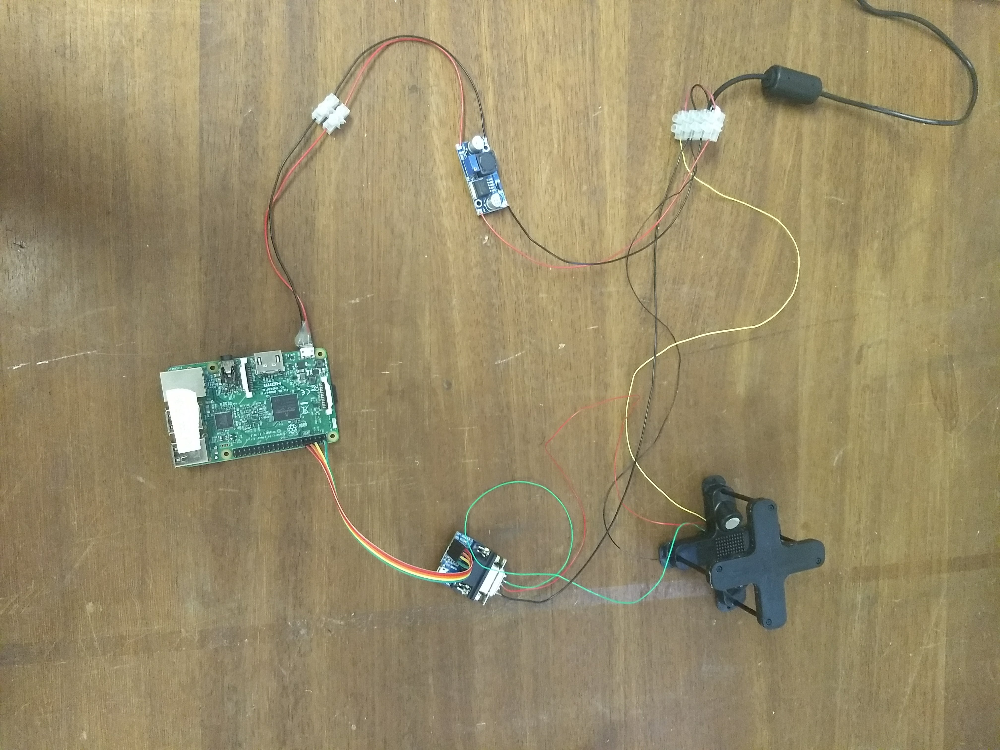
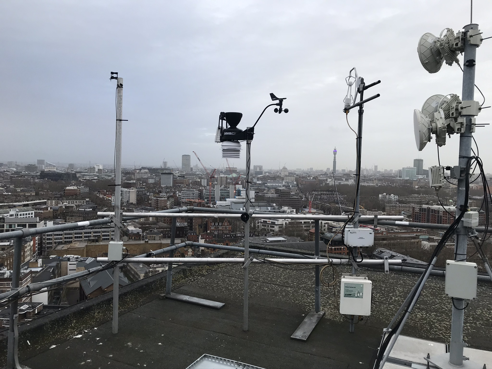

.. _TRISONICAWS:

***********
TRISONICAWS
***********

Introduction
############

.. include:: intros/TRISONICAWS_intro.rst

Manufacturer and Model
######################

.. csv-table:: 
   :file: manufacturers/TRISONICAWS_manufacturer.csv
   :header-rows: 1

Output definitions
##################

.. csv-table:: 
   :file: out_defs/TRISONICAWS_out_defs.csv
   :header-rows: 1

Variables measured by instrument
################################

.. csv-table:: Variables measured - sorted alphabetically
   :file: variables/TRISONICAWS_variables.csv
   :header-rows: 1

Serials
#######

.. csv-table:: 
   :file: serials/TRISONICAWS_serials.csv
   :header-rows: 1

Deployments
###########

.. _M00101A:

Serial number: M00101A
**********************

.. csv-table:: 
   :file: deployments/TRISONICAWS/M00101A_deployments.csv
   :header-rows: 1

Photos
######

   Before being deployed 26-02-2018.

   At :ref:`IMU` (on pole to the left) 08/01/2020 

Supplementary information
#########################

.. list-table:: 
   :header-rows: 1

   * - Link
     - Title
     - Description
   * - :download:`Trisonica MiniWS manual. <manuals/TRISONICAWS_manual.pdf>`
     - Trisonica MiniWS manual.
     - Manual provided by Anemoment.
   * - :download:`Trisonica MiniWS datasheet. <manuals/TRISONICAWS_ds.pdf>`
     - Trisonica MiniWS datasheet.
     - Datasheet provided by Anemoment.

Data acquisition
################

.. include:: ../../../data_acquisition/data_acquisition_default.rst

References
##########

