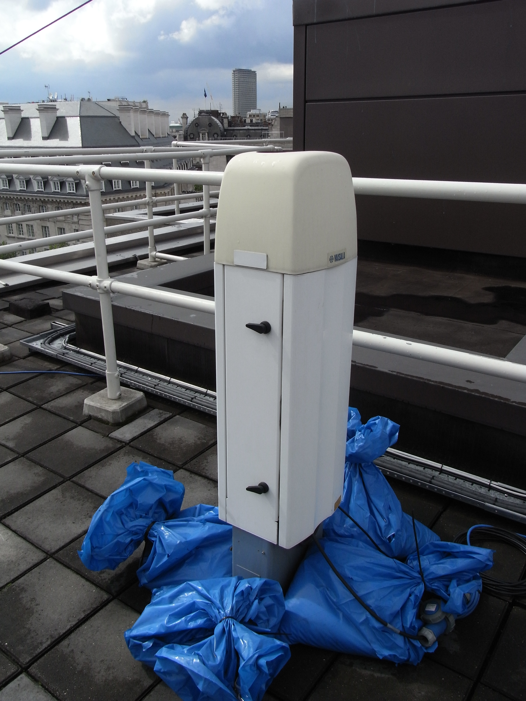
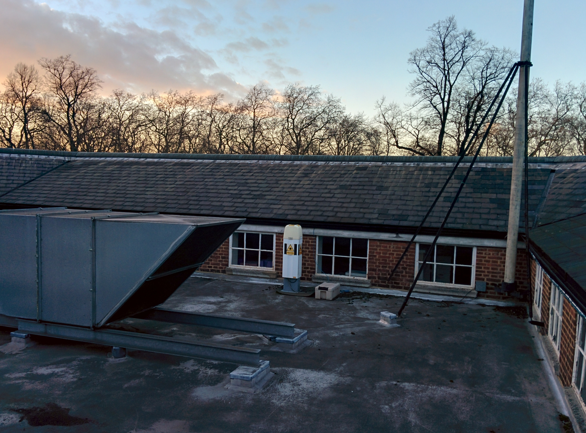

.. _CL31:

****
CL31
****

Introduction
############

.. include:: intros/CL31_intro.rst

Manufacturer and Model
######################

.. csv-table:: 
   :file: manufacturers/CL31_manufacturer.csv
   :header-rows: 1

Output definitions
##################

.. csv-table:: 
   :file: out_defs/CL31_out_defs.csv
   :header-rows: 1

Processing code
###############

Code used to process raw data:
https://github.com/Urban-Meteorology-Reading/Operations-CEIL

Variables measured by instrument
################################

.. csv-table:: Variables measured - sorted alphabetically
   :file: variables/CL31_variables.csv
   :header-rows: 1

Serials
#######

.. csv-table:: 
   :file: serials/CL31_serials.csv
   :header-rows: 1

Deployments
###########

.. _WMO03672:

Serial number: WMO03672
***********************

.. csv-table:: 
   :file: deployments/CL31/WMO03672_deployments.csv
   :header-rows: 1

.. _B20201:

Serial number: B20201
*********************

.. csv-table:: 
   :file: deployments/CL31/B20201_deployments.csv
   :header-rows: 1

.. _J1720003:

Serial number: J1720003
***********************

.. csv-table:: 
   :file: deployments/CL31/J1720003_deployments.csv
   :header-rows: 1

.. _F2730001:

Serial number: F2730001
***********************

.. csv-table:: 
   :file: deployments/CL31/F2730001_deployments.csv
   :header-rows: 1

.. _F2730002:

Serial number: F2730002
***********************

.. csv-table:: 
   :file: deployments/CL31/F2730002_deployments.csv
   :header-rows: 1

.. _B20202:

Serial number: B20202
*********************

.. csv-table:: 
   :file: deployments/CL31/B20202_deployments.csv
   :header-rows: 1

.. _103150004:

Serial number: 103150004
************************

.. csv-table:: 
   :file: deployments/CL31/103150004_deployments.csv
   :header-rows: 1

Photos
######

.. figure:: photos/CL31/IMG_2710.jpeg
   :width: 50 %

   CL31 at :ref:`HOP` 12/12/2018

   CL31 at :ref:`KSS45W` 

   CL31 at :ref:`RGS` 26/02/2014

Supplementary information
#########################

.. list-table:: 
   :header-rows: 1

   * - Link
     - Title
     - Description
   * - https://www.manualslib.com/manual/1226537/Vaisala-Cl31.html#manual
     - CL31 user guide
     - Manual provided by Vaisala. If link has expired please raise a `GitHub Issues`_.

Data acquisition
################

.. include:: ../../../data_acquisition/data_acquisition_default.rst

References
##########

#. Kotthaus, S., Haeffelin, M., Drouin, M.-A., Dupont, J.-C., Grimmond, S., Haefele, A., Hervo, M., Poltera, Y. and Wiegner, M. (2020) Tailored algorithms for the detection of the atmospheric boundary layer height from common automatic lidars and ceilometers (ALC). Remote Sensing, 12 (19). p. 3259. ISSN 2072-4292 doi: https://doi.org/10.3390/rs12193259
#. Hertwig, D., Grimmond, S., Kotthaus, S., Vanderwel, C., Gough, H., Haeffelin, M. and Robins, A. (2020) Variability of physical meteorology in urban areas at different scales: implications for air quality. Faraday Discussions. ISSN 1364-5498 doi: https://doi.org/10.1039/D0FD00098A (In Press)
#. Squires, F. A., Nemitz, E., Langford, B., Wild, O., Drysdale, W. S., Acton, W. J. F., Fu, P., Grimmond, C. S. B., Hamilton, J. F., Hewitt, C. N., Hollaway, M., Kotthaus, S., Lee, J., Metzger, S., Pingintha-Durden, N., Shaw, M., Vaughan, A. R., Wang, X., Wu, R., Zhang, Q. and Zhang, Y. (2020) Measurements of traffic-dominated pollutant emissions in a Chinese megacity. Atmospheric Chemistry and Physics, 20 (14). pp. 8737-8761. ISSN 1680-7316 doi: https://doi.org/10.5194/acp-20-8737-2020
#. Harrison, R. M., Beddows, D. C. S., Alam, M. S., Singh, A., Brean, J., Xu, R., Kotthaus, S. and Grimmond, S. (2019) Interpretation of particle number size distributions measured across an urban area during the FASTER campaign. Atmospheric Chemistry and Physics, 19 (1). pp. 39-55. ISSN 1680-7324 doi: https://doi.org/10.5194/acp-19-39-2019
#. Shi, Z., Vu, T., Kotthaus, S., Harrison, R. M., Grimmond, S., Yue, S., Zhu, T., Lee, J., Han, Y., Demuzere, M., Dunmore, R. E., Ren, L., Liu, D., Wang, Y., Wild, O., Allan, J., Acton, W. J., Barlow, J., Barratt, B., Beddows, D., Bloss, W. J., Calzolai, G., Carruthers, D., Carslaw, D. C., Chan, Q., Chatzidiakou, L., Chen, Y., Crilley, L., Coe, H., Dai, T., Doherty, R., Duan, F., Fu, P., Ge, B., Ge, M., Guan, D., Hamilton, J. F., He, K., Heal, M., Heard, D., Hewitt, C. N., Hollaway, M., Hu, M., Ji, D., Jiang, X., Jones, R., Kalberer, M., Kelly, F. J., Kramer, L., Langford, B., Lin, C., Lewis, A. C., Li, J., Li, W., Liu, H., Liu, J., Loh, M., Lu, K., Lucarelli, F., Mann, G., McFiggans, G., Miller, M. R., Mills, G., Monk, P., Nemitz, E., O&amp;apos;Connor, F., Ouyang, B., Palmer, P. I., Percival, C., Popoola, O., Reeves, C., Rickard, A. R., Shao, L., Shi, G., Spracklen, D., Stevenson, D., Sun, Y., Sun, Z., Tao, S., Tong, S., Wang, Q., Wang, W., Wang, X., Wang, X., Wang, Z., Wei, L., Whalley, L., Wu, X., Wu, Z., Xie, P., Yang, F., Zhang, Q., Zhang, Y., Zhang, Y. and Zheng, M. (2019) In-depth study of air pollution sources and processes within Beijing and its surrounding region (APHH-Beijing). Atmospheric Chemistry and Physics (11). pp. 7519-7546. ISSN 1680-7316 doi: https://doi.org/10.5194/acp-19-7519-2019
#. Theeuwes, N. E., Barlow, J. F., Teuling, A. J., Grimmond, C. S. B. and Kotthaus, S. (2019) Persistent cloud cover over mega-cities linked to surface heat release. npj Climate and Atmospheric Science, 2. 15. ISSN 2397-3722 doi: https://doi.org/10.1038/s41612-019-0072-x
#. Kotthaus, S., Halios, C. H., Barlow, J. F. and Grimmond, C. S. B. (2018) Volume for pollution dispersion: London’s atmospheric boundary layer during ClearfLo observed with two ground-based lidar types. Atmospheric Environment, 190. pp. 401-414. ISSN 1352-2310 doi: https://doi.org/10.1016/j.atmosenv.2018.06.042
#. Kotthaus, S. and Grimmond, C. S. B. (2018) Atmospheric boundary layer characteristics from Ceilometer measurements part 2: application to London’s urban boundary layer. Quarterly Journal of the Royal Meteorological Society, 144 (714). pp. 1511-1524. ISSN 1477-870X doi: https://doi.org/10.1002/qj.3298
#. Kotthaus, S. and Grimmond, C. S. B. (2018) Atmospheric boundary layer characteristics from ceilometer measurements. Part 1: a new method to track mixed layer height and classify clouds. Quarterly Journal of the Royal Meteorological Society, 144 (714). pp. 1525-1538. ISSN 1477-870X doi: https://doi.org/10.1002/qj.3299
#. Kent, C. W., Grimmond, C. S. B., Gatey, D. and Barlow, J. F. (2018) Assessing methods to extrapolate the vertical wind-speed profile from surface observations in a city centre during strong winds. Journal of Wind Engineering and Industrial Aerodynamics, 173. pp. 100-111. ISSN 0167-6105 doi: https://doi.org/10.1016/j.jweia.2017.09.007
#. Peng, J., Grimmond, C. S. B., Fu, X. S., Chang, Y. Y., Zhang, G., Guo, J., Tang, C. Y., Gao, J., Xu, X. D. and Tan, J. G. (2017) Ceilometer based analysis of Shanghai’s boundary layer height (under rain and fog free conditions). Journal of Atmospheric and Oceanic Technology, 34 (4). pp. 749-764. ISSN 1520-0426 doi: https://doi.org/10.1175/JTECH-D-16-0132.1
#. Kotthaus, S., O'Connor, E., M�nkel, C., Charlton-Perez, C., Haeffelin, M., Gabey, A. M. and Grimmond, C. S. B. (2016) Recommendations for processing atmospheric attenuated backscatter profiles from Vaisala CL31 ceilometers. Atmospheric Measurement Techniques, 9. pp. 3769-3791. ISSN 1867-8548 doi: https://doi.org/10.5194/amt-9-3769-2016
#. Tan, J., Yang, L., Grimmond, C. S. B., Shi, J., Gu, W., Chang, Y., Hu, P., Sun, J., Ao, X. and Han, Z. (2015) Urban integrated meteorological observations: practice and experience in Shanghai, China. Bulletin of the American Meteorological Society, 96 (1). pp. 85-102. ISSN 0003-0007 doi: https://doi.org/10.1175/BAMS-D-13-00216.1
#. Kotthaus, S. and Grimmond, C. S. B. (2014) Energy exchange in a dense urban environment – part I: temporal variability of long-term observations in central London. Urban Climate, 10 (2). pp. 261-280. ISSN 2212-0955 doi: https://doi.org/10.1016/j.uclim.2013.10.002
#. Magliulo, V., Toscano, P., Grimmond, C. S. B., Kotthaus, S., J�rvi, L., Set�l�, H., Lindberg, F., Vogt, R., Staszewski, T., Bubak, A., Synnefa, A. and Santamouris, M. (2014) Environmental measurements in BRIDGE case studies. In: Chrysoulakis, N., de Castro, E. A. and Moors, E. J. (eds.) Understanding Urban Metabolism. Routledge, pp. 45-57. ISBN 9780415835114
#. Oliphant, A.J., Dragoni, D., Deng, B., Grimmond, C.S.B., Schmid, H.-P. and Scott, S.L. (2011) The role of sky conditions on gross primary production in a mixed deciduous forest. Agricultural and Forest Meteorology, 151 (7). pp. 781-791. ISSN 0168-1923 doi: https://doi.org/10.1016/j.agrformet.2011.01.005
#. Loridan, T., Grimmond, C.S.B., Offerle, B. D., Young, D. T., Smith, T. E. L., J�rvi, L. and Lindberg, F. (2011) Local-scale urban meteorological parameterization scheme (LUMPS): longwave radiation parameterization and seasonality-related developments. Journal of Applied Meteorology and Climatology, 50 (1). pp. 185-202. ISSN 1558-8424 doi: https://doi.org/10.1175/2010JAMC2474.1

