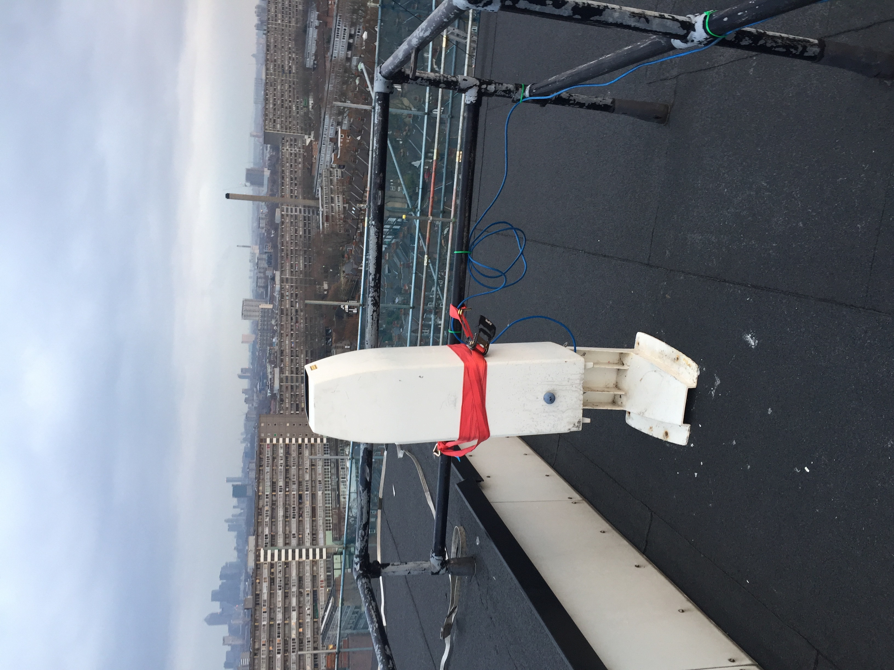

.. _CT25K:

*****
CT25K
*****

Introduction
############

.. include:: intros/CT25K_intro.rst

Manufacturer and Model
######################

.. csv-table:: 
   :file: manufacturers/CT25K_manufacturer.csv
   :header-rows: 1

Output definitions
##################

.. csv-table:: 
   :file: out_defs/CT25K_out_defs.csv
   :header-rows: 1

Processing code
###############

Code used to process raw data:
https://github.com/Urban-Meteorology-Reading/Operations-CEIL

Variables measured by instrument
################################

.. csv-table:: Variables measured - sorted alphabetically
   :file: variables/CT25K_variables.csv
   :header-rows: 1

Serials
#######

.. csv-table:: 
   :file: serials/CT25K_serials.csv
   :header-rows: 1

Deployments
###########

.. _LCBR022:

Serial number: LCBR022
**********************

.. csv-table:: 
   :file: deployments/CT25K/LCBR022_deployments.csv
   :header-rows: 1

.. _LCBR045:

Serial number: LCBR045
**********************

.. csv-table:: 
   :file: deployments/CT25K/LCBR045_deployments.csv
   :header-rows: 1

.. _LCBR327:

Serial number: LCBR327
**********************

.. csv-table:: 
   :file: deployments/CT25K/LCBR327_deployments.csv
   :header-rows: 1

.. _LCBRV010:

Serial number: LCBRV010
***********************

.. csv-table:: 
   :file: deployments/CT25K/LCBRV010_deployments.csv
   :header-rows: 1

.. _LCBRV017:

Serial number: LCBRV017
***********************

.. csv-table:: 
   :file: deployments/CT25K/LCBRV017_deployments.csv
   :header-rows: 1

.. _LCBRV098:

Serial number: LCBRV098
***********************

.. csv-table:: 
   :file: deployments/CT25K/LCBRV098_deployments.csv
   :header-rows: 1

.. _LCBRV152:

Serial number: LCBRV152
***********************

.. csv-table:: 
   :file: deployments/CT25K/LCBRV152_deployments.csv
   :header-rows: 1

.. _LCBRV312:

Serial number: LCBRV312
***********************

.. csv-table:: 
   :file: deployments/CT25K/LCBRV312_deployments.csv
   :header-rows: 1

.. _LCBRV559:

Serial number: LCBRV559
***********************

.. csv-table:: 
   :file: deployments/CT25K/LCBRV559_deployments.csv
   :header-rows: 1

Photos
######

   CT25K at :ref:`SWT` 15/12/2016

.. figure:: photos/CT25K/27246847345_59135275cb_o.jpg
   :width: 50 %

   CT25K at :ref:`RGS`  25/05/2016 

Supplementary information
#########################

.. list-table:: 
   :header-rows: 1

   * - Link
     - Title
     - Description
   * - https://www.manualslib.com/manual/1414094/Vaisala-Ct25k.html
     - CT25K user manual
     - Manual provided by Vaisala. If link has expired please please raise a `GitHub Issues`_.

Data acquisition
################

.. include:: ../../../data_acquisition/data_acquisition_default.rst

References
##########

#. Theeuwes, N. E., Barlow, J. F., Teuling, A. J., Grimmond, C. S. B. and Kotthaus, S. (2019) Persistent cloud cover over mega-cities linked to surface heat release. npj Climate and Atmospheric Science, 2. 15. ISSN 2397-3722 doi: https://doi.org/10.1038/s41612-019-0072-x
#. Kotthaus, S., O'Connor, E., M�nkel, C., Charlton-Perez, C., Haeffelin, M., Gabey, A. M. and Grimmond, C. S. B. (2016) Recommendations for processing atmospheric attenuated backscatter profiles from Vaisala CL31 ceilometers. Atmospheric Measurement Techniques, 9. pp. 3769-3791. ISSN 1867-8548 doi: https://doi.org/10.5194/amt-9-3769-2016

