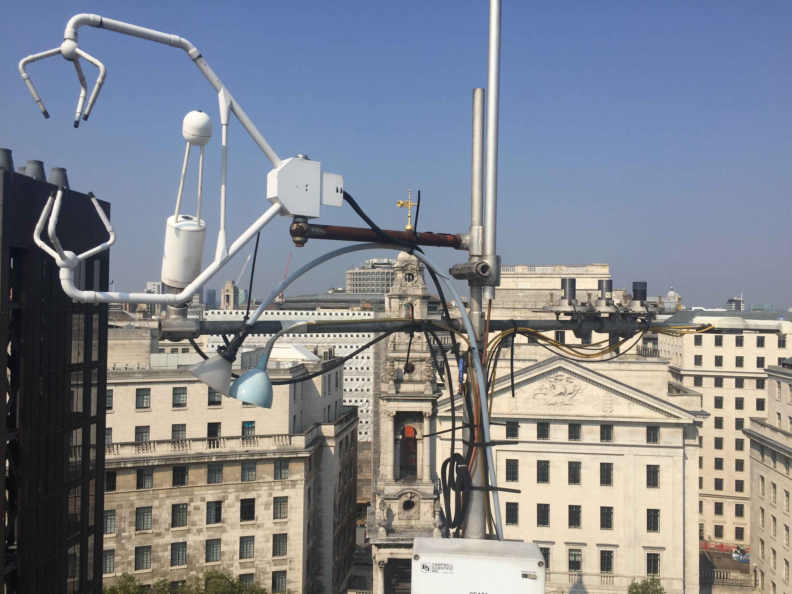
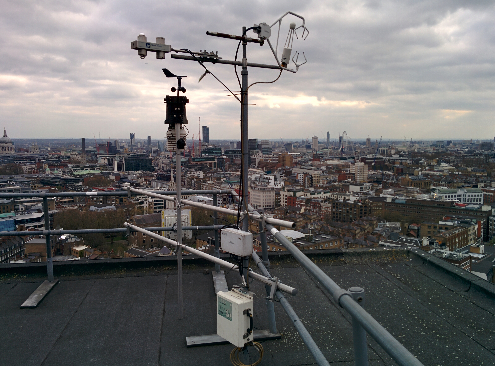
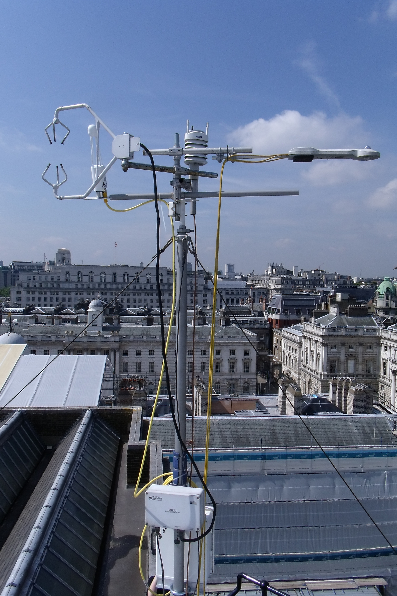
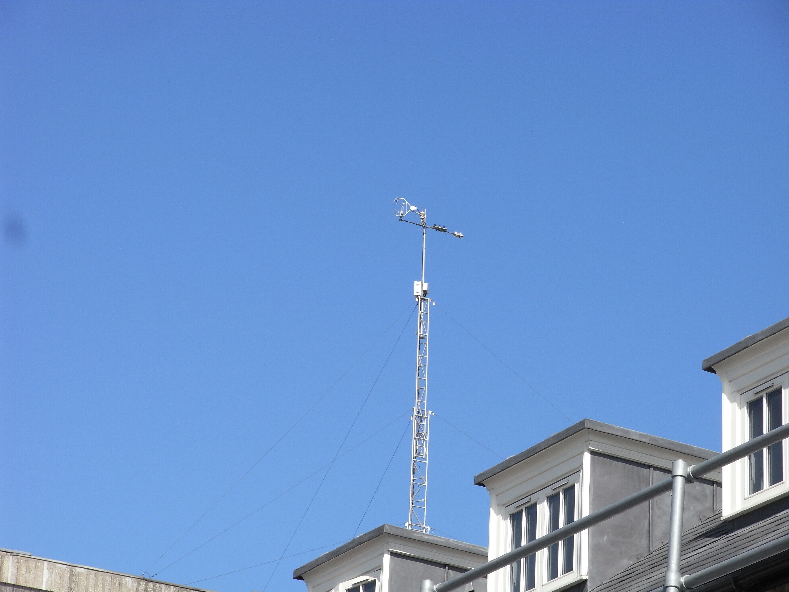

.. _LI7500A:

*******
LI7500A
*******

Introduction
############

.. include:: intros/LI7500A_intro.rst

Manufacturer and Model
######################

.. csv-table:: 
   :file: manufacturers/LI7500A_manufacturer.csv
   :header-rows: 1

Output definitions
##################

.. csv-table:: 
   :file: out_defs/LI7500A_out_defs.csv
   :header-rows: 1

Processing code
###############

Code used to process raw data:
https://github.com/Urban-Meteorology-Reading/Operations-FLUX

Variables measured by instrument
################################

.. csv-table:: Variables measured - sorted alphabetically
   :file: variables/LI7500A_variables.csv
   :header-rows: 1

Serials
#######

.. csv-table:: 
   :file: serials/LI7500A_serials.csv
   :header-rows: 1

Deployments
###########

.. _75H-1973:

Serial number: 75H-1973
***********************

.. csv-table:: 
   :file: deployments/LI7500A/75H-1973_deployments.csv
   :header-rows: 1

.. _75H-1124:

Serial number: 75H-1124
***********************

.. csv-table:: 
   :file: deployments/LI7500A/75H-1124_deployments.csv
   :header-rows: 1

.. _75H-0995:

Serial number: 75H-0995
***********************

.. csv-table:: 
   :file: deployments/LI7500A/75H-0995_deployments.csv
   :header-rows: 1

Photos
######

   At :ref:`KSSW` 15/09/2016 

   At :ref:`KSNW` 05/07/2015 

   At :ref:`IMU` 18/04/2016

   At :ref:`KSK` 19/08/2011

   Atop tower :ref:`KSS` 08/04/2011.

Supplementary information
#########################

.. list-table:: 
   :header-rows: 1

   * - Link
     - Title
     - Description
   * - :download:`LI7500A/RS manual <manuals/7500RS_manual.pdf>`
     - LI7500A/RS manual
     - Manual from Li-Cor.
   * - :download:`LI7500A brochure <manuals/7500A_brochure.pdf>`
     - LI7500A brochure
     - Brochure from Li-Cor.

Data acquisition
################

.. include:: ../../../data_acquisition/data_acquisition_default.rst

References
##########

#. Bjorkegren, A. and Grimmond, C. S. B., (2017) Net carbon dioxide emissions from central London. Urban Climate, 23. pp. 131-158. ISSN 2212-0955 doi: https://doi.org/10.1016/j.uclim.2016.10.002
#. Helfter, C., Tremper, A. H., Halios, C. H., Kotthaus, S., Bjorkegren, A., Grimmond, C. S. B., Barlow, J. F. and Nemitz, E. (2016) Spatial and temporal variability of urban fluxes of methane, carbon monoxide and carbon dioxide above London, UK. Atmospheric Chemistry and Physics, 16 (16). pp. 10543-10557. ISSN 1680-7316 doi: https://doi.org/10.5194/acp-16-10543-2016
#. Bjorkeren, A. B., Grimmond, C. S. B., Kotthaus, S. and Malamud, B. D. (2015) CO2 emission estimation in the urban environment: measurement of the CO2 storage term. Atmospheric Environment, 122. pp. 775-790. ISSN 1352-2310 doi: https://doi.org/10.1016/j.atmosenv.2015.10.012
#. Font, A., Grimmond, C. S. B., Kotthaus, S., Morgu�, J. -A., Stockdale, C., O'Connor, E., Priestman, M. and Barratt, B. (2015) Daytime CO2 urban surface fluxes from airborne measurements, eddy-covariance observations and emissions inventory in Greater London. Environmental Pollution, 196. pp. 98-106. ISSN 0269-7491 doi: https://doi.org/10.1016/j.envpol.2014.10.001
#. Best, M. J. and Grimmond, C. S. B. (2015) Key conclusions of the first international urban land surface model comparison project. Bulletin of the American Meteorological Society, 96 (5). pp. 805-819. ISSN 1520-0477 doi: https://doi.org/10.1175/BAMS-D-14-00122.1
#. Kotthaus, S. and Grimmond, C. S. B. (2014) Energy exchange in a dense urban environment – part I: temporal variability of long-term observations in central London. Urban Climate, 10 (2). pp. 261-280. ISSN 2212-0955 doi: https://doi.org/10.1016/j.uclim.2013.10.002
#. Magliulo, V., Toscano, P., Grimmond, C. S. B., Kotthaus, S., J�rvi, L., Set�l�, H., Lindberg, F., Vogt, R., Staszewski, T., Bubak, A., Synnefa, A. and Santamouris, M. (2014) Environmental measurements in BRIDGE case studies. In: Chrysoulakis, N., de Castro, E. A. and Moors, E. J. (eds.) Understanding Urban Metabolism. Routledge, pp. 45-57. ISBN 9780415835114
#. Best, M. J. and Grimmond, C. S. B. (2013) Analysis of the seasonal cycle within the first international urban land-surface model comparison. Boundary-Layer Meteorology, 146 (3). pp. 421-446. ISSN 1573-1472 doi: https://doi.org/10.1007/s10546-012-9769-7
#. Kotthaus, S. and Grimmond, C. S. B. (2012) Identification of micro-scale anthropogenic CO2, heat and moisture sources – processing eddy covariance fluxes for a dense urban environment. Atmospheric Environment, 57. pp. 301-316. ISSN 1352-2310 doi: https://doi.org/10.1016/j.atmosenv.2012.04.024
#. Grimmond, C. S. B., Blackett, M., Best, M. J., Baik, J. J., Belcher, S. E., Beringer, J., Bohnenstengel, S. I., Calmet, I., Chen, F., Coutts, A., Dandou, A., Fortuniak, K., Gouvea, M. L., Hamdi, R., Hendry, M., Kanda, M., Kawai, T., Kawamoto, Y., Kondo, H., Krayenhoff, E. S., Lee, S. H., Loridan, T., Martilli, A., Masson, V., Miao, S., Oleson, K., Ooka, R., Pigeon, G., Porson, A., Ryu, Y. H., Salamanca, F., Steeneveld, G. J., Tombrou, M., Voogt, J. A., Young, D.T. and Zhang, N. (2011) Initial results from Phase 2 of the international urban energy balance model comparison. International Journal of Climatology, 31 (2). pp. 244-272. ISSN 1097-0088 doi: https://doi.org/10.1002/joc.2227

