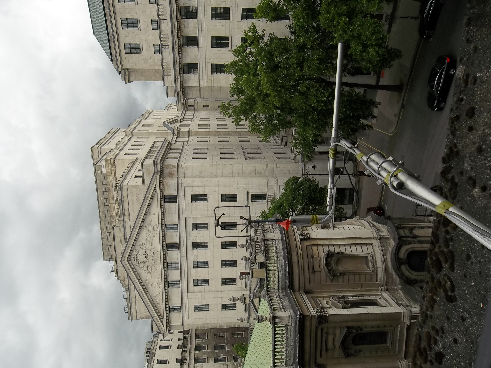
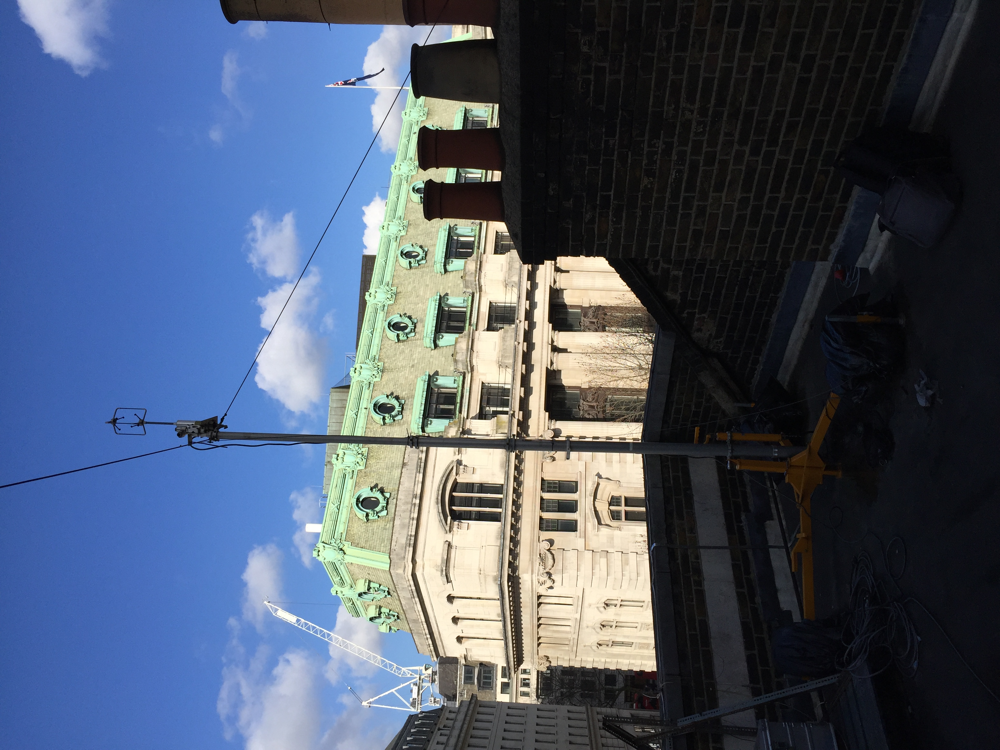
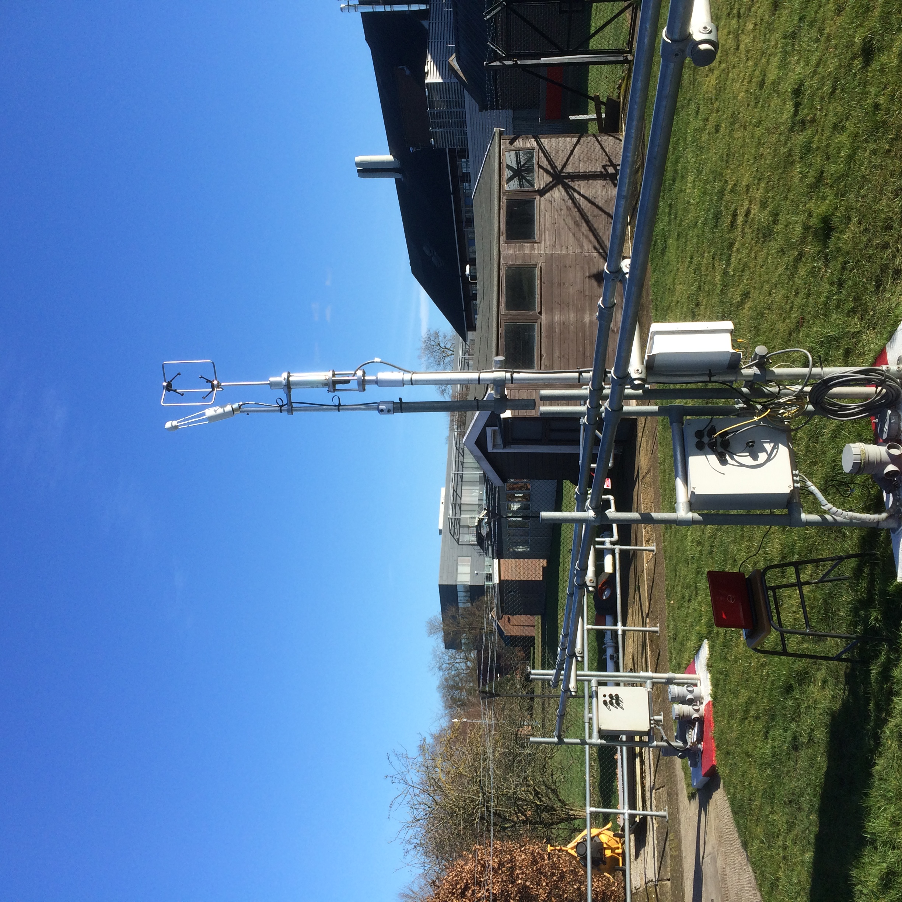

.. _GILL121R03:

**********
GILL121R03
**********

Introduction
############

.. include:: intros/GILL121R03_intro.rst

Manufacturer and Model
######################

.. csv-table:: 
   :file: manufacturers/GILL121R03_manufacturer.csv
   :header-rows: 1

Output definitions
##################

.. csv-table:: 
   :file: out_defs/GILL121R03_out_defs.csv
   :header-rows: 1

Processing code
###############

Code used to process raw data:
https://github.com/Urban-Meteorology-Reading/Operations-FLUX

Variables measured by instrument
################################

.. csv-table:: Variables measured - sorted alphabetically
   :file: variables/GILL121R03_variables.csv
   :header-rows: 1

Serials
#######

.. csv-table:: 
   :file: serials/GILL121R03_serials.csv
   :header-rows: 1

Deployments
###########

.. _307:

Serial number: 307
******************

.. csv-table:: 
   :file: deployments/GILL121R03/307_deployments.csv
   :header-rows: 1

.. _152701:

Serial number: 152701
*********************

.. csv-table:: 
   :file: deployments/GILL121R03/152701_deployments.csv
   :header-rows: 1

.. _1070-3:

Serial number: 1070-3
*********************

.. csv-table:: 
   :file: deployments/GILL121R03/1070-3_deployments.csv
   :header-rows: 1

Photos
######

   At :ref:`KSB` 05-07-2015.

   At :ref:`KSNW` 18-02-2016.

   At :ref:`URAO` 17-02-2015.

Supplementary information
#########################

.. list-table:: 
   :header-rows: 1

   * - Link
     - Title
     - Description
   * - :download:`Gill manual <manuals/Gill_manual.pdf>`
     - Gill manual
     - Manual from Gill.

Data acquisition
################

.. include:: ../../../data_acquisition/data_acquisition_default.rst

References
##########

#. Hertwig, D., Grimmond, S., Hendry, M. A., Saunders, B., Wang, Z., Jeoffrion, M., Vidale, P. L., McGuire, P. C., Bohnenstengel, S. I., Ward, H. C. and Kotthaus, S. (2020) Urban signals in high-resolution weather and climate simulations: role of urban land-surface characterisation. Theoretical and Applied Climatology. ISSN 0177-798X doi: https://doi.org/10.1007/s00704-020-03294-1
#. Tsiringakis, A., Holtslag, A. A. M., Grimmond, S. and Steeneveld, G. J. (2020) Surface and atmospheric driven variability of the single‐layer urban canopy model under clear‐sky conditions over London. Journal of Geophysical Research: Atmospheres, 125 (14). e2019JD032167. ISSN 2169-8996 doi: https://doi.org/10.1029/2019JD032167
#. Gough, H.L., Barlow, J. F., Luo, Z., King, M.-F., Halios, C.H. and Grimmond, C.S.B. (2020) Evaluating single-sided natural ventilation models against full-scale idealised measurements: impact of wind direction and turbulence. Building and Environment, 170. 106556. ISSN 0360-1323 doi: https://doi.org/10.1016/j.buildenv.2019.106556
#. Gough, H., King, M.-F., Nathan, P., Grimmond, C. S. B., Robins, A., Noakes, C. J., Luo, Z. and Barlow, J. F. (2019) Influence of neighbouring structures on building façade pressures: comparison between full-scale, wind-tunnel, CFD and practitioner guidelines. Journal of Wind Engineering and Industrial Aerodynamics, 189. pp. 22-33. ISSN 0167‐6105 doi: https://doi.org/10.1016/j.jweia.2019.03.011
#. Ward, H., Tan, Y. S., Gabey, A. M., Kotthaus, S. and Grimmond, C. S. B. (2018) Impact of temporal resolution of precipitation forcing data on modelled urban-atmosphere exchanges and surface conditions. International Journal of Climatology, 38 (2). pp. 649-662. ISSN 1097-0088 doi: https://doi.org/10.1002/joc.5200
#. Helfter, C., Tremper, A. H., Halios, C. H., Kotthaus, S., Bjorkegren, A., Grimmond, C. S. B., Barlow, J. F. and Nemitz, E. (2016) Spatial and temporal variability of urban fluxes of methane, carbon monoxide and carbon dioxide above London, UK. Atmospheric Chemistry and Physics, 16 (16). pp. 10543-10557. ISSN 1680-7316 doi: https://doi.org/10.5194/acp-16-10543-2016
#. Bjorkeren, A. B., Grimmond, C. S. B., Kotthaus, S. and Malamud, B. D. (2015) CO2 emission estimation in the urban environment: measurement of the CO2 storage term. Atmospheric Environment, 122. pp. 775-790. ISSN 1352-2310 doi: https://doi.org/10.1016/j.atmosenv.2015.10.012
#. Ward, H. C., Evans, J. G., Grimmond, C. S. B. and Bradford, J. (2015) Infrared and millimetre-wave scintillometry in the suburban environment – Part 1: Structure parameters. Atmospheric Measurement Techniques, 8 (3). pp. 1385-1405. ISSN 1867-8548 doi: https://doi.org/10.5194/amt-8-1385-2015
#. Ward, H. G., Evans, J. G. and Grimmond, C. S. B. (2015) Infrared and millimetre-wave scintillometry in the suburban environment – Part 2: Large-area sensible and latent heat fluxes. Atmospheric Measurement Techniques, 8 (3). pp. 1407-1424. ISSN 1867-8548 doi: https://doi.org/10.5194/amt-8-1407-2015
#. Ward, H. C., Kotthaus, S., Grimmond, C. S. B., Bjorkegren, A., Wilkinson, M., Morrison, W. T. J., Evans, J. G., Morison, J. I. L. and Iamarino, M. (2015) Effects of urban density on carbon dioxide exchanges: observations of dense urban, suburban and woodland areas of southern England. Environmental Pollution, 198. pp. 186-200. ISSN 0269-7491 doi: https://doi.org/10.1016/j.envpol.2014.12.031
#. Ward, H. C., Evans, J. G. and Grimmond, C. S. B. (2014) Multi-scale sensible heat fluxes in the urban environment from large aperture scintillometry and eddy covariance. Boundary-Layer Meteorology, 152 (1). pp. 65-89. ISSN 0006-8314 doi: https://doi.org/10.1007/s10546-014-9916-4
#. Ward, H. C., Evans, J. G. and Grimmond, C. S. B. (2013) Multi-season eddy covariance observations of energy, water and carbon fluxes over a suburban area in Swindon, UK. Atmospheric Chemistry and Physics, 13. pp. 4645-4666. ISSN 1680-7316 doi: https://doi.org/10.5194/acp-13-4645-2013
#. Helfter, C., Famulari, D., Phillips, G. J., Barlow, J. F., Wood, C., Grimmond, C. S. B. and Nemitz, E. (2011) Controls of carbon dioxide concentrations and fluxes above central London. Atmospheric Chemistry and Physics, 11 (5). pp. 1913-1928. ISSN 1680-7316 doi: https://doi.org/10.5194/acp-11-1913-2011
#. Ward, H. C., Evans, J. G. and Grimmond, C.S.B. (2011) Effects of non-uniform crosswind fields on scintillometry measurements. Boundary-Layer Meteorology, 141 (1). pp. 143-163. ISSN 0006-8314 doi: https://doi.org/10.1007/s10546-011-9626-0

