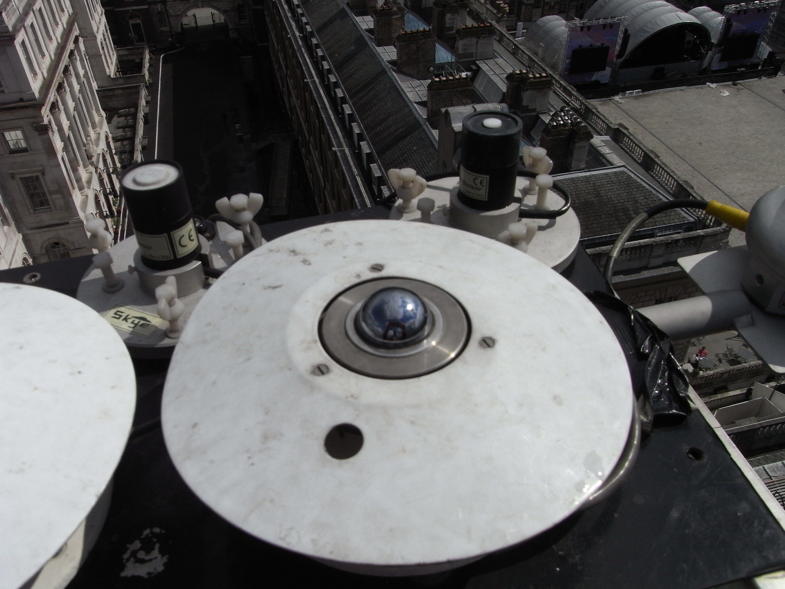
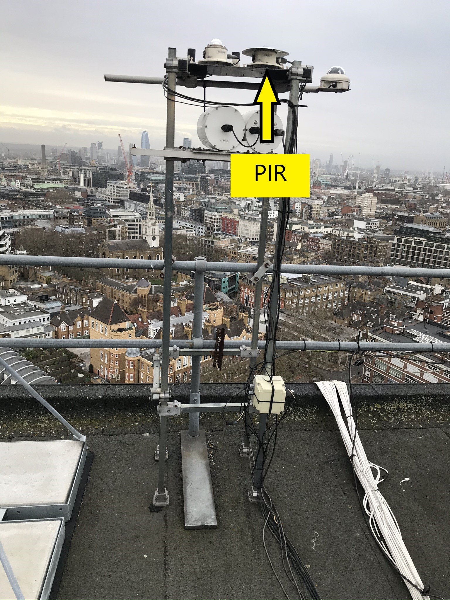

.. _PIR:

***
PIR
***

Introduction
############

.. include:: intros/PIR_intro.rst

Manufacturer and Model
######################

.. csv-table:: 
   :file: manufacturers/PIR_manufacturer.csv
   :header-rows: 1

Output definitions
##################

.. csv-table:: 
   :file: out_defs/PIR_out_defs.csv
   :header-rows: 1

Processing code
###############

Variables measured by instrument
################################

.. csv-table:: Variables measured - sorted alphabetically
   :file: variables/PIR_variables.csv
   :header-rows: 1

Serials
#######

.. csv-table:: 
   :file: serials/PIR_serials.csv
   :header-rows: 1

Deployments
###########

.. _29757F3:

Serial number: 29757F3
**********************

.. csv-table:: 
   :file: deployments/PIR/29757F3_deployments.csv
   :header-rows: 1

Photos
######

   At :ref:`KSS45W`. Unknowm date between 2012-02-27 and 2016-04-14.

   At :ref:`IMU`, indicated by arrow, 08-01-2020.

Supplementary information
#########################

.. list-table:: 
   :header-rows: 1

   * - Link
     - Title
     - Description
   * - :download:`PIR specification <manuals/PIR_spec.pdf>`
     - PIR specification
     - From Eppley.
   * - :download:`PIR manual <manuals/PIR_manual.pdf>`
     - PIR manual
     - Manual from Campbell Scientific.

Data acquisition
################

.. include:: ../../../data_acquisition/data_acquisition_default.rst

References
##########

#. Harrison, R. M., Beddows, D. C. S., Alam, M. S., Singh, A., Brean, J., Xu, R., Kotthaus, S. and Grimmond, S. (2019) Interpretation of particle number size distributions measured across an urban area during the FASTER campaign. Atmospheric Chemistry and Physics, 19 (1). pp. 39-55. ISSN 1680-7324 doi: https://doi.org/10.5194/acp-19-39-2019

