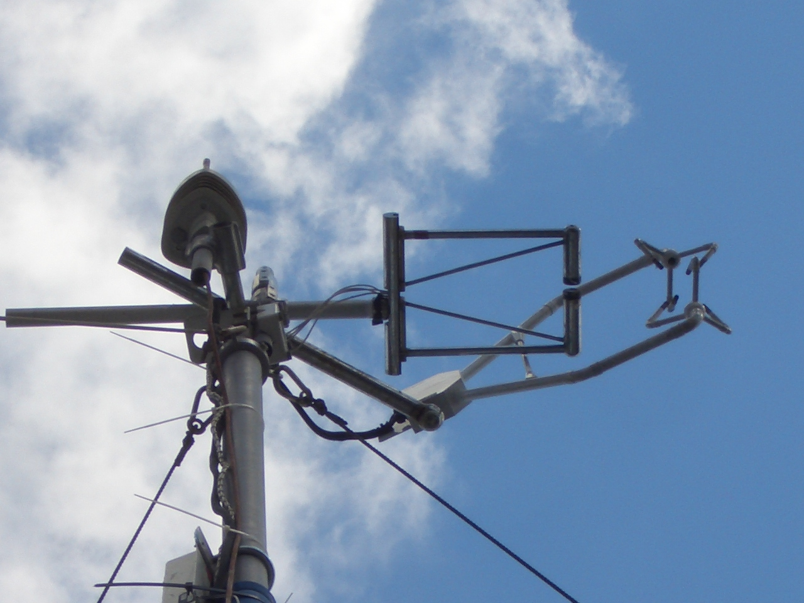
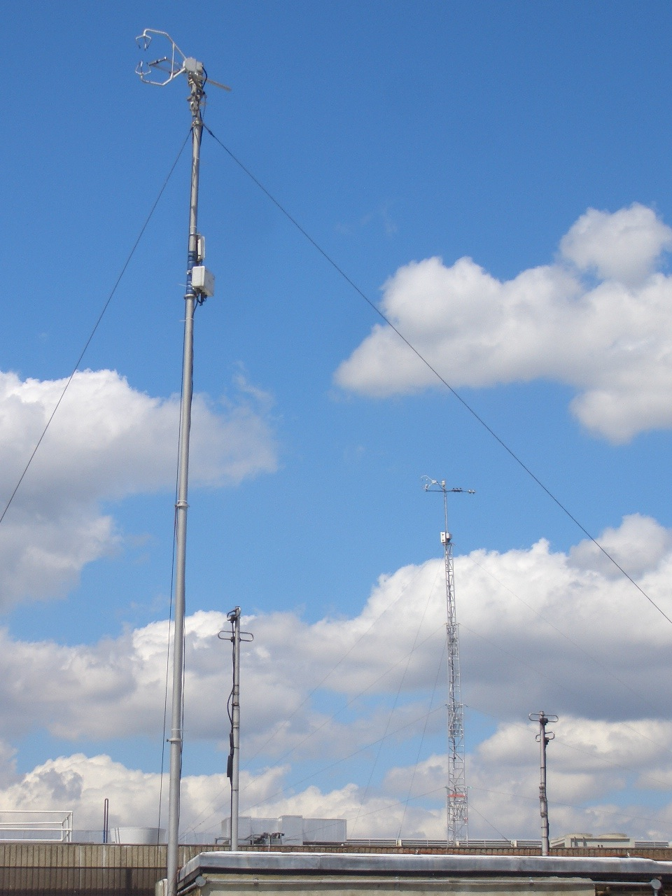

.. _KH20:

****
KH20
****

Manufacturer and Model
######################

.. csv-table:: 
   :file: manufacturers/KH20_manufacturer.csv
   :header-rows: 1

Serials
#######

.. csv-table:: 
   :file: serials/KH20_serials.csv
   :header-rows: 1

Deployments
###########

.. _1122:

Serial number: 1122
*******************

.. csv-table:: 
   :file: deployments/KH20/1122_deployments.csv
   :header-rows: 1

Photos
######

   As part of eddy covariance system at :ref:`KSK`. KH20 is oriented in the horizontal plane. 20-07-2010.

   Atop mast as part of eddy covariance system at :ref:`KSK` 20-07-2010.

Supplementary information
#########################

.. list-table:: 
   :header-rows: 1

   * - Link
     - Title
     - Description
   * - :download:`KH20 manual <manuals/KH20_manual.pdf>`
     - KH20 manual
     - Manual from Campbell Scientific.

Data acquisition
################

.. include:: ../../../data_acquisition/data_acquisition_default.rst

References
##########

#. Best, M. J. and Grimmond, C. S. B. (2013) Analysis of the seasonal cycle within the first international urban land-surface model comparison. Boundary-Layer Meteorology, 146 (3). pp. 421-446. ISSN 1573-1472 doi: https://doi.org/10.1007/s10546-012-9769-7
#. Grimmond, C. S. B., Blackett, M., Best, M. J., Baik, J. J., Belcher, S. E., Beringer, J., Bohnenstengel, S. I., Calmet, I., Chen, F., Coutts, A., Dandou, A., Fortuniak, K., Gouvea, M. L., Hamdi, R., Hendry, M., Kanda, M., Kawai, T., Kawamoto, Y., Kondo, H., Krayenhoff, E. S., Lee, S. H., Loridan, T., Martilli, A., Masson, V., Miao, S., Oleson, K., Ooka, R., Pigeon, G., Porson, A., Ryu, Y. H., Salamanca, F., Steeneveld, G. J., Tombrou, M., Voogt, J. A., Young, D.T. and Zhang, N. (2011) Initial results from Phase 2 of the international urban energy balance model comparison. International Journal of Climatology, 31 (2). pp. 244-272. ISSN 1097-0088 doi: https://doi.org/10.1002/joc.2227

