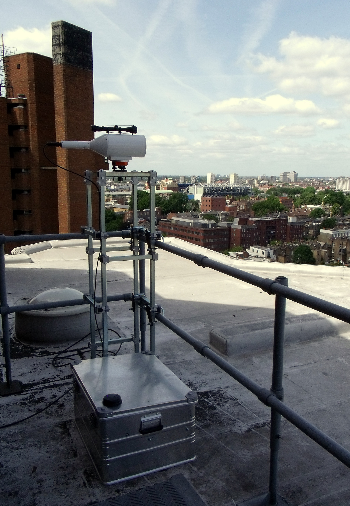
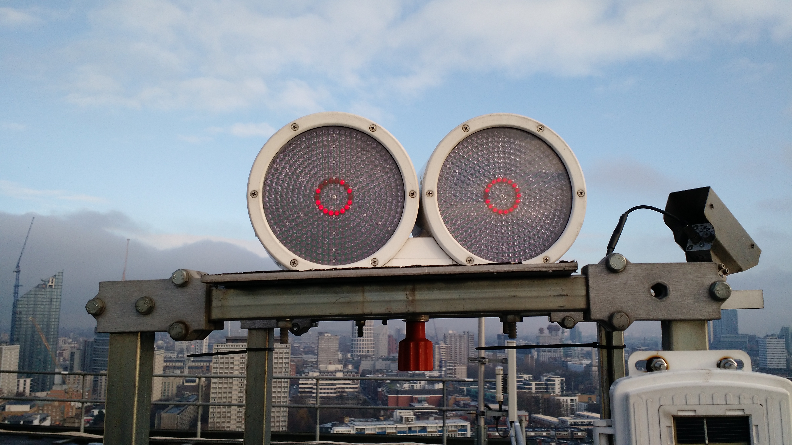
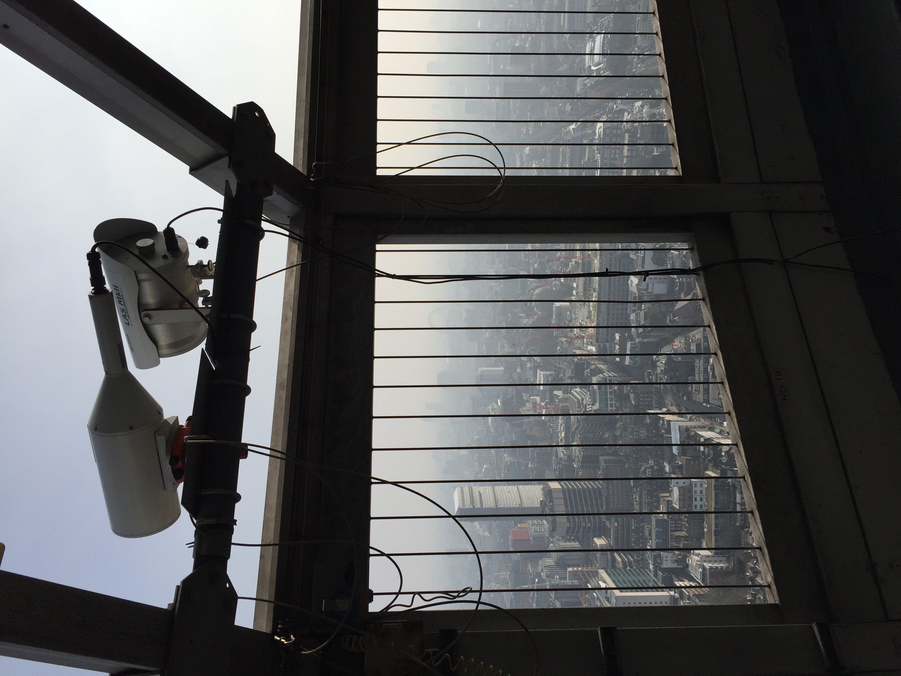
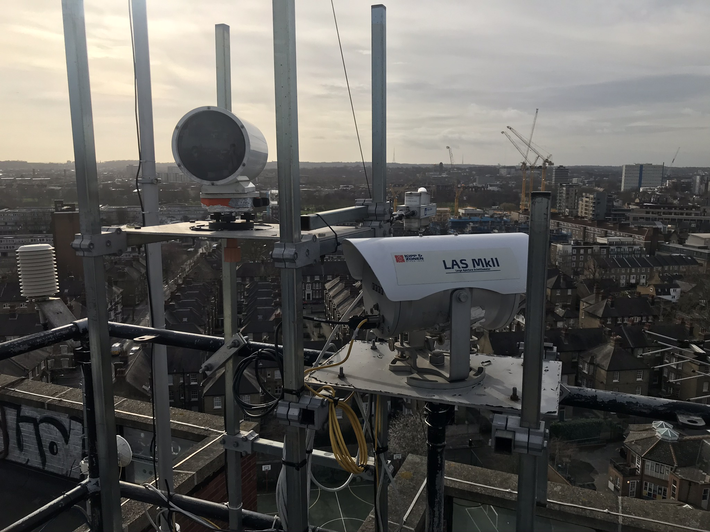

.. _BLS:

***
BLS
***

Introduction
############

.. include:: intros/BLS_intro.rst

Manufacturer and Model
######################

.. csv-table:: 
   :file: manufacturers/BLS_manufacturer.csv
   :header-rows: 1

Output definitions
##################

.. csv-table:: 
   :file: out_defs/BLS_out_defs.csv
   :header-rows: 1

Processing code
###############

Code used to process raw data:
https://github.com/Urban-Meteorology-Reading/Operations-LAS

Variables measured by instrument
################################

.. csv-table:: Variables measured - sorted alphabetically
   :file: variables/BLS_variables.csv
   :header-rows: 1

Serials
#######

.. csv-table:: 
   :file: serials/BLS_serials.csv
   :header-rows: 1

Deployments
###########

.. _T-E-0470:

Serial number: T-E-0470
***********************

.. csv-table:: 
   :file: deployments/BLS/T-E-0470_deployments.csv
   :header-rows: 1

Photos
######

   BLS900 reciever at :ref:`NDT` 24/05/2011

.. figure:: photos/BLS/dartrey-bls-view-to-trellick-3_23160155864_o.jpg
   :width: 50 %

   View of BLS900 at :ref:`NDT` towards :ref:`NTT` 24/05/2011

   BLS transmitter at :ref:`IMU` 06/01/2016

   Reciever (left) at :ref:`BTT` 11/02/2016

   Reciever (left) at :ref:`SWT` 18/02/2020

Supplementary information
#########################

.. list-table:: 
   :header-rows: 1

   * - Link
     - Title
     - Description
   * - :download:`BLS manual <manuals/BLS_manual.pdf>`
     - BLS manual
     - Manual from Scintec.
   * - :download:`BLS 900 brochure <manuals/BLS_brochure.pdf>`
     - BLS 900 brochure
     - Brochure from Scintec.

Data acquisition
################

.. include:: ../../../data_acquisition/data_acquisition_default.rst

References
##########

#. Crawford, B., Grimmond, C. S. B., Ward, H. C., Morrison, W. and Kotthaus, S. (2017) Spatial and temporal patterns of surface-atmosphere energy exchange in a dense urban environment using scintillometry. Quarterly Journal of the Royal Meteorological Society, 143 (703). pp. 817-833. ISSN 1477-870X doi: https://doi.org/10.1002/qj.2967
#. Ward, H. C., Evans, J. G., Grimmond, C. S. B. and Bradford, J. (2015) Infrared and millimetre-wave scintillometry in the suburban environment – Part 1: Structure parameters. Atmospheric Measurement Techniques, 8 (3). pp. 1385-1405. ISSN 1867-8548 doi: https://doi.org/10.5194/amt-8-1385-2015
#. Ward, H. G., Evans, J. G. and Grimmond, C. S. B. (2015) Infrared and millimetre-wave scintillometry in the suburban environment – Part 2: Large-area sensible and latent heat fluxes. Atmospheric Measurement Techniques, 8 (3). pp. 1407-1424. ISSN 1867-8548 doi: https://doi.org/10.5194/amt-8-1407-2015
#. Ward, H. C., Evans, J. G. and Grimmond, C. S. B. (2014) Multi-scale sensible heat fluxes in the urban environment from large aperture scintillometry and eddy covariance. Boundary-Layer Meteorology, 152 (1). pp. 65-89. ISSN 0006-8314 doi: https://doi.org/10.1007/s10546-014-9916-4
#. Wood, C. R., Pauscher, L., Ward, H. C., Kotthaus, S., Barlow, J., Gouvea, M., Lane, S. E. and Grimmond, C. S. B. (2013) Wind observations above an urban river using a new lidar technique, scintillometry and anemometry. Science of the Total Environment, 442. pp. 527-533. ISSN 0048-9697 doi: https://doi.org/10.1016/j.scitotenv.2012.10.061

