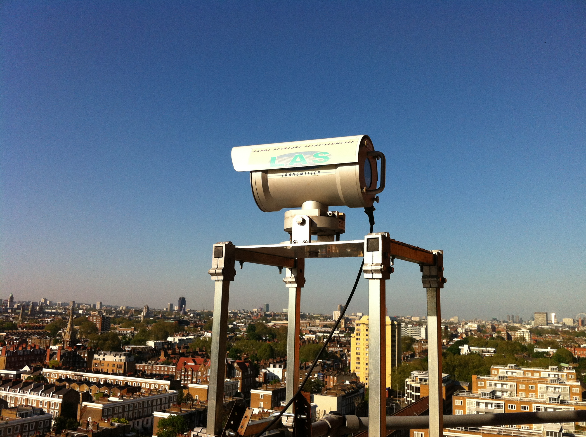
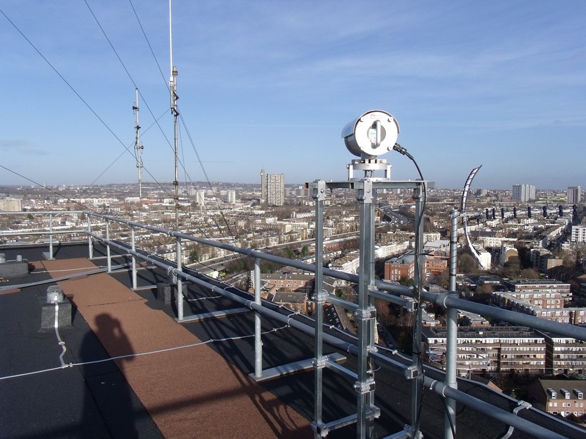

.. _LAS150:

******
LAS150
******

Introduction
############

.. include:: intros/LAS150_intro.rst

Manufacturer and Model
######################

.. csv-table:: 
   :file: manufacturers/LAS150_manufacturer.csv
   :header-rows: 1

Output definitions
##################

.. csv-table:: 
   :file: out_defs/LAS150_out_defs.csv
   :header-rows: 1

Processing code
###############

Code used to process raw data:
https://github.com/Urban-Meteorology-Reading/Operations-LAS

Variables measured by instrument
################################

.. csv-table:: Variables measured - sorted alphabetically
   :file: variables/LAS150_variables.csv
   :header-rows: 1

Serials
#######

.. csv-table:: 
   :file: serials/LAS150_serials.csv
   :header-rows: 1

Deployments
###########

.. _60029:

Serial number: 60029
********************

.. csv-table:: 
   :file: deployments/LAS150/60029_deployments.csv
   :header-rows: 1

Photos
######

   Transmitter from :ref:`KGG` to :ref:`BTT` 05-08-2011.

   Reciever at :ref:`NGT` 25-05-2012.

   Receiver at :ref:`NGT` 06/01/2012.

.. figure:: photos/LAS150/dartrey_tower_las_cityscan_bls_23161439553_o.jpg
   :width: 50 %

   Receiver at :ref:`NDT` 11/01/2012.

Data acquisition
################

.. include:: ../../../data_acquisition/data_acquisition_default.rst

References
##########

