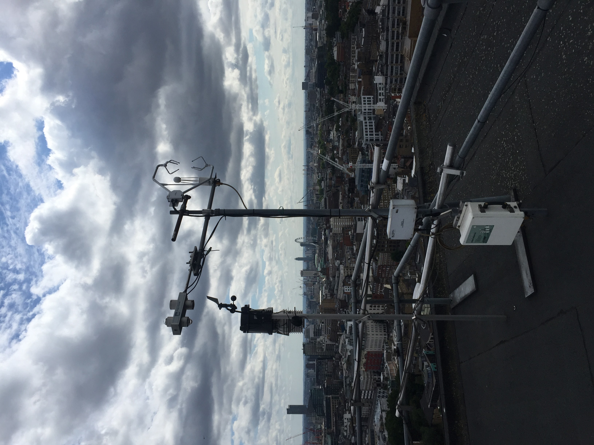
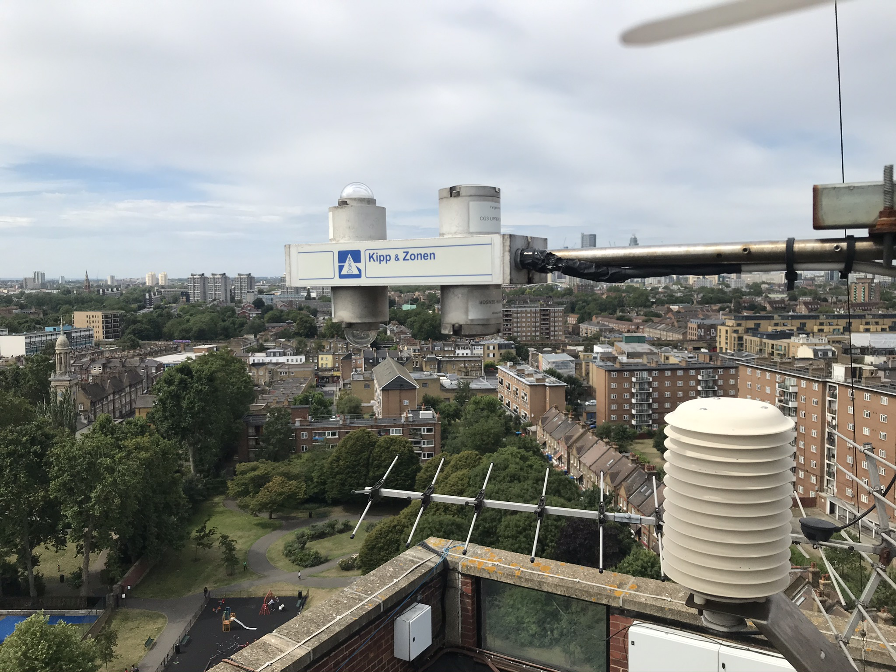

.. _CNR1:

****
CNR1
****

Introduction
############

.. include:: intros/CNR1_intro.rst

Manufacturer and Model
######################

.. csv-table:: 
   :file: manufacturers/CNR1_manufacturer.csv
   :header-rows: 1

Output definitions
##################

.. csv-table:: 
   :file: out_defs/CNR1_out_defs.csv
   :header-rows: 1

Processing code
###############

Code used to process raw data:
https://github.com/Urban-Meteorology-Reading/Operations-Radiometers

Variables measured by instrument
################################

.. csv-table:: Variables measured - sorted alphabetically
   :file: variables/CNR1_variables.csv
   :header-rows: 1

Serials
#######

.. csv-table:: 
   :file: serials/CNR1_serials.csv
   :header-rows: 1

Deployments
###########

.. _00022123:

Serial number: 00022123
***********************

.. csv-table:: 
   :file: deployments/CNR1/00022123_deployments.csv
   :header-rows: 1

.. _000220:

Serial number: 000220
*********************

.. csv-table:: 
   :file: deployments/CNR1/000220_deployments.csv
   :header-rows: 1

Photos
######

.. figure:: photos/CNR1/dscf1772_23787603735_o.jpg
   :width: 50 %

   CNR1 (leftmost instrument) at :ref:`KSK` 18/08/2009 

.. figure:: photos/CNR1/r0015029_23161117173_o.jpg
   :width: 50 %

   On top of tower at :ref:`KSS` 08/04/2011

.. figure:: photos/CNR1/102_1939_23631816005_o.jpg
   :width: 50 %

   At :ref:`KSNW` 05/07/2015

   At :ref:`IMU` 21/07/2017

   At :ref:`SWT` 23/07/2020

Supplementary information
#########################

.. list-table:: 
   :header-rows: 1

   * - Link
     - Title
     - Description
   * - :download:`CNR1 manual <manuals/CNR1_manual.pdf>`
     - CNR1 manual
     - Manual from Campbell Scientific

Data acquisition
################

.. include:: ../../../data_acquisition/data_acquisition_default.rst

References
##########

#. Meyer, D., Schoetter, R., Riechert, M., Verrelle, A., Tewari, M., Dudhia, J., Masson, V., Reeuwijk, M. and Grimmond, S. (2020) WRF‐TEB: implementation and evaluation of the coupled Weather Research and Forecasting (WRF) and Town Energy Balance (TEB) model. Journal of Advances in Modeling Earth Systems, 12 (8). e2019MS001961. ISSN 1942-2466 doi: https://doi.org/10.1029/2019MS001961
#. Hertwig, D., Grimmond, S., Hendry, M. A., Saunders, B., Wang, Z., Jeoffrion, M., Vidale, P. L., McGuire, P. C., Bohnenstengel, S. I., Ward, H. C. and Kotthaus, S. (2020) Urban signals in high-resolution weather and climate simulations: role of urban land-surface characterisation. Theoretical and Applied Climatology. ISSN 0177-798X doi: https://doi.org/10.1007/s00704-020-03294-1
#. Järvi, L., Havu, M., Ward, H. C., Bellucco, V., McFadden, J. P., Toivonen, T., Heikinheimo, V., Kolari, P., Riikonen, A. and Grimmond, C. S. B. (2019) Spatial modelling of local‐scale biogenic and anthropogenic carbon dioxide emissions in Helsinki. Journal of Geophysical Research: Atmospheres, 124 (15). pp. 8363-8384. ISSN 2169-8996 doi: https://doi.org/10.1029/2018JD029576
#. Kokkonen, T. V., Grimmond, S., Murto, S., Liu, H., Sundstr�m, A.-M. and J�rvi, L. (2019) Simulation of the radiative effect of haze on the urban hydrological cycle using reanalysis data in Beijing. Atmospheric Chemistry and Physics, 19. pp. 7001-7017. ISSN 1680-7316 doi: https://doi.org/10.5194/acp-19-7001-2019
#. Ao, X., Grimmond, C. S. B., Liu, D., Han, Z., Hu, P., Wang, Y., Zhen, X. and Tan, J. (2016) Radiation fluxes in a business district of Shanghai, China. Journal of Applied Meteorology and Climatology, 55 (11). pp. 2451-2468. ISSN 1558-8432 doi: https://doi.org/10.1175/JAMC-D-16-0082.1
#. Karsisto, P., Fortelius, C., Demuzere, M., Grimmond, C. S. B., Oleson, K. W., Kouznetsov, R., Masson, V. and J�rvi, L. (2016) Seasonal surface urban energy balance and wintertime stability simulated using three land-surface models in the high-latitude city Helsinki. Quarterly Journal of the Royal Meteorological Society, 142 (694). pp. 401-417. ISSN 1477-870X doi: https://doi.org/10.1002/qj.2659
#. Bjorkeren, A. B., Grimmond, C. S. B., Kotthaus, S. and Malamud, B. D. (2015) CO2 emission estimation in the urban environment: measurement of the CO2 storage term. Atmospheric Environment, 122. pp. 775-790. ISSN 1352-2310 doi: https://doi.org/10.1016/j.atmosenv.2015.10.012
#. Ward, H. C., Kotthaus, S., Grimmond, C. S. B., Bjorkegren, A., Wilkinson, M., Morrison, W. T. J., Evans, J. G., Morison, J. I. L. and Iamarino, M. (2015) Effects of urban density on carbon dioxide exchanges: observations of dense urban, suburban and woodland areas of southern England. Environmental Pollution, 198. pp. 186-200. ISSN 0269-7491 doi: https://doi.org/10.1016/j.envpol.2014.12.031
#. Kotthaus, S. and Grimmond, C. S. B. (2014) Energy exchange in a dense urban environment Part II: impact of spatial heterogeneity of the surface. Urban Climate, 10 (2). pp. 281-307. ISSN 2212-0955 doi: https://doi.org/10.1016/j.uclim.2013.10.001
#. Kotthaus, S. and Grimmond, C. S. B. (2014) Energy exchange in a dense urban environment – part I: temporal variability of long-term observations in central London. Urban Climate, 10 (2). pp. 261-280. ISSN 2212-0955 doi: https://doi.org/10.1016/j.uclim.2013.10.002
#. Magliulo, V., Toscano, P., Grimmond, C. S. B., Kotthaus, S., J�rvi, L., Set�l�, H., Lindberg, F., Vogt, R., Staszewski, T., Bubak, A., Synnefa, A. and Santamouris, M. (2014) Environmental measurements in BRIDGE case studies. In: Chrysoulakis, N., de Castro, E. A. and Moors, E. J. (eds.) Understanding Urban Metabolism. Routledge, pp. 45-57. ISBN 9780415835114
#. J�rvi, L., Grimmond, C. S. B., Taka, M., Nordbo, A., Set�l�, H. and Strachan, I. B. (2014) Development of the Surface Urban Energy and Water balance Scheme (SUEWS) for cold climate cities. Geoscientific Model Development, 7. pp. 1691-1711. ISSN 1991-9603 doi: https://doi.org/10.5194/gmd-7-1691-2014
#. Wood, C. R., Pauscher, L., Ward, H. C., Kotthaus, S., Barlow, J., Gouvea, M., Lane, S. E. and Grimmond, C. S. B. (2013) Wind observations above an urban river using a new lidar technique, scintillometry and anemometry. Science of the Total Environment, 442. pp. 527-533. ISSN 0048-9697 doi: https://doi.org/10.1016/j.scitotenv.2012.10.061
#. Loridan, T., Lindberg, F., Jorba, O., Kotthaus, S., Grossman-Clarke, S. and Grimmond, C. S. B. (2013) High resolution simulation of the variability of surface energy balance fluxes across central London with urban zones for energy partitioning. Boundary-Layer Meteorology, 147 (3). pp. 493-523. ISSN 0006-8314 doi: https://doi.org/10.1007/s10546-013-9797-y
#. Kotthaus, S. and Grimmond, C. S. B. (2012) Identification of micro-scale anthropogenic CO2, heat and moisture sources – processing eddy covariance fluxes for a dense urban environment. Atmospheric Environment, 57. pp. 301-316. ISSN 1352-2310 doi: https://doi.org/10.1016/j.atmosenv.2012.04.024
#. Loridan, T., Grimmond, C.S.B., Offerle, B. D., Young, D. T., Smith, T. E. L., J�rvi, L. and Lindberg, F. (2011) Local-scale urban meteorological parameterization scheme (LUMPS): longwave radiation parameterization and seasonality-related developments. Journal of Applied Meteorology and Climatology, 50 (1). pp. 185-202. ISSN 1558-8424 doi: https://doi.org/10.1175/2010JAMC2474.1

