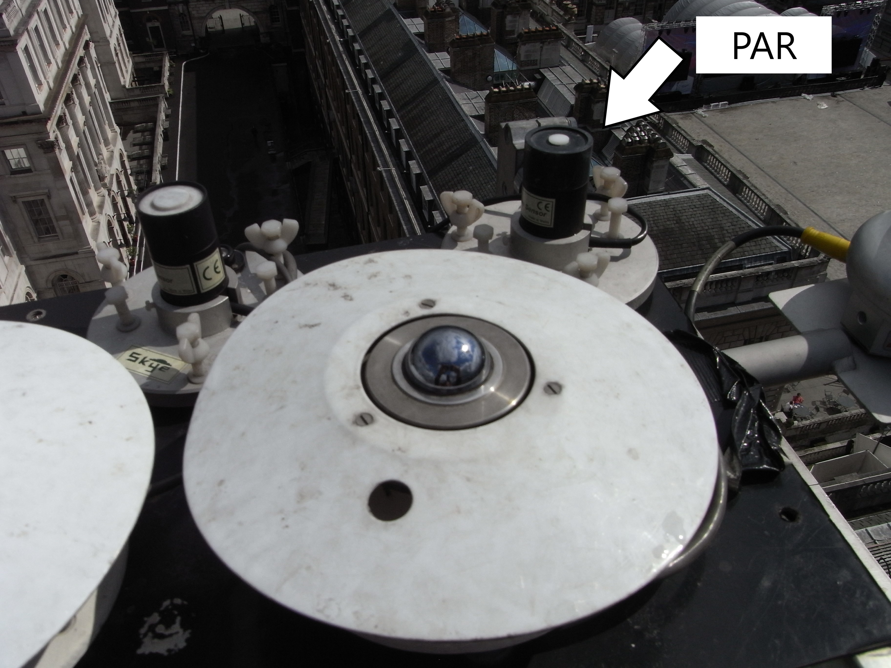
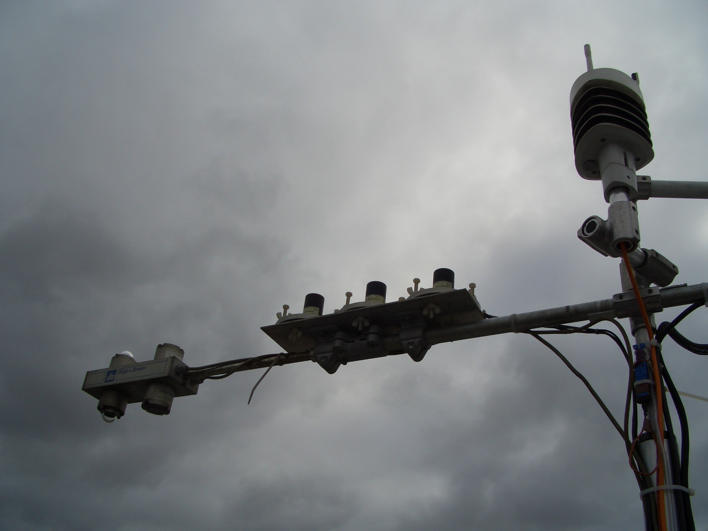
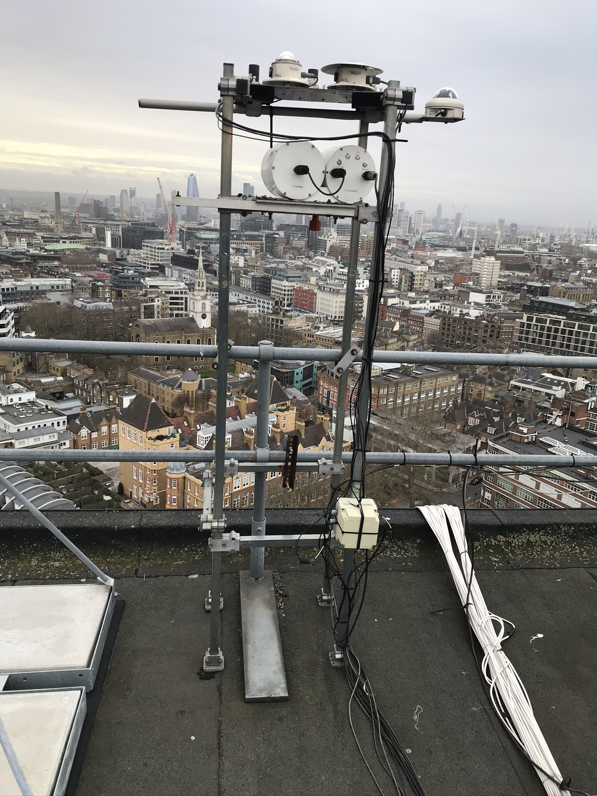

.. _PAR:

***
PAR
***

Introduction
############

.. include:: intros/PAR_intro.rst

Manufacturer and Model
######################

.. csv-table:: 
   :file: manufacturers/PAR_manufacturer.csv
   :header-rows: 1

Processing code
###############

Code used to process raw data:
https://github.com/Urban-Meteorology-Reading/Operations-Radiometers

Serials
#######

.. csv-table:: 
   :file: serials/PAR_serials.csv
   :header-rows: 1

Deployments
###########

.. _020630659:

Serial number: 020630659
************************

.. csv-table:: 
   :file: deployments/PAR/020630659_deployments.csv
   :header-rows: 1

.. _020630661:

Serial number: 020630661
************************

.. csv-table:: 
   :file: deployments/PAR/020630661_deployments.csv
   :header-rows: 1

Photos
######

   Indicated by arrow at :ref:`KSS45W`. Unknown date between 2012-02-27 and  2016-04-14.

.. figure:: photos/PAR/tower-lowering-15092016_29409179500_o.jpg
   :width: 50 %

   At :ref:`KSSW` 15-09-2016.

.. figure:: photos/PAR/dscf1768_23679131102_o.jpg
   :width: 50 %

   Atop tower at :ref:`KSK` 18-08-2009.

   At :ref:`KSS` 16-10-2009.

   Structure on which it was on top of at :ref:`IMU` 08-01-2020.

Supplementary information
#########################

.. list-table:: 
   :header-rows: 1

   * - Link
     - Title
     - Description
   * - :download:`PAR manual <manuals/PAR_manual.pdf>`
     - PAR manual
     - Manual from Skye Instruments.

Data acquisition
################

.. include:: ../../../data_acquisition/data_acquisition_default.rst

References
##########

#. Tsiringakis, A., Holtslag, A. A. M., Grimmond, S. and Steeneveld, G. J. (2020) Surface and atmospheric driven variability of the single‐layer urban canopy model under clear‐sky conditions over London. Journal of Geophysical Research: Atmospheres, 125 (14). e2019JD032167. ISSN 2169-8996 doi: https://doi.org/10.1029/2019JD032167
#. Harrison, R. M., Beddows, D. C. S., Alam, M. S., Singh, A., Brean, J., Xu, R., Kotthaus, S. and Grimmond, S. (2019) Interpretation of particle number size distributions measured across an urban area during the FASTER campaign. Atmospheric Chemistry and Physics, 19 (1). pp. 39-55. ISSN 1680-7324 doi: https://doi.org/10.5194/acp-19-39-2019
#. Kokkonen, T. V., Grimmond, S., Murto, S., Liu, H., Sundstr�m, A.-M. and J�rvi, L. (2019) Simulation of the radiative effect of haze on the urban hydrological cycle using reanalysis data in Beijing. Atmospheric Chemistry and Physics, 19. pp. 7001-7017. ISSN 1680-7316 doi: https://doi.org/10.5194/acp-19-7001-2019
#. Liu, D., Joshi, R., Wang, J., Yu, C., Allan, J. D., Coe, H., Flynn, M. J., Xie, C., Lee, J., Squires, F., Kotthaus, S., Grimmond, S., Ge, X., Sun, Y. and Fu, P. (2019) Contrasting physical properties of black carbon in urban Beijing between winter and summer. Atmospheric Chemistry and Physics, 19. pp. 6749-6769. ISSN 1680-7316 doi: https://doi.org/10.5194/acp-19-6749-2019
#. Shi, Z., Vu, T., Kotthaus, S., Harrison, R. M., Grimmond, S., Yue, S., Zhu, T., Lee, J., Han, Y., Demuzere, M., Dunmore, R. E., Ren, L., Liu, D., Wang, Y., Wild, O., Allan, J., Acton, W. J., Barlow, J., Barratt, B., Beddows, D., Bloss, W. J., Calzolai, G., Carruthers, D., Carslaw, D. C., Chan, Q., Chatzidiakou, L., Chen, Y., Crilley, L., Coe, H., Dai, T., Doherty, R., Duan, F., Fu, P., Ge, B., Ge, M., Guan, D., Hamilton, J. F., He, K., Heal, M., Heard, D., Hewitt, C. N., Hollaway, M., Hu, M., Ji, D., Jiang, X., Jones, R., Kalberer, M., Kelly, F. J., Kramer, L., Langford, B., Lin, C., Lewis, A. C., Li, J., Li, W., Liu, H., Liu, J., Loh, M., Lu, K., Lucarelli, F., Mann, G., McFiggans, G., Miller, M. R., Mills, G., Monk, P., Nemitz, E., O&amp;apos;Connor, F., Ouyang, B., Palmer, P. I., Percival, C., Popoola, O., Reeves, C., Rickard, A. R., Shao, L., Shi, G., Spracklen, D., Stevenson, D., Sun, Y., Sun, Z., Tao, S., Tong, S., Wang, Q., Wang, W., Wang, X., Wang, X., Wang, Z., Wei, L., Whalley, L., Wu, X., Wu, Z., Xie, P., Yang, F., Zhang, Q., Zhang, Y., Zhang, Y. and Zheng, M. (2019) In-depth study of air pollution sources and processes within Beijing and its surrounding region (APHH-Beijing). Atmospheric Chemistry and Physics (11). pp. 7519-7546. ISSN 1680-7316 doi: https://doi.org/10.5194/acp-19-7519-2019
#. Theeuwes, N. E., Ronda, R. J., Harman, I. N., Christen, A. and Grimmond, C. S. B. (2019) Parametrizing horizontally-averaged wind and temperature profiles in the urban roughness sublayer. Boundary-Layer Meteorology, 173 (3). pp. 321-348. ISSN 0006-8314 doi: https://doi.org/10.1007/s10546-019-00472-1
#. Järvi, L., Havu, M., Ward, H. C., Bellucco, V., McFadden, J. P., Toivonen, T., Heikinheimo, V., Kolari, P., Riikonen, A. and Grimmond, C. S. B. (2019) Spatial modelling of local‐scale biogenic and anthropogenic carbon dioxide emissions in Helsinki. Journal of Geophysical Research: Atmospheres, 124 (15). pp. 8363-8384. ISSN 2169-8996 doi: https://doi.org/10.1029/2018JD029576
#. Liang, X., Miao, S., Li, J., Bornstein, R., Zhang, X., Gao, Y., Cao, X., Chen, F., Cheng, Z., Clements, C., Dabberdt, W., Ding, A., Ding, D., Dou, J. J., Dou, J. X., Dou, Y., Grimmond, C. S. B., Gonzalez-Cruz, J., He, J., Huang, M., Huang, X., Ju, S., Li, Q., Niyogi, D., Quan, J., Sun, J., Sun, J. Z., Yu, M., Zhang, J., Zhang, Y., Zhao, X., Zheng, Z. and Zhou, M. (2018) SURF: understanding and predicting urban convection and haze. Bulletin of the American Meteorological Society, 99 (7). pp. 1391-1413. ISSN 0003-0007 doi: https://doi.org/10.1175/BAMS-D-16-0178.1
#. Ward, H., Tan, Y. S., Gabey, A. M., Kotthaus, S. and Grimmond, C. S. B. (2018) Impact of temporal resolution of precipitation forcing data on modelled urban-atmosphere exchanges and surface conditions. International Journal of Climatology, 38 (2). pp. 649-662. ISSN 1097-0088 doi: https://doi.org/10.1002/joc.5200
#. Bjorkegren, A. and Grimmond, C. S. B., (2017) Net carbon dioxide emissions from central London. Urban Climate, 23. pp. 131-158. ISSN 2212-0955 doi: https://doi.org/10.1016/j.uclim.2016.10.002
#. Kotthaus, S., O'Connor, E., M�nkel, C., Charlton-Perez, C., Haeffelin, M., Gabey, A. M. and Grimmond, C. S. B. (2016) Recommendations for processing atmospheric attenuated backscatter profiles from Vaisala CL31 ceilometers. Atmospheric Measurement Techniques, 9. pp. 3769-3791. ISSN 1867-8548 doi: https://doi.org/10.5194/amt-9-3769-2016
#. Sun, T., Grimmond, C. S. E. and Ni, G.-H. (2016) How do green roofs mitigate urban thermal stress under heat waves? Journal of Geophysical Research: Atmospheres, 121 (10). pp. 5320-5335. ISSN 2169-8996 doi: https://doi.org/10.1002/2016JD024873
#. Best, M. J. and Grimmond, C. S. B. (2016) Modelling the partitioning of turbulent fluxes at urban sites with varying vegetation cover. Journal of Hydrometeorology, 17 (10). pp. 2537-2553. ISSN 1525-7541 doi: https://doi.org/10.1175/JHM-D-15-0126.1
#. Ward, H. C., Kotthaus, S., J�rvi, L. and Grimmond, C. S. B. (2016) Surface Urban Energy and Water Balance Scheme (SUEWS): development and evaluation at two UK sites. Urban Climate, 18. pp. 1-32. ISSN 2212-0955 doi: https://doi.org/10.1016/j.uclim.2016.05.001
#. Grimmond, C. S. B., Ward, H. C. and Kotthaus, S. (2015) How is urbanization altering local and regional climate? In: Seto, K. C., Solecki, W. D. and Griffith, C. A. (eds.) The Routledge Handbook of Urbanization and Global Environmental Change. Routledge. ISBN 9780415732260
#. Bjorkeren, A. B., Grimmond, C. S. B., Kotthaus, S. and Malamud, B. D. (2015) CO2 emission estimation in the urban environment: measurement of the CO2 storage term. Atmospheric Environment, 122. pp. 775-790. ISSN 1352-2310 doi: https://doi.org/10.1016/j.atmosenv.2015.10.012
#. Ward, H. G., Evans, J. G. and Grimmond, C. S. B. (2015) Infrared and millimetre-wave scintillometry in the suburban environment – Part 2: Large-area sensible and latent heat fluxes. Atmospheric Measurement Techniques, 8 (3). pp. 1407-1424. ISSN 1867-8548 doi: https://doi.org/10.5194/amt-8-1407-2015
#. Ward, H. C., Kotthaus, S., Grimmond, C. S. B., Bjorkegren, A., Wilkinson, M., Morrison, W. T. J., Evans, J. G., Morison, J. I. L. and Iamarino, M. (2015) Effects of urban density on carbon dioxide exchanges: observations of dense urban, suburban and woodland areas of southern England. Environmental Pollution, 198. pp. 186-200. ISSN 0269-7491 doi: https://doi.org/10.1016/j.envpol.2014.12.031
#. Loridan, T., Lindberg, F., Jorba, O., Kotthaus, S., Grossman-Clarke, S. and Grimmond, C. S. B. (2013) High resolution simulation of the variability of surface energy balance fluxes across central London with urban zones for energy partitioning. Boundary-Layer Meteorology, 147 (3). pp. 493-523. ISSN 0006-8314 doi: https://doi.org/10.1007/s10546-013-9797-y
#. Ward, H. C., Evans, J. G. and Grimmond, C. S. B. (2013) Multi-season eddy covariance observations of energy, water and carbon fluxes over a suburban area in Swindon, UK. Atmospheric Chemistry and Physics, 13. pp. 4645-4666. ISSN 1680-7316 doi: https://doi.org/10.5194/acp-13-4645-2013
#. Loridan, T. and Grimmond, C. S. B. (2012) Characterization of energy flux partitioning in urban environments: links with surface seasonal properties. Journal of Applied Meteorology and Climatology, 51 (2). pp. 219-241. ISSN 1558-8432 doi: https://doi.org/10.1175/JAMC-D-11-038.1
#. Oliphant, A.J., Dragoni, D., Deng, B., Grimmond, C.S.B., Schmid, H.-P. and Scott, S.L. (2011) The role of sky conditions on gross primary production in a mixed deciduous forest. Agricultural and Forest Meteorology, 151 (7). pp. 781-791. ISSN 0168-1923 doi: https://doi.org/10.1016/j.agrformet.2011.01.005
#. Crawford, B., Grimmond, C. S. B. and Christen, A. (2011) Five years of carbon dioxide fluxes measurements in a highly vegetated suburban area. Atmospheric Environment, 45 (4). pp. 896-905. ISSN 1352-2310 doi: https://doi.org/10.1016/j.atmosenv.2010.11.017
#. Grimmond, C. S. B., Blackett, M., Best, M. J., Baik, J. J., Belcher, S. E., Beringer, J., Bohnenstengel, S. I., Calmet, I., Chen, F., Coutts, A., Dandou, A., Fortuniak, K., Gouvea, M. L., Hamdi, R., Hendry, M., Kanda, M., Kawai, T., Kawamoto, Y., Kondo, H., Krayenhoff, E. S., Lee, S. H., Loridan, T., Martilli, A., Masson, V., Miao, S., Oleson, K., Ooka, R., Pigeon, G., Porson, A., Ryu, Y. H., Salamanca, F., Steeneveld, G. J., Tombrou, M., Voogt, J. A., Young, D.T. and Zhang, N. (2011) Initial results from Phase 2 of the international urban energy balance model comparison. International Journal of Climatology, 31 (2). pp. 244-272. ISSN 1097-0088 doi: https://doi.org/10.1002/joc.2227
#. Best, M. J., Pryor, M., Clark, D. B., Rooney, G. G., Essery, R. L. H., Ménard, C. B., Edwards, J. M., Hendry, M. A., Porson, A., Gedney, N., Mercado, L. M., Sitch, S., Blyth, E., Boucher, O., Cox, P. M., Grimmond, C.S.B. and Harding, R. J. (2011) The Joint UK Land Environment Simulator (JULES), model description – part 1: energy and water fluxes. Geoscientific Model Development, 4 (1). pp. 677-699. ISSN 1991-9603 doi: https://doi.org/10.5194/gmd-4-677-2011
#. Grimmond, C.S.B., Blackett, M., Best, M. J., Barlow, J., Baik, J.-J., Belcher, S. E., Bohnenstengel, S. I., Calmet, I., Chen, F., Dandou, A., Fortuniak, K., Gouvea, M. L., Hamdi, R., Hendry, M., Kawai, T., Kawamoto, Y., Kondo, H., Krayenhoff, E. S., Lee, S.-H., Loridan, T., Martilli, A., Masson, V., Miao, S., Oleson, K., Pigeon, G., Porson, A., Ryu, Y.-H., Salamanca, F., Shashua-Bar, L., Steeneveld, G.-J., Tombrou, M., Voogt, J., Young, D. and Zhang, N. (2010) The International Urban Energy Balance Models Comparison Project: First Results from Phase 1. Journal of Applied Meteorology and Climatology, 49 (6). pp. 1268-1292. ISSN 1558-8432 doi: https://doi.org/10.1175/2010JAMC2354.1

