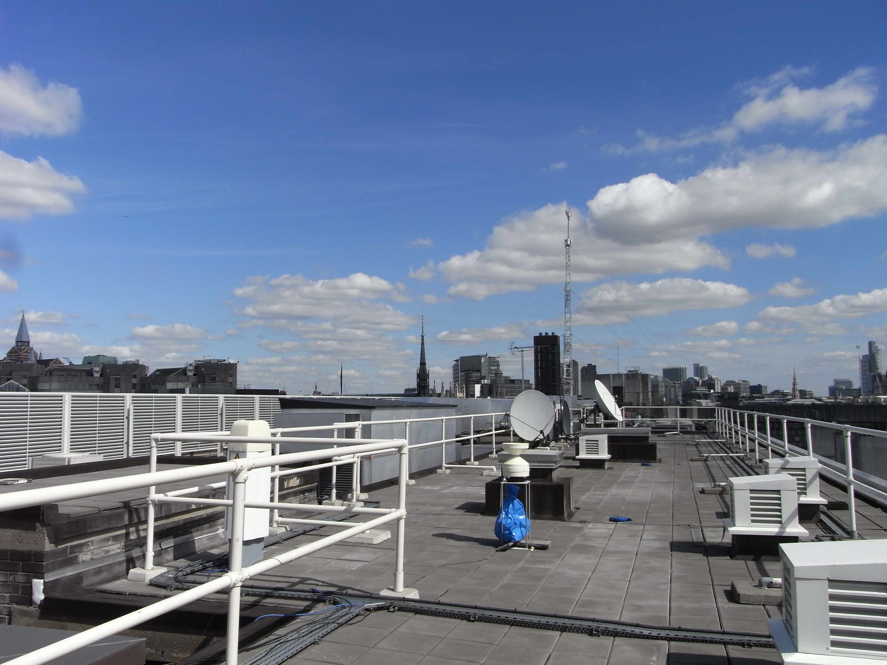
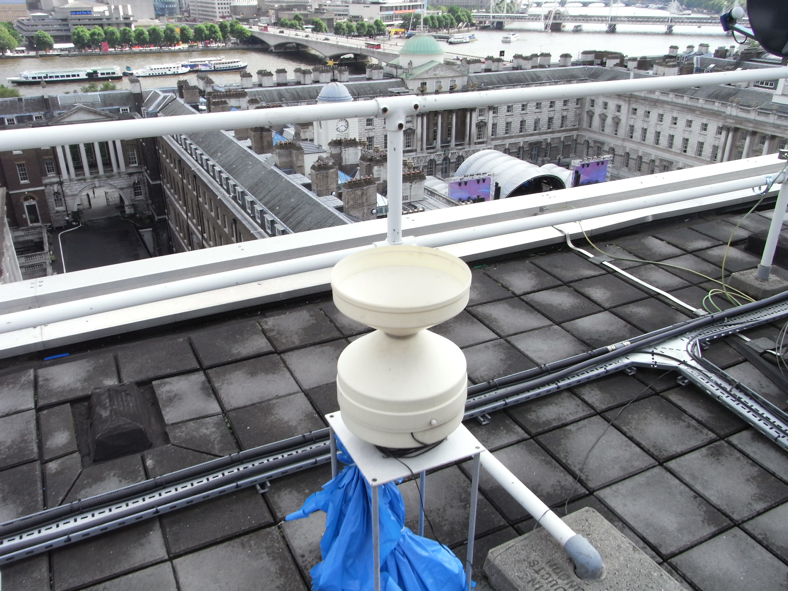

.. _ARG100:

******
ARG100
******

Introduction
############

.. include:: intros/ARG100_intro.rst

Manufacturer and Model
######################

.. csv-table:: 
   :file: manufacturers/ARG100_manufacturer.csv
   :header-rows: 1

Output definitions
##################

.. csv-table:: 
   :file: out_defs/ARG100_out_defs.csv
   :header-rows: 1

Variables measured by instrument
################################

.. csv-table:: Variables measured - sorted alphabetically
   :file: variables/ARG100_variables.csv
   :header-rows: 1

Serials
#######

.. csv-table:: 
   :file: serials/ARG100_serials.csv
   :header-rows: 1

Deployments
###########

.. _042908:

Serial number: 042908
*********************

.. csv-table:: 
   :file: deployments/ARG100/042908_deployments.csv
   :header-rows: 1

.. _SOUTHWARK_ARG100:

Serial number: SOUTHWARK_ARG100
*******************************

.. csv-table:: 
   :file: deployments/ARG100/SOUTHWARK_ARG100_deployments.csv
   :header-rows: 1

Photos
######

.. figure:: photos/ARG100/23-07-2020_(16).JPEG
   :width: 50 %

   ARG100 (foreground) at :ref:`SWT` 23/07/2020

   ARG100 (middle of image) at :ref:`KSS45W` 31/08/2010

   At :ref:`KSSW` 2016 - 2017

Supplementary information
#########################

.. list-table:: 
   :header-rows: 1

   * - Link
     - Title
     - Description
   * - :download:`ARG100 manual <manuals/ARG100_manual.pdf>`
     - ARG100 manual
     - Manual from Campbell Scientific

Data acquisition
################

.. include:: ../../../data_acquisition/data_acquisition_default.rst

References
##########

#. Kotthaus, S. and Grimmond, C. S. B. (2014) Energy exchange in a dense urban environment – part I: temporal variability of long-term observations in central London. Urban Climate, 10 (2). pp. 261-280. ISSN 2212-0955 doi: https://doi.org/10.1016/j.uclim.2013.10.002
#. Magliulo, V., Toscano, P., Grimmond, C. S. B., Kotthaus, S., J�rvi, L., Set�l�, H., Lindberg, F., Vogt, R., Staszewski, T., Bubak, A., Synnefa, A. and Santamouris, M. (2014) Environmental measurements in BRIDGE case studies. In: Chrysoulakis, N., de Castro, E. A. and Moors, E. J. (eds.) Understanding Urban Metabolism. Routledge, pp. 45-57. ISBN 9780415835114
#. Wood, C. R., Pauscher, L., Ward, H. C., Kotthaus, S., Barlow, J., Gouvea, M., Lane, S. E. and Grimmond, C. S. B. (2013) Wind observations above an urban river using a new lidar technique, scintillometry and anemometry. Science of the Total Environment, 442. pp. 527-533. ISSN 0048-9697 doi: https://doi.org/10.1016/j.scitotenv.2012.10.061
#. Kotthaus, S. and Grimmond, C. S. B. (2012) Identification of micro-scale anthropogenic CO2, heat and moisture sources – processing eddy covariance fluxes for a dense urban environment. Atmospheric Environment, 57. pp. 301-316. ISSN 1352-2310 doi: https://doi.org/10.1016/j.atmosenv.2012.04.024

