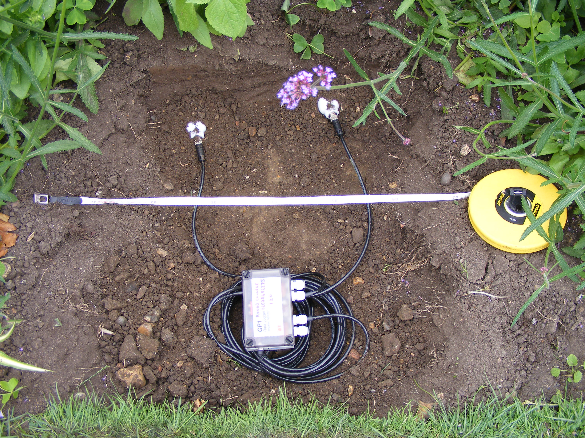
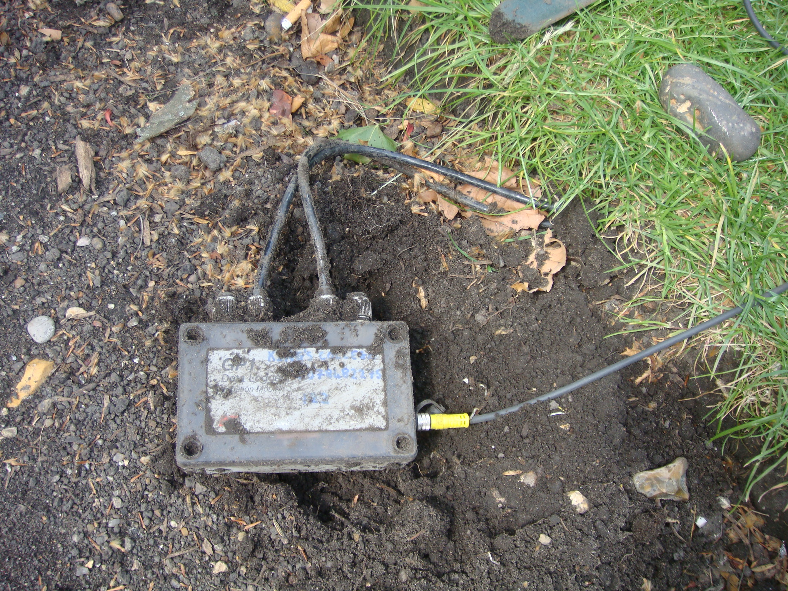
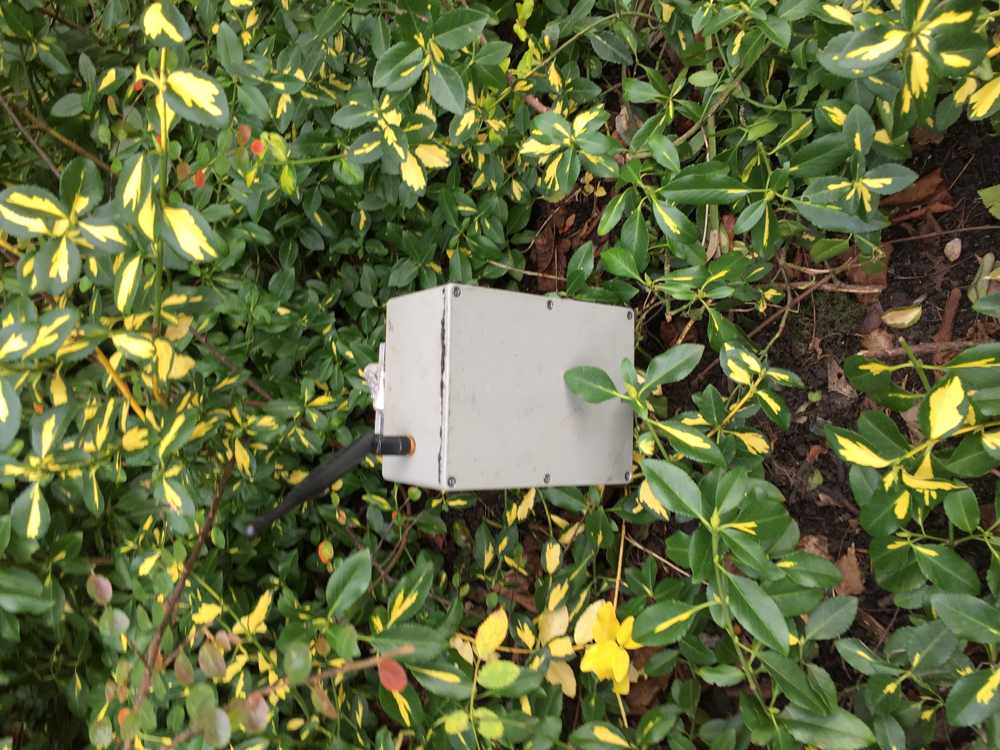
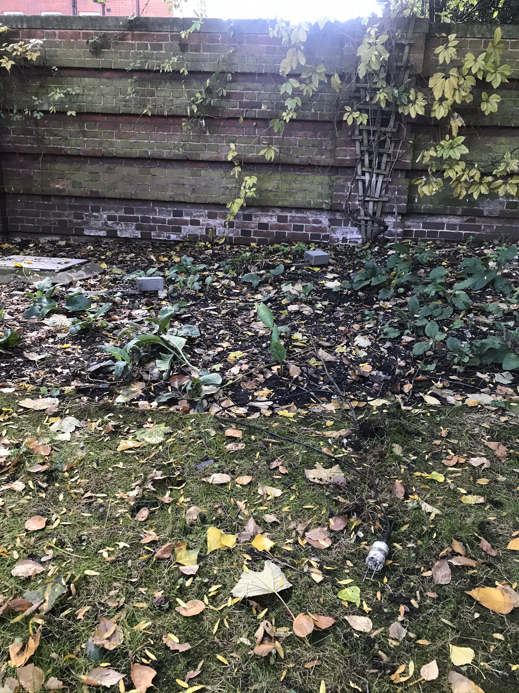
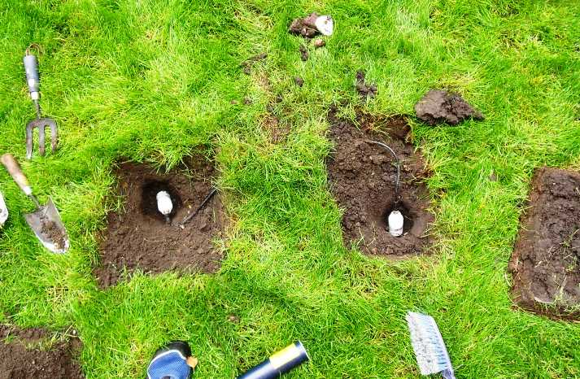

.. _SM300:

*****
SM300
*****

Introduction
############

.. include:: intros/SM300_intro.rst

Manufacturer and Model
######################

.. csv-table:: 
   :file: manufacturers/SM300_manufacturer.csv
   :header-rows: 1

Output definitions
##################

.. csv-table:: 
   :file: out_defs/SM300_out_defs.csv
   :header-rows: 1

Processing code
###############

Code used to process raw data:
https://github.com/Urban-Meteorology-Reading/Operations-WSN

Variables measured by instrument
################################

.. csv-table:: Variables measured - sorted alphabetically
   :file: variables/SM300_variables.csv
   :header-rows: 1

Serials
#######

.. csv-table:: 
   :file: serials/SM300_serials.csv
   :header-rows: 1

Deployments
###########

.. _A01362:

Serial number: A01362
*********************

.. csv-table:: 
   :file: deployments/SM300/A01362_deployments.csv
   :header-rows: 1

.. _A01365:

Serial number: A01365
*********************

.. csv-table:: 
   :file: deployments/SM300/A01365_deployments.csv
   :header-rows: 1

.. _A01366:

Serial number: A01366
*********************

.. csv-table:: 
   :file: deployments/SM300/A01366_deployments.csv
   :header-rows: 1

.. _A01360:

Serial number: A01360
*********************

.. csv-table:: 
   :file: deployments/SM300/A01360_deployments.csv
   :header-rows: 1

.. _A01357:

Serial number: A01357
*********************

.. csv-table:: 
   :file: deployments/SM300/A01357_deployments.csv
   :header-rows: 1

.. _A01363:

Serial number: A01363
*********************

.. csv-table:: 
   :file: deployments/SM300/A01363_deployments.csv
   :header-rows: 1

.. _A01605:

Serial number: A01605
*********************

.. csv-table:: 
   :file: deployments/SM300/A01605_deployments.csv
   :header-rows: 1

.. _A01358:

Serial number: A01358
*********************

.. csv-table:: 
   :file: deployments/SM300/A01358_deployments.csv
   :header-rows: 1

.. _A01361:

Serial number: A01361
*********************

.. csv-table:: 
   :file: deployments/SM300/A01361_deployments.csv
   :header-rows: 1

.. _A01359:

Serial number: A01359
*********************

.. csv-table:: 
   :file: deployments/SM300/A01359_deployments.csv
   :header-rows: 1

.. _A01364:

Serial number: A01364
*********************

.. csv-table:: 
   :file: deployments/SM300/A01364_deployments.csv
   :header-rows: 1

Photos
######

   At :ref:`EMB` 30/07/2010

   At :ref:`HAN` 08/06/2011

   Node at :ref:`BTM` 13/01/2016

   Unnearthed at :ref:`RGS` 22/10/2020.

   At :ref:`MT` 13/06/2011.

Supplementary information
#########################

.. list-table:: 
   :header-rows: 1

   * - Link
     - Title
     - Description
   * - https://dynamax.com/images/uploads/papers/SM300_Manual.pdf
     - SM300 manual
     - Manual from Delta-T.

Data acquisition
################

.. include:: ../../../data_acquisition/data_acquisition_default.rst

References
##########

#. Magliulo, V., Toscano, P., Grimmond, C. S. B., Kotthaus, S., J�rvi, L., Set�l�, H., Lindberg, F., Vogt, R., Staszewski, T., Bubak, A., Synnefa, A. and Santamouris, M. (2014) Environmental measurements in BRIDGE case studies. In: Chrysoulakis, N., de Castro, E. A. and Moors, E. J. (eds.) Understanding Urban Metabolism. Routledge, pp. 45-57. ISBN 9780415835114

