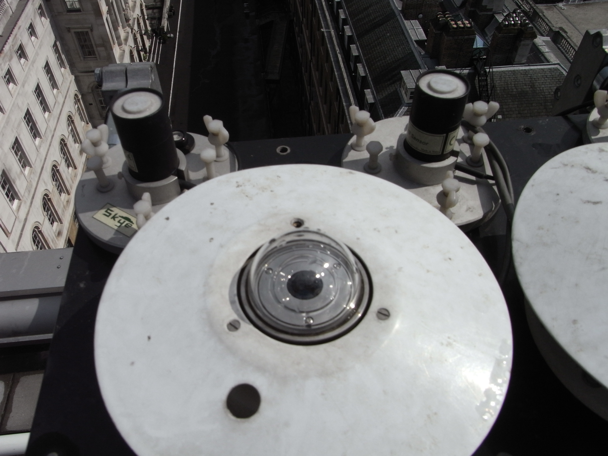

.. _PSP:

***
PSP
***

Introduction
############

.. include:: intros/PSP_intro.rst

Manufacturer and Model
######################

.. csv-table:: 
   :file: manufacturers/PSP_manufacturer.csv
   :header-rows: 1

Output definitions
##################

.. csv-table:: 
   :file: out_defs/PSP_out_defs.csv
   :header-rows: 1

Processing code
###############

Code used to process raw data:
https://github.com/Urban-Meteorology-Reading/Operations-Radiometers

Variables measured by instrument
################################

.. csv-table:: Variables measured - sorted alphabetically
   :file: variables/PSP_variables.csv
   :header-rows: 1

Serials
#######

.. csv-table:: 
   :file: serials/PSP_serials.csv
   :header-rows: 1

Deployments
###########

.. _29765F3:

Serial number: 29765F3
**********************

.. csv-table:: 
   :file: deployments/PSP/29765F3_deployments.csv
   :header-rows: 1

Photos
######

   At :ref:`KSS45W`. Unknown date between 2012-02-27 and 2016-04-14.

.. figure:: photos/PSP/08-01-2020(7).png
   :width: 50 %

   At :ref:`IMU`, indicated by arrow, 08-01-2020.

Supplementary information
#########################

.. list-table:: 
   :header-rows: 1

   * - Link
     - Title
     - Description
   * - :download:`PSP manual <manuals/PSP_manual.pdf>`
     - PSP manual
     - Manual from Eppley

Data acquisition
################

.. include:: ../../../data_acquisition/data_acquisition_default.rst

References
##########

