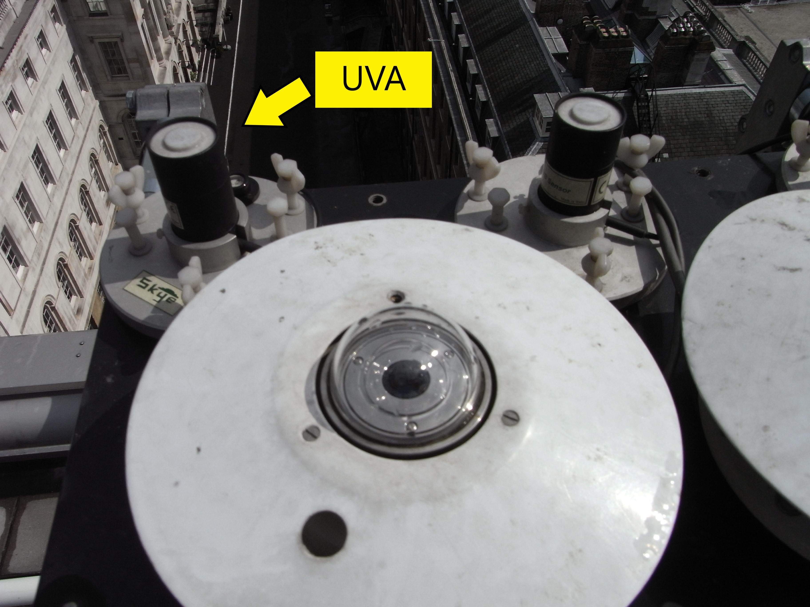
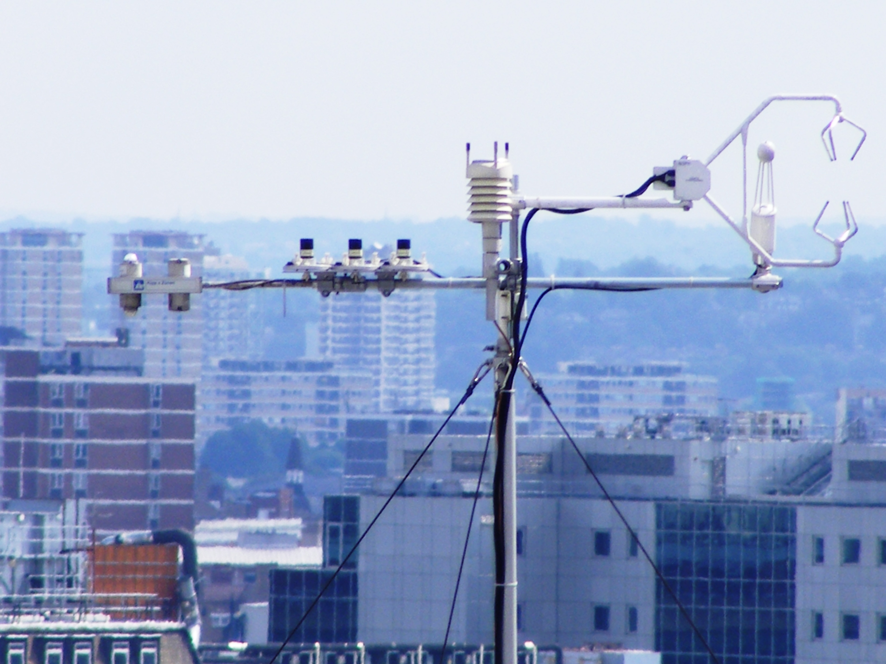
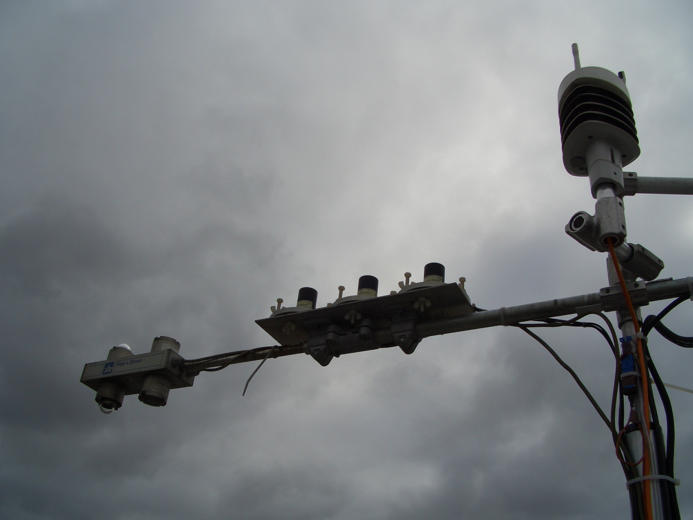
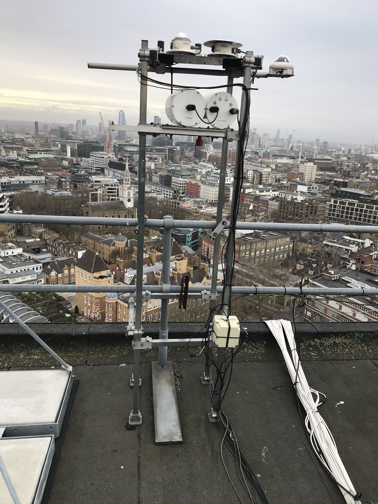

.. _UVA:

***
UVA
***

Introduction
############

.. include:: intros/UVA_intro.rst

Manufacturer and Model
######################

.. csv-table:: 
   :file: manufacturers/UVA_manufacturer.csv
   :header-rows: 1

Output definitions
##################

.. csv-table:: 
   :file: out_defs/UVA_out_defs.csv
   :header-rows: 1

Processing code
###############

Code used to process raw data:
https://github.com/Urban-Meteorology-Reading/Operations-Radiometers

Variables measured by instrument
################################

.. csv-table:: Variables measured - sorted alphabetically
   :file: variables/UVA_variables.csv
   :header-rows: 1

Serials
#######

.. csv-table:: 
   :file: serials/UVA_serials.csv
   :header-rows: 1

Deployments
###########

.. _060427921:

Serial number: 060427921
************************

.. csv-table:: 
   :file: deployments/UVA/060427921_deployments.csv
   :header-rows: 1

.. _020630656:

Serial number: 020630656
************************

.. csv-table:: 
   :file: deployments/UVA/020630656_deployments.csv
   :header-rows: 1

.. _060427922:

Serial number: 060427922
************************

.. csv-table:: 
   :file: deployments/UVA/060427922_deployments.csv
   :header-rows: 1

.. _020630655:

Serial number: 020630655
************************

.. csv-table:: 
   :file: deployments/UVA/020630655_deployments.csv
   :header-rows: 1

Photos
######

   Indicated by arrow at :ref:`KSS45W`. Unknown date between 2012-02-27 and  2016-04-14.

.. figure:: photos/UVA/tower-lowering-15092016_29409179500_o.jpg
   :width: 50 %

   At :ref:`KSSW` 15-09-2016.

   Atop tower at :ref:`KSK` 18-08-2009.

   At :ref:`KSS` 16-10-2009.

   Structure on which it was on top of at :ref:`IMU` 08-01-2020.

Supplementary information
#########################

.. list-table:: 
   :header-rows: 1

   * - Link
     - Title
     - Description
   * - :download:`UV sensors manual <manuals/UV_manual.pdf>`
     - UV sensors manual
     - From Skye.

Data acquisition
################

.. include:: ../../../data_acquisition/data_acquisition_default.rst

References
##########

#. Sun, T., Grimmond, C. S. E. and Ni, G.-H. (2016) How do green roofs mitigate urban thermal stress under heat waves? Journal of Geophysical Research: Atmospheres, 121 (10). pp. 5320-5335. ISSN 2169-8996 doi: https://doi.org/10.1002/2016JD024873

