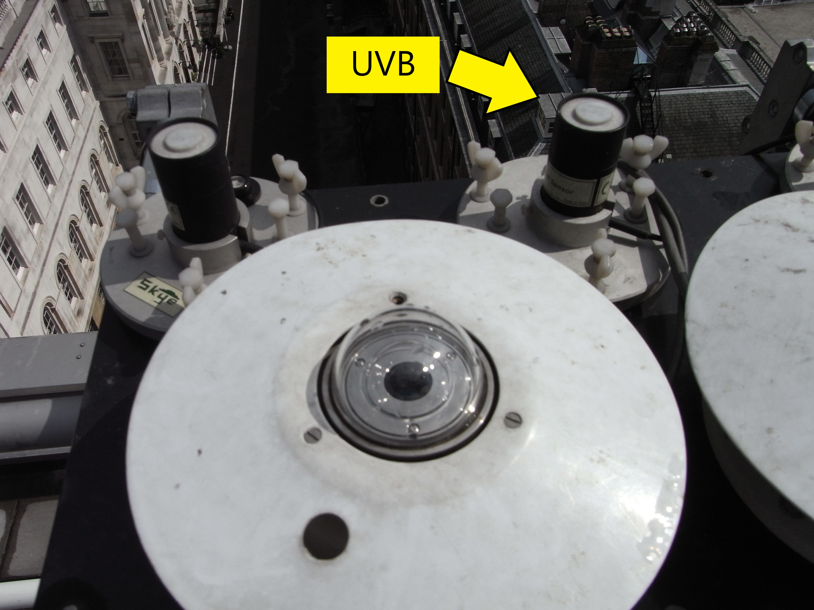
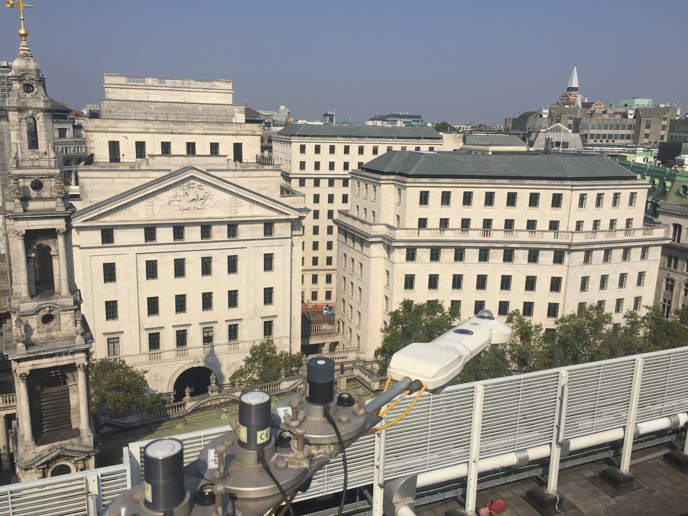
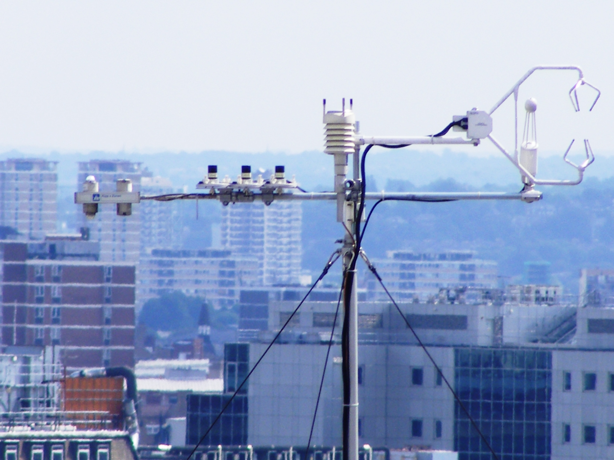

.. _UVB:

***
UVB
***

Introduction
############

.. include:: intros/UVB_intro.rst

Manufacturer and Model
######################

.. csv-table:: 
   :file: manufacturers/UVB_manufacturer.csv
   :header-rows: 1

Processing code
###############

Code used to process raw data:
https://github.com/Urban-Meteorology-Reading/Operations-Radiometers

Serials
#######

.. csv-table:: 
   :file: serials/UVB_serials.csv
   :header-rows: 1

Deployments
###########

.. _060427924:

Serial number: 060427924
************************

.. csv-table:: 
   :file: deployments/UVB/060427924_deployments.csv
   :header-rows: 1

.. _060427925:

Serial number: 060427925
************************

.. csv-table:: 
   :file: deployments/UVB/060427925_deployments.csv
   :header-rows: 1

.. _020630657:

Serial number: 020630657
************************

.. csv-table:: 
   :file: deployments/UVB/020630657_deployments.csv
   :header-rows: 1

.. _020630658:

Serial number: 020630658
************************

.. csv-table:: 
   :file: deployments/UVB/020630658_deployments.csv
   :header-rows: 1

Photos
######

   Indicated by arrow at :ref:`KSS45W`. Unknown date between 2012-02-27 and  2016-04-14.

   At :ref:`KSSW` 15-09-2016.

   Atop tower at :ref:`KSK` 18-08-2009.

.. figure:: photos/UVB/cimg4994_23705531841_o.jpg
   :width: 50 %

   At :ref:`KSS` 16-10-2009.

.. figure:: photos/UVB/08-01-2020(7)(1).JPEG
   :width: 50 %

   Structure on which it was on top of at :ref:`IMU` 08-01-2020.

Supplementary information
#########################

.. list-table:: 
   :header-rows: 1

   * - Link
     - Title
     - Description
   * - :download:`UV sensors manual <manuals/UV_manual.pdf>`
     - UV sensors manual
     - From Skye.

Data acquisition
################

.. include:: ../../../data_acquisition/data_acquisition_default.rst

