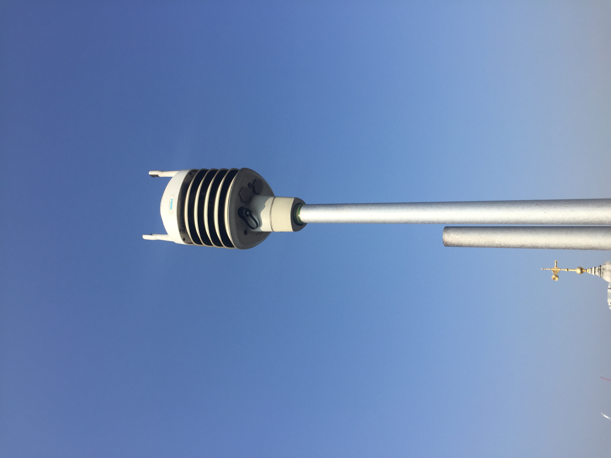
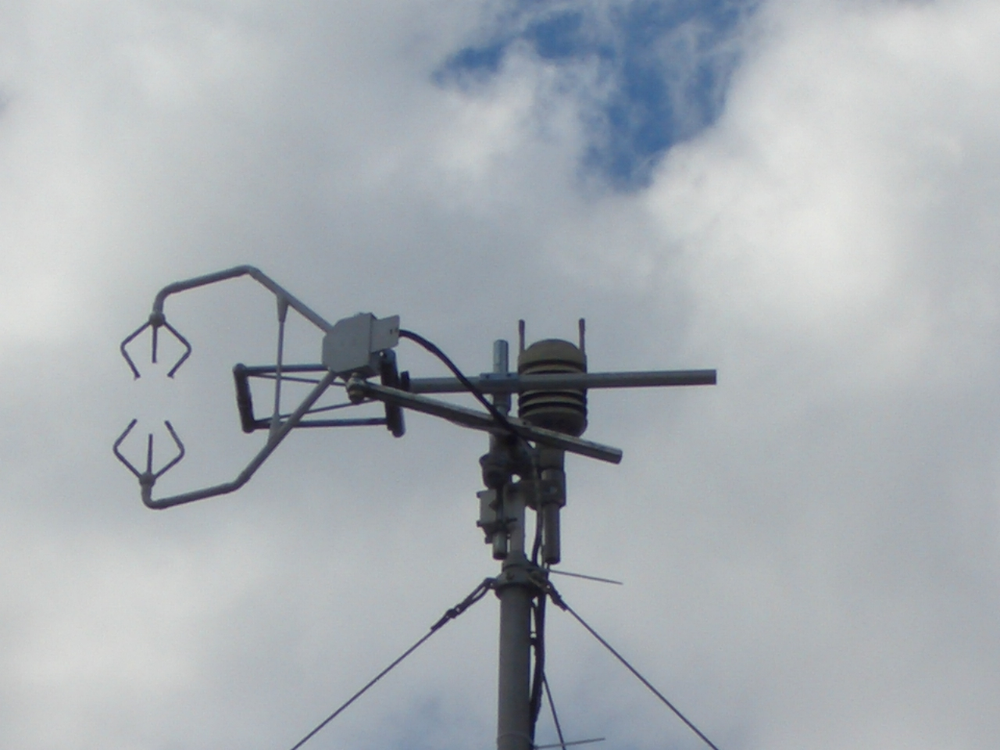
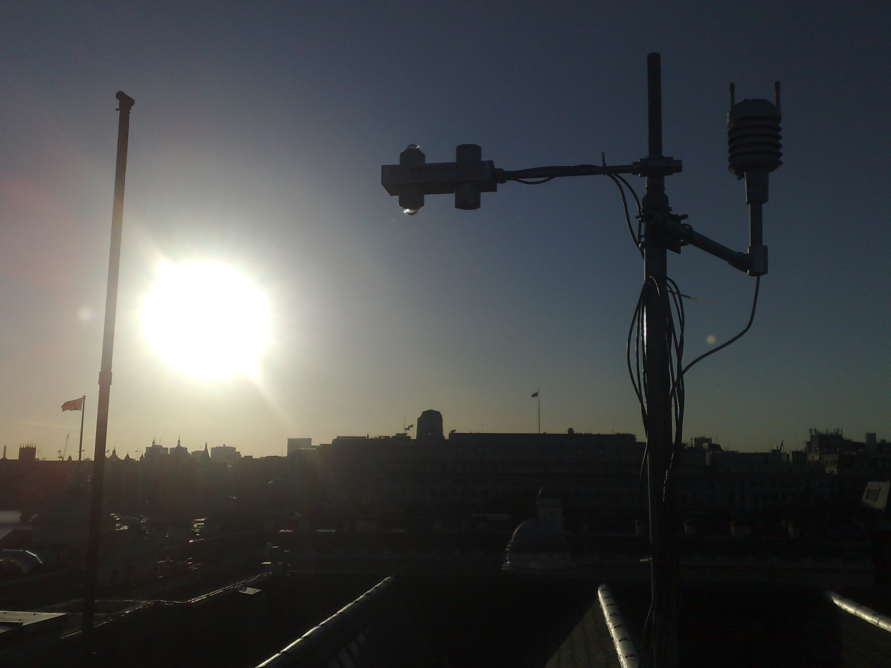
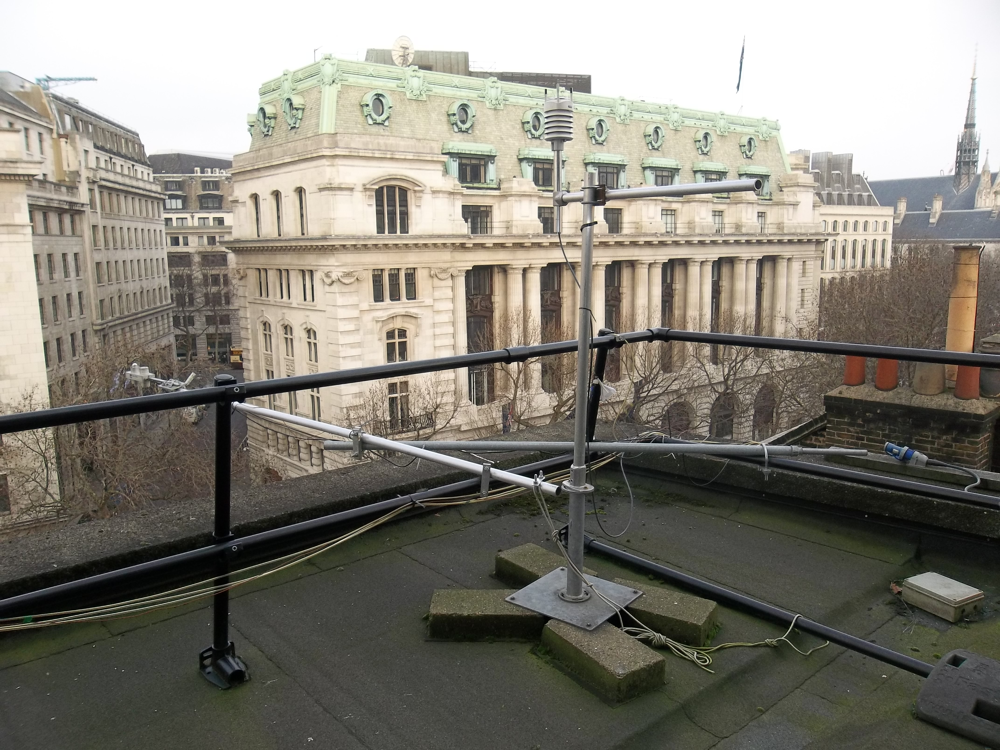
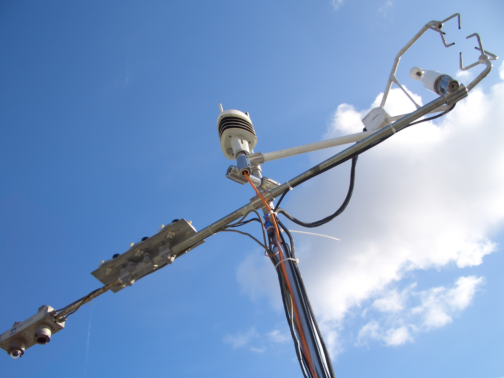
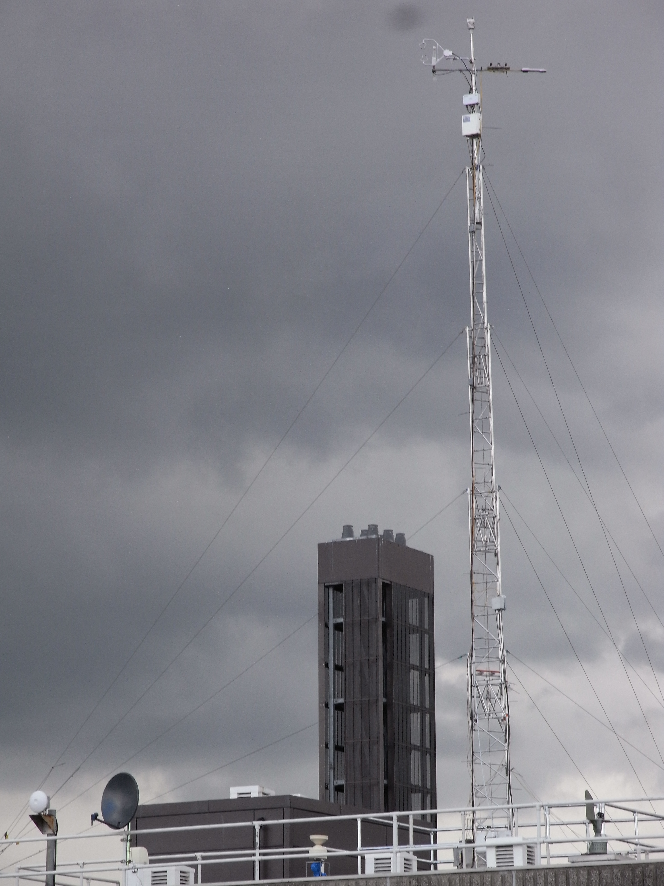
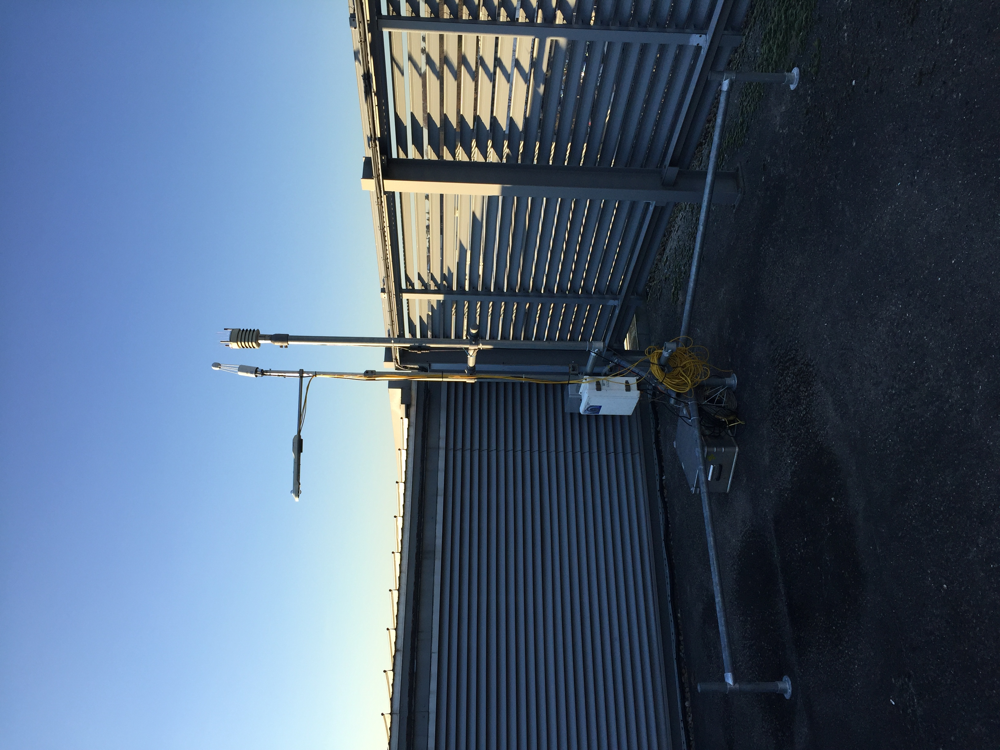

.. note::
   The instrument type for this instrument should be :ref:`Weather station`.

.. _WXT510:

******
WXT510
******

Introduction
############

.. include:: intros/WXT510_intro.rst

Manufacturer and Model
######################

.. csv-table:: 
   :file: manufacturers/WXT510_manufacturer.csv
   :header-rows: 1

Output definitions
##################

.. csv-table:: 
   :file: out_defs/WXT510_out_defs.csv
   :header-rows: 1

Variables measured by instrument
################################

.. csv-table:: Variables measured - sorted alphabetically
   :file: variables/WXT510_variables.csv
   :header-rows: 1

Serials
#######

.. csv-table:: 
   :file: serials/WXT510_serials.csv
   :header-rows: 1

Deployments
###########

.. _B084006:

Serial number: B084006
**********************

.. csv-table:: 
   :file: deployments/WXT510/B084006_deployments.csv
   :header-rows: 1

.. _B0840003:

Serial number: B0840003
***********************

.. csv-table:: 
   :file: deployments/WXT510/B0840003_deployments.csv
   :header-rows: 1

.. _E1620004:

Serial number: E1620004
***********************

.. csv-table:: 
   :file: deployments/WXT510/E1620004_deployments.csv
   :header-rows: 1

.. _B084005:

Serial number: B084005
**********************

.. csv-table:: 
   :file: deployments/WXT510/B084005_deployments.csv
   :header-rows: 1

.. _B0840006-G0630168:

Serial number: B0840006-G0630168
********************************

.. csv-table:: 
   :file: deployments/WXT510/B0840006-G0630168_deployments.csv
   :header-rows: 1

.. _E1620005:

Serial number: E1620005
***********************

.. csv-table:: 
   :file: deployments/WXT510/E1620005_deployments.csv
   :header-rows: 1

Photos
######

   At :ref:`KSSW` 15-09-2016.

   At :ref:`KSK` 20-07-2010.

   At :ref:`KSK` 24-01-2008.

   At :ref:`KSNW` 11-01-2013.

   At :ref:`KSS` (centre) 16-10-2009.

   Atop tower at :ref:`KSSW`. Unknown date between 26-03-2012 and 13-06-2017.

   At :ref:`SHU` 20-01-2017.

Supplementary information
#########################

.. list-table:: 
   :header-rows: 1

   * - Link
     - Title
     - Description
   * - :download:`WXT510 manual <manuals/WXT510_brochure.pdf>`
     - WXT510 manual
     - From Vaisala

Data acquisition
################

.. include:: ../../../data_acquisition/data_acquisition_default.rst

References
##########

#. Hertwig, D., Grimmond, S., Hendry, M. A., Saunders, B., Wang, Z., Jeoffrion, M., Vidale, P. L., McGuire, P. C., Bohnenstengel, S. I., Ward, H. C. and Kotthaus, S. (2020) Urban signals in high-resolution weather and climate simulations: role of urban land-surface characterisation. Theoretical and Applied Climatology, 142. pp. 701-728. ISSN 0177-798X doi: https://doi.org/10.1007/s00704-020-03294-1
#. Ward, H. C., Kotthaus, S., Grimmond, C. S. B., Bjorkegren, A., Wilkinson, M., Morrison, W. T. J., Evans, J. G., Morison, J. I. L. and Iamarino, M. (2015) Effects of urban density on carbon dioxide exchanges: observations of dense urban, suburban and woodland areas of southern England. Environmental Pollution, 198. pp. 186-200. ISSN 0269-7491 doi: https://doi.org/10.1016/j.envpol.2014.12.031
#. Kotthaus, S. and Grimmond, C. S. B. (2014) Energy exchange in a dense urban environment – part I: temporal variability of long-term observations in central London. Urban Climate, 10 (2). pp. 261-280. ISSN 2212-0955 doi: https://doi.org/10.1016/j.uclim.2013.10.002
#. Magliulo, V., Toscano, P., Grimmond, C. S. B., Kotthaus, S., J�rvi, L., Set�l�, H., Lindberg, F., Vogt, R., Staszewski, T., Bubak, A., Synnefa, A. and Santamouris, M. (2014) Environmental measurements in BRIDGE case studies. In: Chrysoulakis, N., de Castro, E. A. and Moors, E. J. (eds.) Understanding Urban Metabolism. Routledge, pp. 45-57. ISBN 9780415835114
#. Ward, H. C., Evans, J. G. and Grimmond, C. S. B. (2014) Multi-scale sensible heat fluxes in the urban environment from large aperture scintillometry and eddy covariance. Boundary-Layer Meteorology, 152 (1). pp. 65-89. ISSN 0006-8314 doi: https://doi.org/10.1007/s10546-014-9916-4
#. Wood, C. R., Pauscher, L., Ward, H. C., Kotthaus, S., Barlow, J., Gouvea, M., Lane, S. E. and Grimmond, C. S. B. (2013) Wind observations above an urban river using a new lidar technique, scintillometry and anemometry. Science of the Total Environment, 442. pp. 527-533. ISSN 0048-9697 doi: https://doi.org/10.1016/j.scitotenv.2012.10.061
#. Loridan, T., Lindberg, F., Jorba, O., Kotthaus, S., Grossman-Clarke, S. and Grimmond, C. S. B. (2013) High resolution simulation of the variability of surface energy balance fluxes across central London with urban zones for energy partitioning. Boundary-Layer Meteorology, 147 (3). pp. 493-523. ISSN 0006-8314 doi: https://doi.org/10.1007/s10546-013-9797-y
#. Ward, H. C., Evans, J. G. and Grimmond, C. S. B. (2013) Multi-season eddy covariance observations of energy, water and carbon fluxes over a suburban area in Swindon, UK. Atmospheric Chemistry and Physics, 13. pp. 4645-4666. ISSN 1680-7316 doi: https://doi.org/10.5194/acp-13-4645-2013
#. Kotthaus, S. and Grimmond, C. S. B. (2012) Identification of micro-scale anthropogenic CO2, heat and moisture sources – processing eddy covariance fluxes for a dense urban environment. Atmospheric Environment, 57. pp. 301-316. ISSN 1352-2310 doi: https://doi.org/10.1016/j.atmosenv.2012.04.024
#. Helfter, C., Famulari, D., Phillips, G. J., Barlow, J. F., Wood, C., Grimmond, C. S. B. and Nemitz, E. (2011) Controls of carbon dioxide concentrations and fluxes above central London. Atmospheric Chemistry and Physics, 11 (5). pp. 1913-1928. ISSN 1680-7316 doi: https://doi.org/10.5194/acp-11-1913-2011
#. Loridan, T., Grimmond, C.S.B., Offerle, B. D., Young, D. T., Smith, T. E. L., J�rvi, L. and Lindberg, F. (2011) Local-scale urban meteorological parameterization scheme (LUMPS): longwave radiation parameterization and seasonality-related developments. Journal of Applied Meteorology and Climatology, 50 (1). pp. 185-202. ISSN 1558-8424 doi: https://doi.org/10.1175/2010JAMC2474.1

