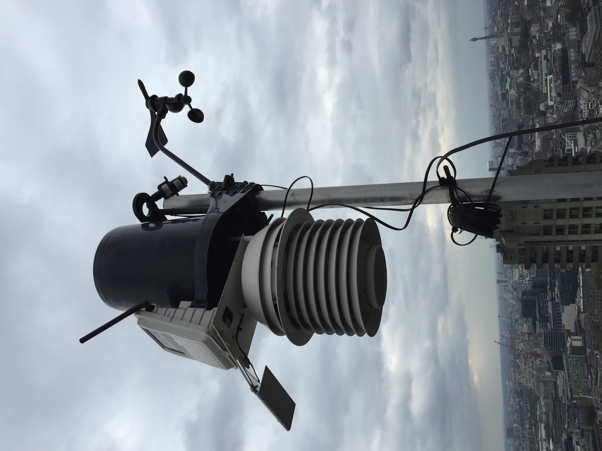
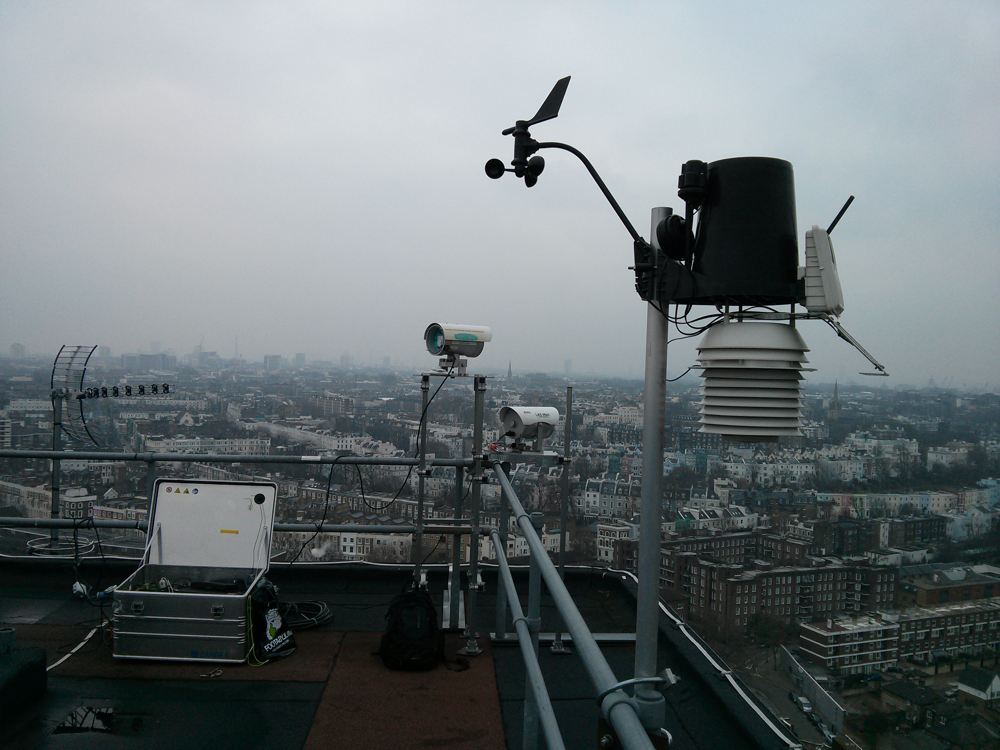
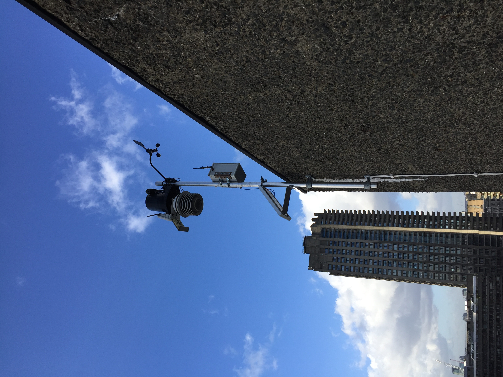

.. _DAVIS:

*****
DAVIS
*****

Introduction
############

.. include:: intros/DAVIS_intro.rst

Manufacturer and Model
######################

.. csv-table:: 
   :file: manufacturers/DAVIS_manufacturer.csv
   :header-rows: 1

Output definitions
##################

.. csv-table:: 
   :file: out_defs/DAVIS_out_defs.csv
   :header-rows: 1

Variables measured by instrument
################################

.. csv-table:: Variables measured - sorted alphabetically
   :file: variables/DAVIS_variables.csv
   :header-rows: 1

Serials
#######

.. csv-table:: 
   :file: serials/DAVIS_serials.csv
   :header-rows: 1

Deployments
###########

.. _AK130521018:

Serial number: AK130521018
**************************

.. csv-table:: 
   :file: deployments/DAVIS/AK130521018_deployments.csv
   :header-rows: 1

.. _AK130521017:

Serial number: AK130521017
**************************

.. csv-table:: 
   :file: deployments/DAVIS/AK130521017_deployments.csv
   :header-rows: 1

.. _BE181023018:

Serial number: BE181023018
**************************

.. csv-table:: 
   :file: deployments/DAVIS/BE181023018_deployments.csv
   :header-rows: 1

.. _AJ130401024:

Serial number: AJ130401024
**************************

.. csv-table:: 
   :file: deployments/DAVIS/AJ130401024_deployments.csv
   :header-rows: 1

.. _A00422A002:

Serial number: A00422A002
*************************

.. csv-table:: 
   :file: deployments/DAVIS/A00422A002_deployments.csv
   :header-rows: 1

.. _AZ170310004:

Serial number: AZ170310004
**************************

.. csv-table:: 
   :file: deployments/DAVIS/AZ170310004_deployments.csv
   :header-rows: 1

.. _A00422A003:

Serial number: A00422A003
*************************

.. csv-table:: 
   :file: deployments/DAVIS/A00422A003_deployments.csv
   :header-rows: 1

Photos
######

   At :ref:`BCT` 15-10-2015.

   At :ref:`BFCL` 03-02-2014.

   At :ref:`NGT` 12-02-2013.

   At :ref:`BMH` 02-02-2016.

   At :ref:`IML` 31-07-2013.

   At :ref:`IMU` 04-11-2020.

Supplementary information
#########################

.. list-table:: 
   :header-rows: 1

   * - Link
     - Title
     - Description
   * - :download:`Davis Vantage Pro manual <manuals/DAVIS_manual.pdf>`
     - Davis Vantage Pro manual
     - From Davis instruments

Data acquisition
################

.. include:: ../../../data_acquisition/data_acquisition_default.rst

References
##########

#. Morrison, W., Kotthaus, S. and Grimmond, S. (2021) Urban surface temperature observations from ground-based thermography: intra- and inter-facet variability. Urban Climate, 35. 100748. ISSN 2212-0955 doi: https://doi.org/10.1016/j.uclim.2020.100748
#. Gabey, A. M., Grimmond, C. S. B. and Capel-Timms, I. (2019) Anthropogenic heat flux: advisable spatial resolutions when input data are scarce. Theoretical and Applied Climatology, 135 (1-2). pp. 791-807. ISSN 1434-4483 doi: https://doi.org/10.1007/s00704-018-2367-y
#. Crawford, B., Grimmond, C. S. B., Ward, H. C., Morrison, W. and Kotthaus, S. (2017) Spatial and temporal patterns of surface-atmosphere energy exchange in a dense urban environment using scintillometry. Quarterly Journal of the Royal Meteorological Society, 143 (703). pp. 817-833. ISSN 1477-870X doi: https://doi.org/10.1002/qj.2967

