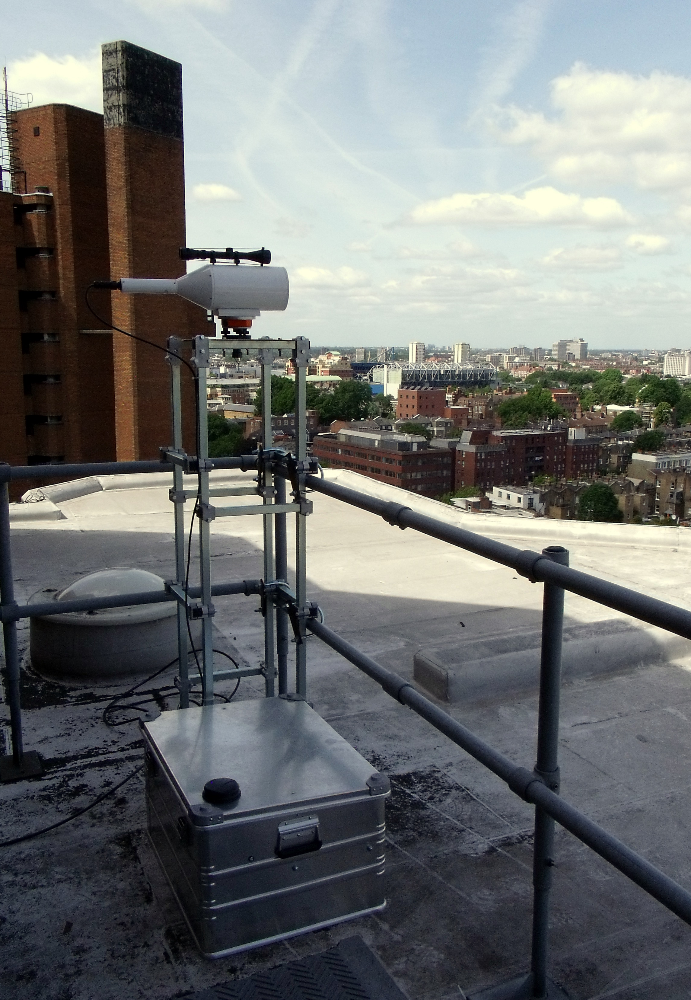
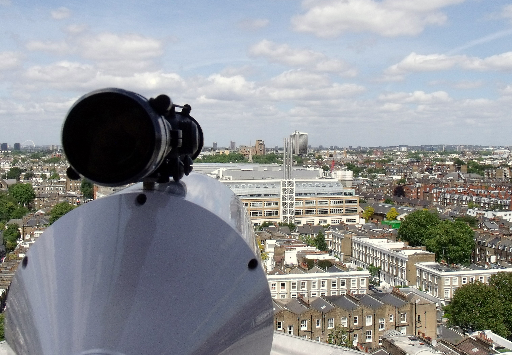
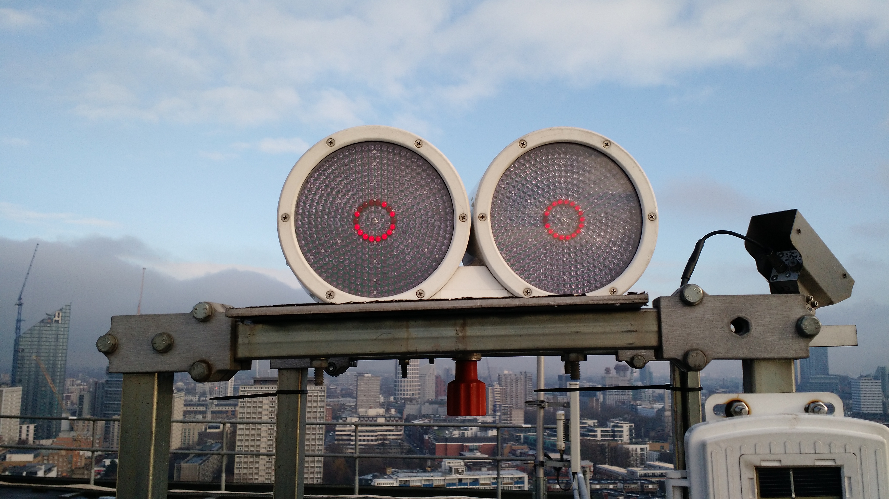
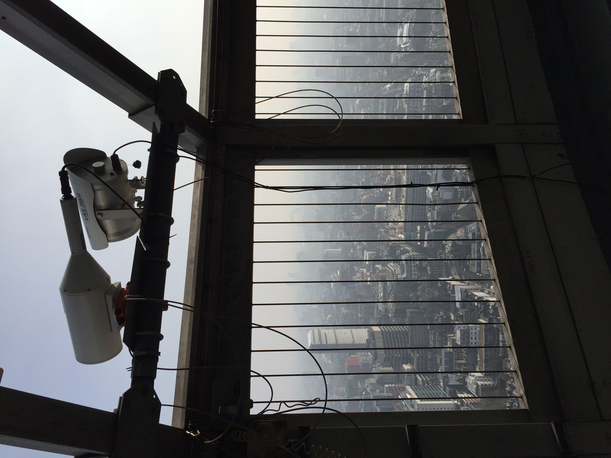
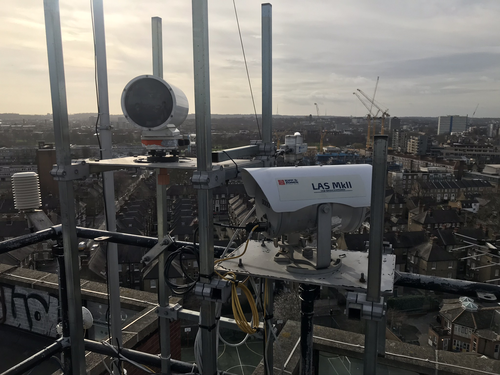

.. _BLS:

***
BLS
***

Introduction
############

.. include:: intros/BLS_intro.rst

Manufacturer and Model
######################

.. csv-table:: 
   :file: manufacturers/BLS_manufacturer.csv
   :header-rows: 1

Output definitions
##################

.. csv-table:: 
   :file: out_defs/BLS_out_defs.csv
   :header-rows: 1

Processing code
###############

Code used to process raw data:
https://github.com/Urban-Meteorology-Reading/Operations-LAS

Variables measured by instrument
################################

.. csv-table:: Variables measured - sorted alphabetically
   :file: variables/BLS_variables.csv
   :header-rows: 1

Serials
#######

.. csv-table:: 
   :file: serials/BLS_serials.csv
   :header-rows: 1

Deployments
###########

.. _T-E-0470:

T-E-0470
********

.. csv-table:: 
   :file: deployments/BLS/T-E-0470_deployments.csv
   :header-rows: 1

Photos
######

   BLS900 reciever at :ref:`NDT` 24/05/2011

   View of BLS900 at :ref:`NDT` towards :ref:`NTT` 24/05/2011

   BLS transmitter at :ref:`IMU` 06/01/2016

   Reciever (left) at :ref:`BTT` 11/02/2016

   Reciever (left) at :ref:`SWT` 18/02/2020

Supplementary information
#########################

Data acquisition
################

.. include:: ../../data_acquisition/data_acquisition_default.rst

References
##########

#. Squires, F. A., Nemitz, E., Langford, B., Wild, O., Drysdale, W. S., Acton, W. J. F., Fu, P., Grimmond, C. S. B., Hamilton, J. F., Hewitt, C. N., Hollaway, M., Kotthaus, S., Lee, J., Metzger, S., Pingintha-Durden, N., Shaw, M., Vaughan, A. R., Wang, X., Wu, R., Zhang, Q. and Zhang, Y. (2020) Measurements of traffic-dominated pollutant emissions in a Chinese megacity. Atmospheric Chemistry and Physics, 20 (14). pp. 8737-8761. ISSN 1680-7316 doi: https://doi.org/10.5194/acp-20-8737-2020
#. Hertwig, D., Gough, H. L., Grimmond, S., Barlow, J. F., Kent, C. W., Lin, W. E., Robins, A. G. and Hayden, P. (2019) Wake characteristics of tall buildings in a realistic urban Canopy. Boundary-Layer Meteorology, 172 (2). pp. 239-270. ISSN 1573-1472 doi: https://doi.org/10.1007/s10546-019-00450-7
#. Shi, Z., Vu, T., Kotthaus, S., Harrison, R. M., Grimmond, S., Yue, S., Zhu, T., Lee, J., Han, Y., Demuzere, M., Dunmore, R. E., Ren, L., Liu, D., Wang, Y., Wild, O., Allan, J., Acton, W. J., Barlow, J., Barratt, B., Beddows, D., Bloss, W. J., Calzolai, G., Carruthers, D., Carslaw, D. C., Chan, Q., Chatzidiakou, L., Chen, Y., Crilley, L., Coe, H., Dai, T., Doherty, R., Duan, F., Fu, P., Ge, B., Ge, M., Guan, D., Hamilton, J. F., He, K., Heal, M., Heard, D., Hewitt, C. N., Hollaway, M., Hu, M., Ji, D., Jiang, X., Jones, R., Kalberer, M., Kelly, F. J., Kramer, L., Langford, B., Lin, C., Lewis, A. C., Li, J., Li, W., Liu, H., Liu, J., Loh, M., Lu, K., Lucarelli, F., Mann, G., McFiggans, G., Miller, M. R., Mills, G., Monk, P., Nemitz, E., O&amp;apos;Connor, F., Ouyang, B., Palmer, P. I., Percival, C., Popoola, O., Reeves, C., Rickard, A. R., Shao, L., Shi, G., Spracklen, D., Stevenson, D., Sun, Y., Sun, Z., Tao, S., Tong, S., Wang, Q., Wang, W., Wang, X., Wang, X., Wang, Z., Wei, L., Whalley, L., Wu, X., Wu, Z., Xie, P., Yang, F., Zhang, Q., Zhang, Y., Zhang, Y. and Zheng, M. (2019) In-depth study of air pollution sources and processes within Beijing and its surrounding region (APHH-Beijing). Atmospheric Chemistry and Physics (11). pp. 7519-7546. ISSN 1680-7316 doi: https://doi.org/10.5194/acp-19-7519-2019
#. Liang, X., Miao, S., Li, J., Bornstein, R., Zhang, X., Gao, Y., Cao, X., Chen, F., Cheng, Z., Clements, C., Dabberdt, W., Ding, A., Ding, D., Dou, J. J., Dou, J. X., Dou, Y., Grimmond, C. S. B., Gonzalez-Cruz, J., He, J., Huang, M., Huang, X., Ju, S., Li, Q., Niyogi, D., Quan, J., Sun, J., Sun, J. Z., Yu, M., Zhang, J., Zhang, Y., Zhao, X., Zheng, Z. and Zhou, M. (2018) SURF: understanding and predicting urban convection and haze. Bulletin of the American Meteorological Society, 99 (7). pp. 1391-1413. ISSN 0003-0007 doi: https://doi.org/10.1175/BAMS-D-16-0178.1
#. Pain, K., Black, D., Blower, J., Grimmond, S., Hunt, A., Milcheva, S., Crawford, B., Dale, N., Doolin, S., Manna, S., Shi, S. and Pugh, R., (2018) Supporting smart urban growth: successful investing in density. Report. Urban Land Institute
#. Peng, J., Grimmond, C. S. B., Fu, X. S., Chang, Y. Y., Zhang, G., Guo, J., Tang, C. Y., Gao, J., Xu, X. D. and Tan, J. G. (2017) Ceilometer based analysis of Shanghai’s boundary layer height (under rain and fog free conditions). Journal of Atmospheric and Oceanic Technology, 34 (4). pp. 749-764. ISSN 1520-0426 doi: https://doi.org/10.1175/JTECH-D-16-0132.1
#. Crawford, B., Grimmond, C. S. B., Ward, H. C., Morrison, W. and Kotthaus, S. (2017) Spatial and temporal patterns of surface-atmosphere energy exchange in a dense urban environment using scintillometry. Quarterly Journal of the Royal Meteorological Society, 143 (703). pp. 817-833. ISSN 1477-870X doi: https://doi.org/10.1002/qj.2967
#. Karsisto, P., Fortelius, C., Demuzere, M., Grimmond, C. S. B., Oleson, K. W., Kouznetsov, R., Masson, V. and J�rvi, L. (2016) Seasonal surface urban energy balance and wintertime stability simulated using three land-surface models in the high-latitude city Helsinki. Quarterly Journal of the Royal Meteorological Society, 142 (694). pp. 401-417. ISSN 1477-870X doi: https://doi.org/10.1002/qj.2659
#. Ward, H. C., Evans, J. G., Grimmond, C. S. B. and Bradford, J. (2015) Infrared and millimetre-wave scintillometry in the suburban
 environment – Part 1: Structure parameters. Atmospheric Measurement Techniques, 8 (3). pp. 1385-1405. ISSN 1867-8548 doi: https://doi.org/10.5194/amt-8-1385-2015
#. Ward, H. G., Evans, J. G. and Grimmond, C. S. B. (2015) Infrared and millimetre-wave scintillometry in the suburban
 environment – Part 2: Large-area sensible and latent heat fluxes. Atmospheric Measurement Techniques, 8 (3). pp. 1407-1424. ISSN 1867-8548 doi: https://doi.org/10.5194/amt-8-1407-2015
#. Font, A., Grimmond, C. S. B., Kotthaus, S., Morgu�, J. -A., Stockdale, C., O'Connor, E., Priestman, M. and Barratt, B. (2015) Daytime CO2 urban surface fluxes from airborne measurements, eddy-covariance observations and emissions inventory in Greater London. Environmental Pollution, 196. pp. 98-106. ISSN 0269-7491 doi: https://doi.org/10.1016/j.envpol.2014.10.001
#. Ward, H. C., Evans, J. G. and Grimmond, C. S. B. (2014) Multi-scale sensible heat fluxes in the urban environment from large aperture scintillometry and eddy covariance. Boundary-Layer Meteorology, 152 (1). pp. 65-89. ISSN 0006-8314 doi: https://doi.org/10.1007/s10546-014-9916-4
#. Wood, C. R., Pauscher, L., Ward, H. C., Kotthaus, S., Barlow, J., Gouvea, M., Lane, S. E. and Grimmond, C. S. B. (2013) Wind observations above an urban river using a new lidar technique, scintillometry and anemometry. Science of the Total Environment, 442. pp. 527-533. ISSN 0048-9697 doi: https://doi.org/10.1016/j.scitotenv.2012.10.061
#. Best, M. J., Pryor, M., Clark, D. B., Rooney, G. G., Essery, R. L. H., Ménard, C. B., Edwards, J. M., Hendry, M. A., Porson, A., Gedney, N., Mercado, L. M., Sitch, S., Blyth, E., Boucher, O., Cox, P. M., Grimmond, C.S.B. and Harding, R. J. (2011) The Joint UK Land Environment Simulator (JULES), model description – part 1: energy and water fluxes. Geoscientific Model Development, 4 (1). pp. 677-699. ISSN 1991-9603 doi: https://doi.org/10.5194/gmd-4-677-2011
#. Oleson, K.W., Bonan, G.B., Feddema, J., Vertenstein, M. and Grimmond, C.S.B. (2008) An urban parameterization for a global climate model. Part I: Formulation and evaluation for two cities. Journal of Applied Meteorology and Climatology, 47 (4). pp. 1038-1060. ISSN 1558-8432 doi: https://doi.org/10.1175/2007JAMC1597.1

