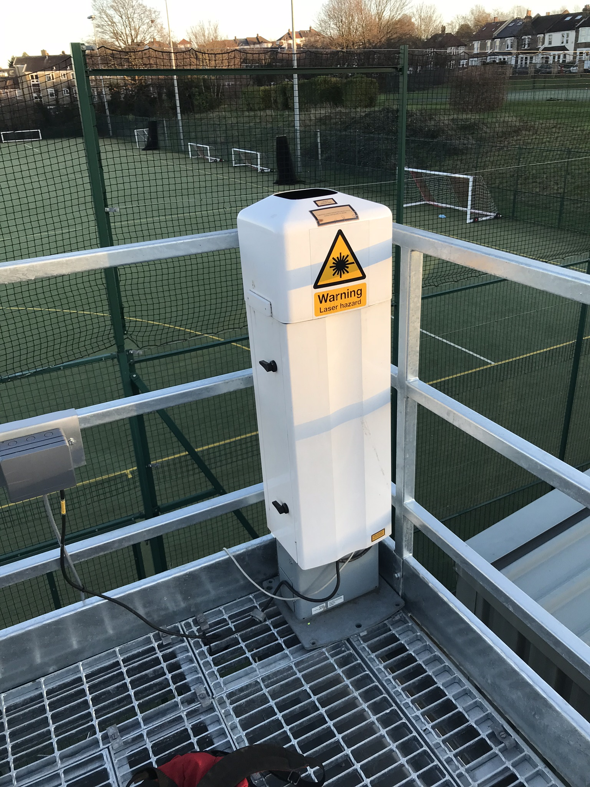

.. _CL31:

****
CL31
****

Introduction
############

.. include:: intros/CL31_intro.rst

Manufacturer and Model
######################

.. csv-table:: 
   :file: manufacturers/CL31_manufacturer.csv
   :header-rows: 1

Output definitions
##################

.. csv-table:: 
   :file: out_defs/CL31_out_defs.csv
   :header-rows: 1

Processing code
###############

Code used to process raw data:
https://github.com/Urban-Meteorology-Reading/Operations-CEIL

Variables measured by instrument
################################

.. csv-table:: Variables measured - sorted alphabetically
   :file: variables/CL31_variables.csv
   :header-rows: 1

Serials
#######

.. csv-table:: 
   :file: serials/CL31_serials.csv
   :header-rows: 1

Deployments
###########

.. _103150004:

103150004
*********

.. csv-table:: 
   :file: deployments/CL31/103150004_deployments.csv
   :header-rows: 1

.. _B20201:

B20201
******

.. csv-table:: 
   :file: deployments/CL31/B20201_deployments.csv
   :header-rows: 1

.. _B20202:

B20202
******

.. csv-table:: 
   :file: deployments/CL31/B20202_deployments.csv
   :header-rows: 1

.. _F2730001:

F2730001
********

.. csv-table:: 
   :file: deployments/CL31/F2730001_deployments.csv
   :header-rows: 1

.. _F2730002:

F2730002
********

.. csv-table:: 
   :file: deployments/CL31/F2730002_deployments.csv
   :header-rows: 1

.. _J1720003:

J1720003
********

.. csv-table:: 
   :file: deployments/CL31/J1720003_deployments.csv
   :header-rows: 1

.. _WMO03672:

WMO03672
********

.. csv-table:: 
   :file: deployments/CL31/WMO03672_deployments.csv
   :header-rows: 1

Photos
######

   CL31 at :ref:`HOP` 12/12/2018

Supplementary information
#########################

.. list-table:: 
   :header-rows: 1

   * - Link
     - Title
     - Description
   * - :download:`CL31 user guide <../../supplementary_info/manuals/CL31/CL31_manual.pdf>`
     - CL31 user guide
     - Manual provided by Vaisala

Data acquisition
################

References
##########

