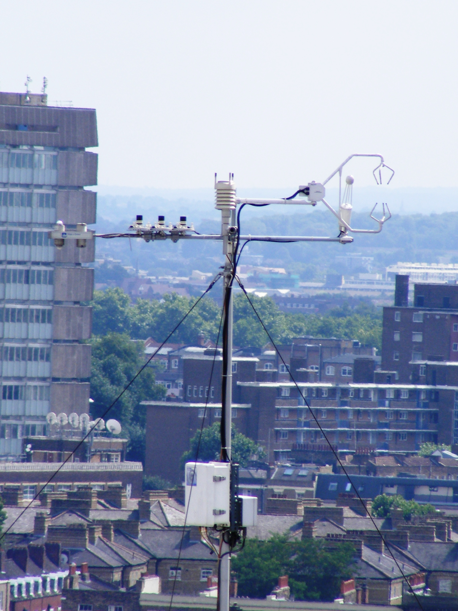
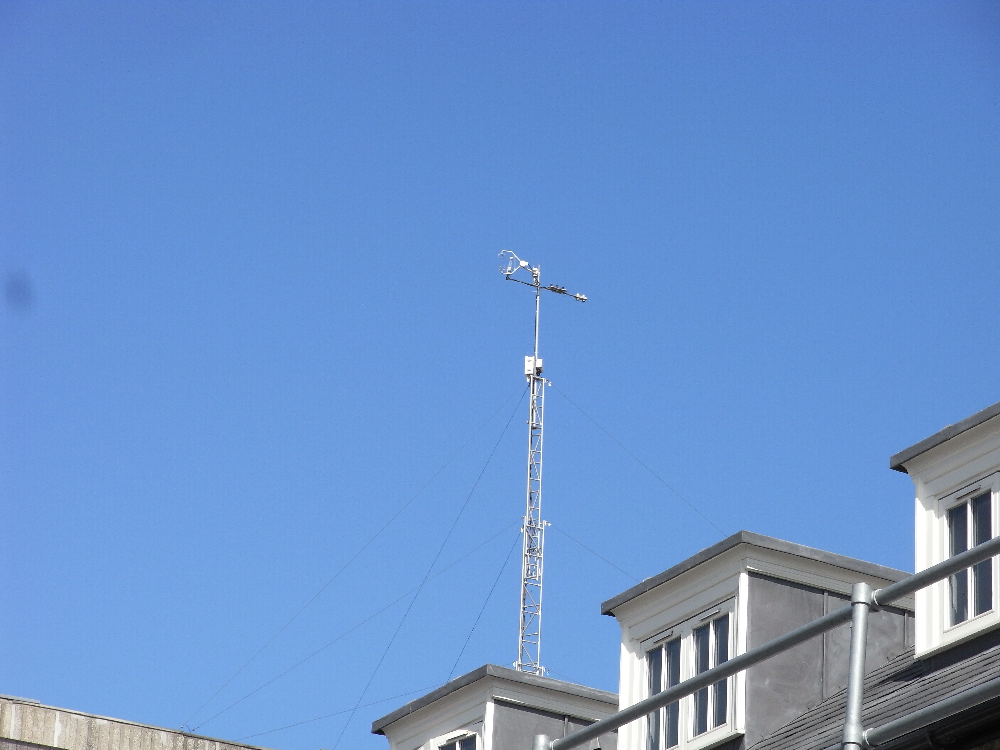
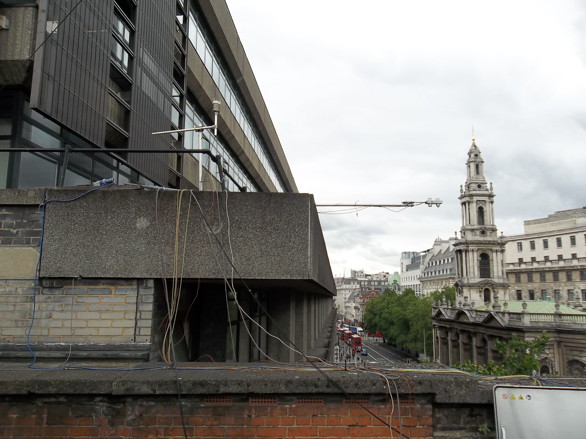
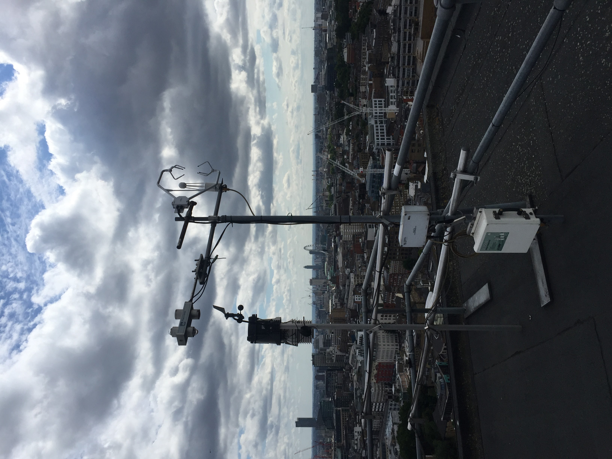
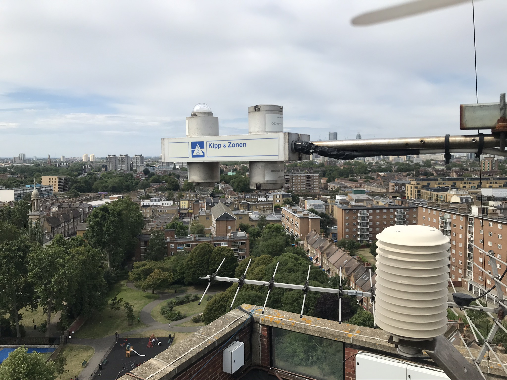

.. _CNR1:

****
CNR1
****

Introduction
############

.. include:: intros/CNR1_intro.rst

Manufacturer and Model
######################

.. csv-table:: 
   :file: manufacturers/CNR1_manufacturer.csv
   :header-rows: 1

Output definitions
##################

.. csv-table:: 
   :file: out_defs/CNR1_out_defs.csv
   :header-rows: 1

Processing code
###############

Code used to process raw data:
https://github.com/Urban-Meteorology-Reading/Operations-Radiometers

Variables measured by instrument
################################

.. csv-table:: Variables measured - sorted alphabetically
   :file: variables/CNR1_variables.csv
   :header-rows: 1

Serials
#######

.. csv-table:: 
   :file: serials/CNR1_serials.csv
   :header-rows: 1

Deployments
###########

.. _000220:

000220
******

.. csv-table:: 
   :file: deployments/CNR1/000220_deployments.csv
   :header-rows: 1

.. _00022123:

00022123
********

.. csv-table:: 
   :file: deployments/CNR1/00022123_deployments.csv
   :header-rows: 1

Photos
######

   CNR1 (leftmost instrument) at :ref:`KSK` 18/08/2009 

   On top of tower at :ref:`KSS` 08/04/2011

   At :ref:`KSNW` 05/07/2015

   At :ref:`IMU` 21/07/2017

   At :ref:`SWT` 23/07/2020

Supplementary information
#########################

Data acquisition
################

.. include:: ../../data_acquisition/data_acquisition_default.rst

References
##########

