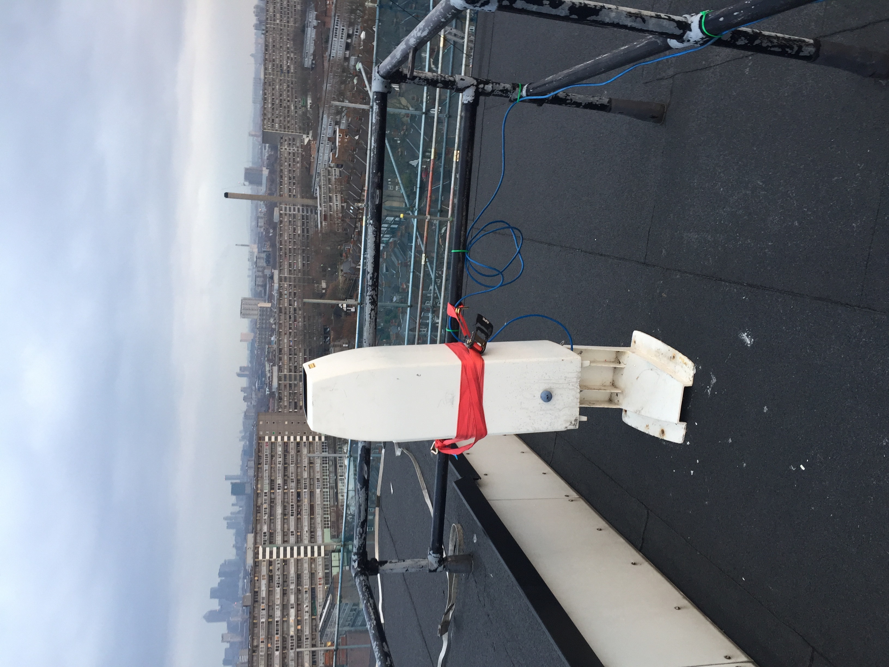

.. _CT25K:

*****
CT25K
*****

Introduction
############

.. include:: intros/CT25K_intro.rst

Manufacturer and Model
######################

.. csv-table:: 
   :file: manufacturers/CT25K_manufacturer.csv
   :header-rows: 1

Output definitions
##################

.. csv-table:: 
   :file: out_defs/CT25K_out_defs.csv
   :header-rows: 1

Processing code
###############

Code used to process raw data:
https://github.com/Urban-Meteorology-Reading/Operations-CEIL

Variables measured by instrument
################################

.. csv-table:: Variables measured - sorted alphabetically
   :file: variables/CT25K_variables.csv
   :header-rows: 1

Serials
#######

.. csv-table:: 
   :file: serials/CT25K_serials.csv
   :header-rows: 1

Deployments
###########

.. _LCBR022:

LCBR022
*******

.. csv-table:: 
   :file: deployments/CT25K/LCBR022_deployments.csv
   :header-rows: 1

.. _LCBR045:

LCBR045
*******

.. csv-table:: 
   :file: deployments/CT25K/LCBR045_deployments.csv
   :header-rows: 1

.. _LCBR327:

LCBR327
*******

.. csv-table:: 
   :file: deployments/CT25K/LCBR327_deployments.csv
   :header-rows: 1

.. _LCBRV010:

LCBRV010
********

.. csv-table:: 
   :file: deployments/CT25K/LCBRV010_deployments.csv
   :header-rows: 1

.. _LCBRV017:

LCBRV017
********

.. csv-table:: 
   :file: deployments/CT25K/LCBRV017_deployments.csv
   :header-rows: 1

.. _LCBRV098:

LCBRV098
********

.. csv-table:: 
   :file: deployments/CT25K/LCBRV098_deployments.csv
   :header-rows: 1

.. _LCBRV152:

LCBRV152
********

.. csv-table:: 
   :file: deployments/CT25K/LCBRV152_deployments.csv
   :header-rows: 1

.. _LCBRV312:

LCBRV312
********

.. csv-table:: 
   :file: deployments/CT25K/LCBRV312_deployments.csv
   :header-rows: 1

.. _LCBRV559:

LCBRV559
********

.. csv-table:: 
   :file: deployments/CT25K/LCBRV559_deployments.csv
   :header-rows: 1

Photos
######

   CT25K at :ref:`SWT` 15/12/2016

.. figure:: photos/CT25K/27246847345_59135275cb_o.jpg
   :scale: 10

   CT25K at :ref:`RGS`  25/05/2016 

Supplementary information
#########################

.. list-table:: 
   :header-rows: 1

   * - Link
     - Title
     - Description
   * - :download:`CT25K user manual <manuals/CT25K_manual.pdf>`
     - CT25K user manual
     - Manual provided by Vaisala

Data acquisition
################

.. include:: ../../data_acquisition/data_acquisition_default.rst

References
##########

