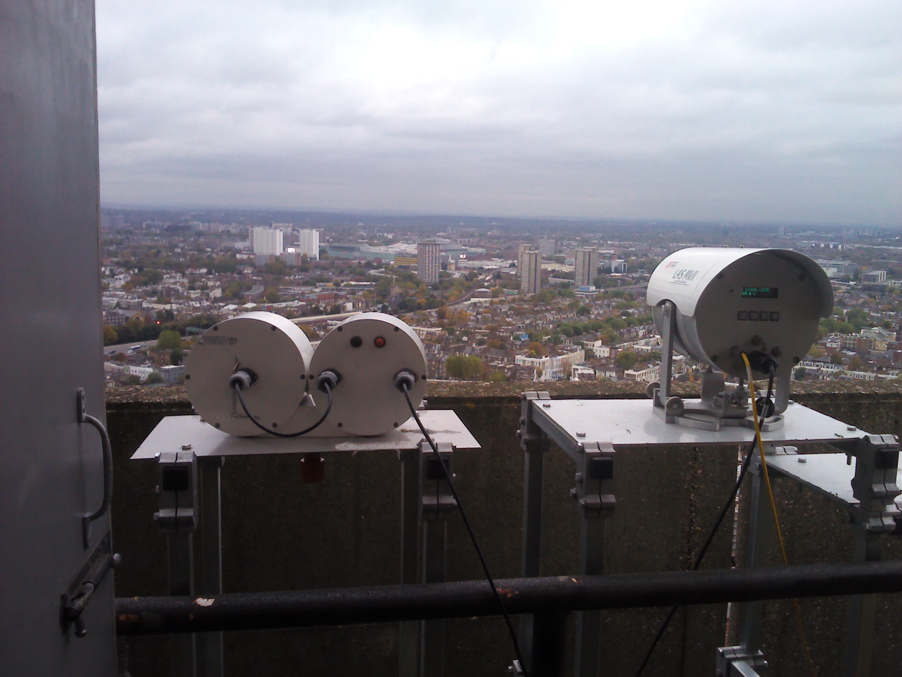
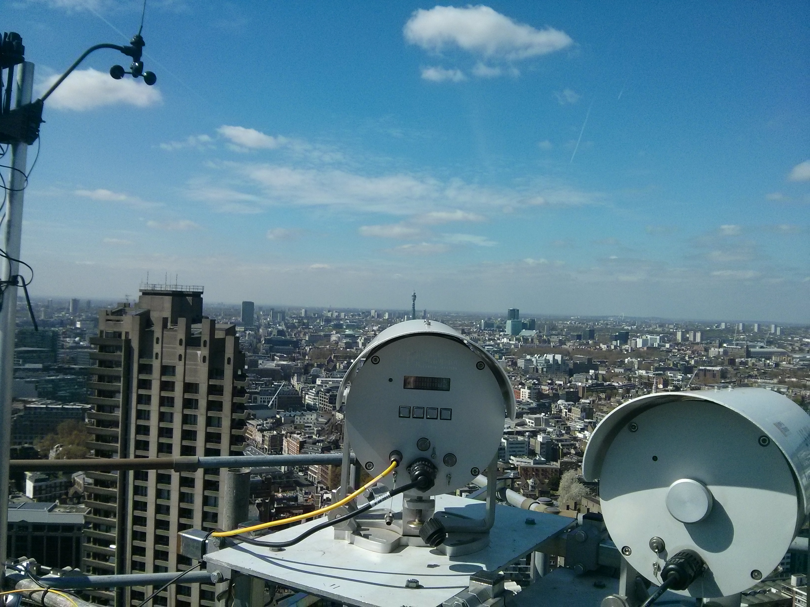
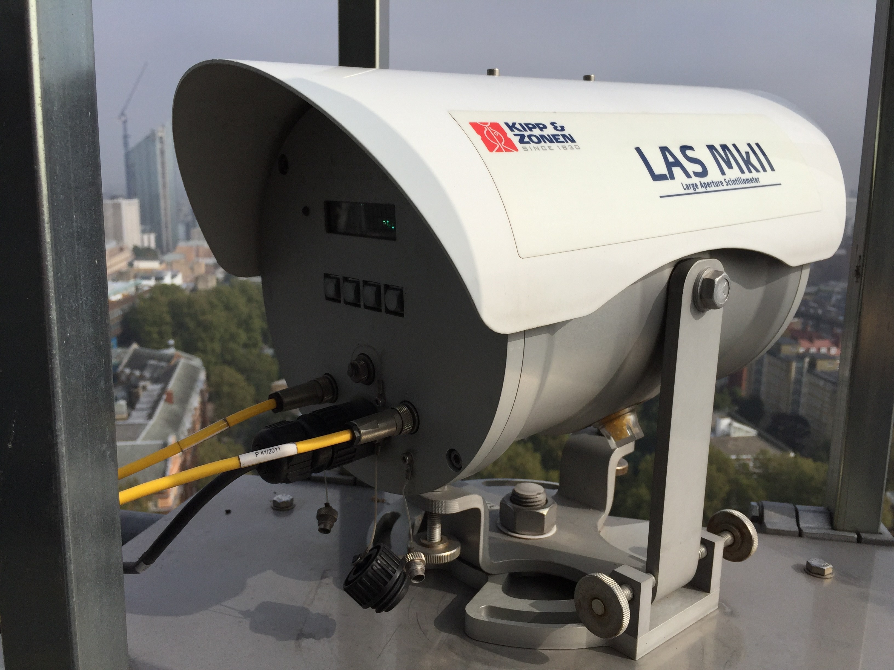

.. _LASMKII:

*******
LASMKII
*******

Introduction
############

.. include:: intros/LASMKII_intro.rst

Manufacturer and Model
######################

.. csv-table:: 
   :file: manufacturers/LASMKII_manufacturer.csv
   :header-rows: 1

Output definitions
##################

.. csv-table:: 
   :file: out_defs/LASMKII_out_defs.csv
   :header-rows: 1

Processing code
###############

Code used to process raw data:
https://github.com/Urban-Meteorology-Reading/Operations-LAS

Variables measured by instrument
################################

.. csv-table:: Variables measured - sorted alphabetically
   :file: variables/LASMKII_variables.csv
   :header-rows: 1

Serials
#######

.. csv-table:: 
   :file: serials/LASMKII_serials.csv
   :header-rows: 1

Deployments
###########

.. _120028:

120028
******

.. csv-table:: 
   :file: deployments/LASMKII/120028_deployments.csv
   :header-rows: 1

.. _120029:

120029
******

.. csv-table:: 
   :file: deployments/LASMKII/120029_deployments.csv
   :header-rows: 1

Photos
######

   LAS MKII (right) at :ref:`NTT` 25/10/2012

   LAS receiver (centre) and transmitter (right) at :ref:`BCT` 09/04/2014

   Receiver at :ref:`IMU` 03/10/2015

Supplementary information
#########################

.. list-table:: 
   :header-rows: 1

   * - Link
     - Title
     - Description
   * - https://www.kippzonen.com/Download/598/LAS-MkII-Scintillometer-Manual?ShowInfo=true
     - LAS MKII manual
     - Manual from Kipp and Zonen. If link has expired please contact Prof. Sue Grimmond.

Data acquisition
################

.. include:: ../../data_acquisition/data_acquisition_default.rst

References
##########

#. Crawford, B., Grimmond, S. B., Gabey, A., Marconcini, M., Ward, H. C. and Kent, C. W. (2018) Variability of urban surface temperatures and implications for aerodynamic energy exchange in unstable conditions. Quarterly Journal of the Royal Meteorological Society, 144 (715). pp. 1719-1741. ISSN 1477-870X doi: https://doi.org/10.1002/qj.3325
#. Ward, H. C., Evans, J. G. and Grimmond, C. S. B. (2014) Multi-scale sensible heat fluxes in the urban environment from large aperture scintillometry and eddy covariance. Boundary-Layer Meteorology, 152 (1). pp. 65-89. ISSN 0006-8314 doi: https://doi.org/10.1007/s10546-014-9916-4

