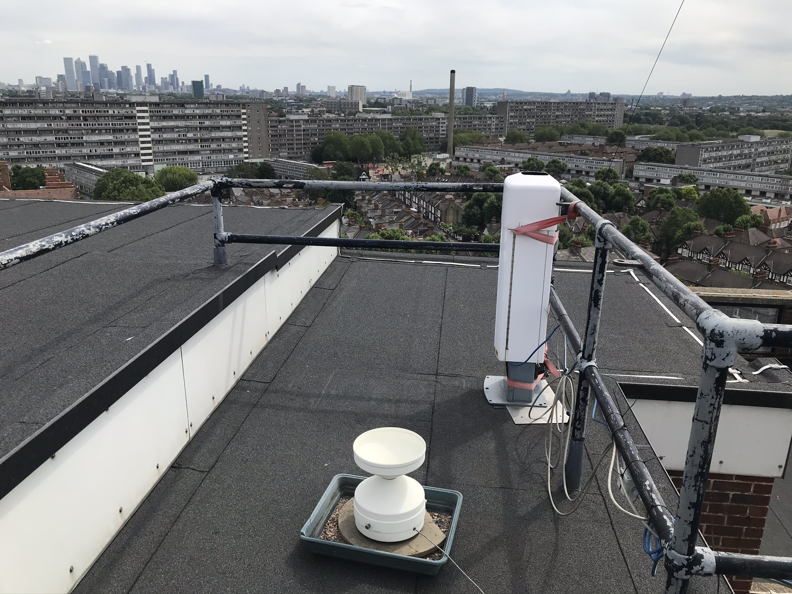
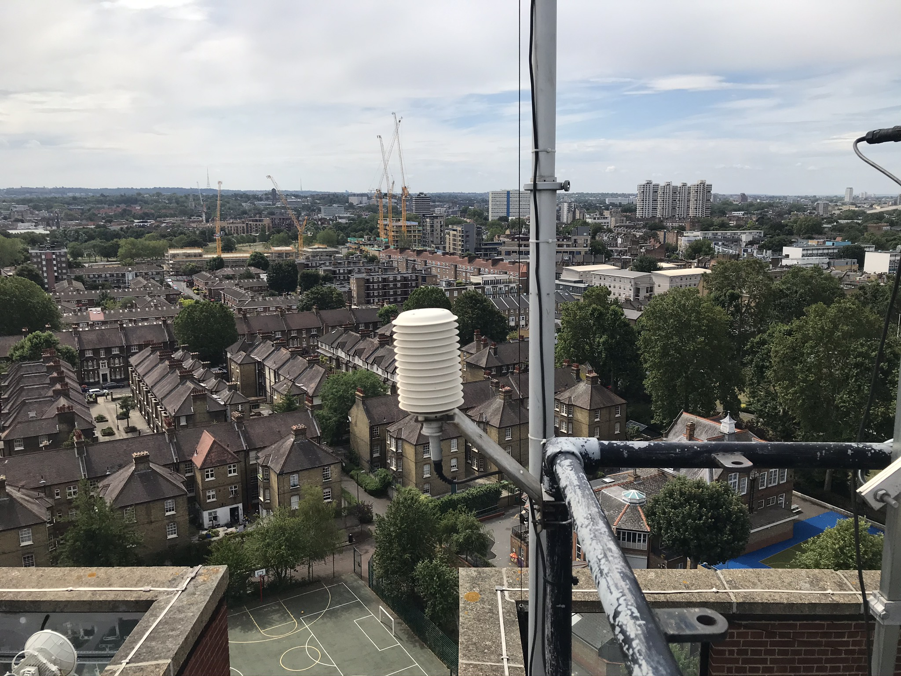
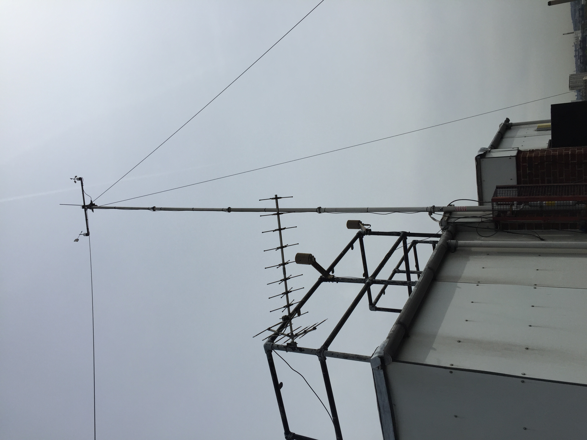

.. _SWTWXSTATION:

************
SWTWXSTATION
************

Introduction
############

.. include:: intros/SWTWXSTATION_intro.rst

Manufacturer and Model
######################

.. csv-table:: 
   :file: manufacturers/SWTWXSTATION_manufacturer.csv
   :header-rows: 1

Output definitions
##################

.. csv-table:: 
   :file: out_defs/SWTWXSTATION_out_defs.csv
   :header-rows: 1

Processing code
###############

Code used to process raw data:
https://github.com/Urban-Meteorology-Reading/Operations-SWT_WX

Variables measured by instrument
################################

.. csv-table:: Variables measured - sorted alphabetically
   :file: variables/SWTWXSTATION_variables.csv
   :header-rows: 1

Serials
#######

.. csv-table:: 
   :file: serials/SWTWXSTATION_serials.csv
   :header-rows: 1

Deployments
###########

.. _SWT123456:

SWT123456
*********

.. csv-table:: 
   :file: deployments/SWTWXSTATION/SWT123456_deployments.csv
   :header-rows: 1

Photos
######

   :ref:`ARG100` ( in foreground) 23-07-2020.

   :ref:`107`, :ref:`HMP45A` 23-07-2020.

   :ref:`107` and :ref:`HMP45A`  in radiation shields, :ref:`WINDSET`  on top of tower 10/06/2016

Supplementary information
#########################

.. list-table:: 
   :header-rows: 1

   * - Link
     - Title
     - Description
   * - http://data.urban-climate.net/southwark_plots/
     - Southwark Meteorological Station
     - Current weather data visualisation and download 

Data acquisition
################

.. include:: data_acquisition/SWTWXSTATION_data_acquisition.rst

References
##########

