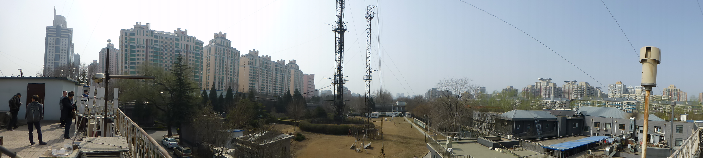
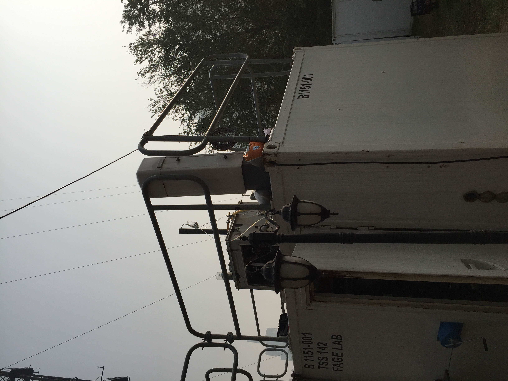
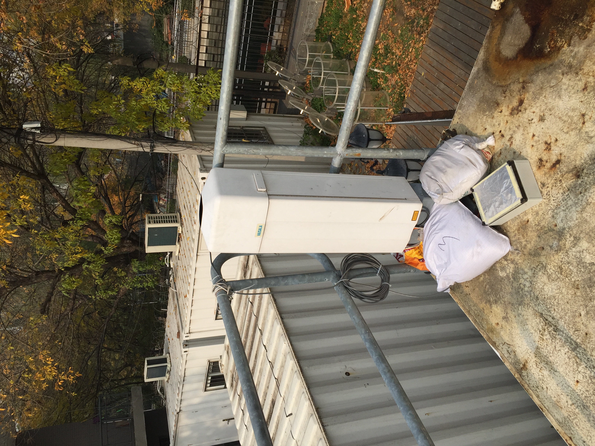

.. _IAP:

***
IAP
***

Introduction
############

.. include:: intros/IAP_intro.rst

Site metadata
#############

.. csv-table:: 
   :file: meta/IAP_meta.csv
   :stub-columns: 1

.. raw:: html

   

   

    

Deployments at site
###################

.. csv-table:: All site deployments
   :file: deployments/dates/IAP_deployment_dates.csv
   :header-rows: 2

.. csv-table:: Position of deployments
   :file: deployments/positions/IAP_deployment_positions.csv
   :header-rows: 2

.. csv-table:: Metadata specific to profiles
   :file: deployments/profile_deployments/IAP_profile_deployments.csv
   :header-rows: 2

Photos
######

   Panoramic looking East 18-03-2016.

   :ref:`CL31` on cabin roof 04-11-2016.

   :ref:`CL31` 04-11-2016.

Data acquisition
################

.. include:: ../../../data_acquisition/data_acquisition_default.rst

References
##########

#. Biggart, M., Stocker, J., Doherty, R. M., Wild, O., Hollaway, M., Carruthers, D., Li, J., Zhang, Q., Wu, R., Kotthaus, S., Grimmond, S., Squires, F. A., Lee, J. and Shi, Z. (2020) Street-scale air quality modelling for Beijing during a winter 2016 measurement campaign. Atmospheric Chemistry and Physics, 20 (5). pp. 2755-2780. ISSN 1680-7324 doi: https://doi.org/10.5194/acp-20-2755-2020
#. Hertwig, D., Grimmond, S., Kotthaus, S., Vanderwel, C., Gough, H., Haeffelin, M. and Robins, A. (2020) Variability of physical meteorology in urban areas at different scales: implications for air quality. Faraday Discussions. ISSN 1364-5498 doi: https://doi.org/10.1039/D0FD00098A (In Press)
#. Squires, F. A., Nemitz, E., Langford, B., Wild, O., Drysdale, W. S., Acton, W. J. F., Fu, P., Grimmond, C. S. B., Hamilton, J. F., Hewitt, C. N., Hollaway, M., Kotthaus, S., Lee, J., Metzger, S., Pingintha-Durden, N., Shaw, M., Vaughan, A. R., Wang, X., Wu, R., Zhang, Q. and Zhang, Y. (2020) Measurements of traffic-dominated pollutant emissions in a Chinese megacity. Atmospheric Chemistry and Physics, 20 (14). pp. 8737-8761. ISSN 1680-7316 doi: https://doi.org/10.5194/acp-20-8737-2020
#. Dou, J., Grimmond, S., Cheng, Z., Miao, S., Feng, D. and Liao, M. (2019) Summertime surface energy balance fluxes at two Beijing sites. International Journal of Climatology, 39 (5). pp. 2793-2810. ISSN 08998418 doi: https://doi.org/10.1002/joc.5989
#. Kokkonen, T. V., Grimmond, S., Murto, S., Liu, H., Sundstr�m, A.-M. and J�rvi, L. (2019) Simulation of the radiative effect of haze on the urban hydrological cycle using reanalysis data in Beijing. Atmospheric Chemistry and Physics, 19. pp. 7001-7017. ISSN 1680-7316 doi: https://doi.org/10.5194/acp-19-7001-2019
#. Shi, Z., Vu, T., Kotthaus, S., Harrison, R. M., Grimmond, S., Yue, S., Zhu, T., Lee, J., Han, Y., Demuzere, M., Dunmore, R. E., Ren, L., Liu, D., Wang, Y., Wild, O., Allan, J., Acton, W. J., Barlow, J., Barratt, B., Beddows, D., Bloss, W. J., Calzolai, G., Carruthers, D., Carslaw, D. C., Chan, Q., Chatzidiakou, L., Chen, Y., Crilley, L., Coe, H., Dai, T., Doherty, R., Duan, F., Fu, P., Ge, B., Ge, M., Guan, D., Hamilton, J. F., He, K., Heal, M., Heard, D., Hewitt, C. N., Hollaway, M., Hu, M., Ji, D., Jiang, X., Jones, R., Kalberer, M., Kelly, F. J., Kramer, L., Langford, B., Lin, C., Lewis, A. C., Li, J., Li, W., Liu, H., Liu, J., Loh, M., Lu, K., Lucarelli, F., Mann, G., McFiggans, G., Miller, M. R., Mills, G., Monk, P., Nemitz, E., O&amp;apos;Connor, F., Ouyang, B., Palmer, P. I., Percival, C., Popoola, O., Reeves, C., Rickard, A. R., Shao, L., Shi, G., Spracklen, D., Stevenson, D., Sun, Y., Sun, Z., Tao, S., Tong, S., Wang, Q., Wang, W., Wang, X., Wang, X., Wang, Z., Wei, L., Whalley, L., Wu, X., Wu, Z., Xie, P., Yang, F., Zhang, Q., Zhang, Y., Zhang, Y. and Zheng, M. (2019) In-depth study of air pollution sources and processes within Beijing and its surrounding region (APHH-Beijing). Atmospheric Chemistry and Physics (11). pp. 7519-7546. ISSN 1680-7316 doi: https://doi.org/10.5194/acp-19-7519-2019
#. Liu, D., Joshi, R., Wang, J., Yu, C., Allan, J. D., Coe, H., Flynn, M. J., Xie, C., Lee, J., Squires, F., Kotthaus, S., Grimmond, S., Ge, X., Sun, Y. and Fu, P. (2019) Contrasting physical properties of black carbon in urban Beijing between winter and summer. Atmospheric Chemistry and Physics, 19. pp. 6749-6769. ISSN 1680-7316 doi: https://doi.org/10.5194/acp-19-6749-2019
#. Liang, X., Miao, S., Li, J., Bornstein, R., Zhang, X., Gao, Y., Cao, X., Chen, F., Cheng, Z., Clements, C., Dabberdt, W., Ding, A., Ding, D., Dou, J. J., Dou, J. X., Dou, Y., Grimmond, C. S. B., Gonzalez-Cruz, J., He, J., Huang, M., Huang, X., Ju, S., Li, Q., Niyogi, D., Quan, J., Sun, J., Sun, J. Z., Yu, M., Zhang, J., Zhang, Y., Zhao, X., Zheng, Z. and Zhou, M. (2018) SURF: understanding and predicting urban convection and haze. Bulletin of the American Meteorological Society, 99 (7). pp. 1391-1413. ISSN 0003-0007 doi: https://doi.org/10.1175/BAMS-D-16-0178.1

