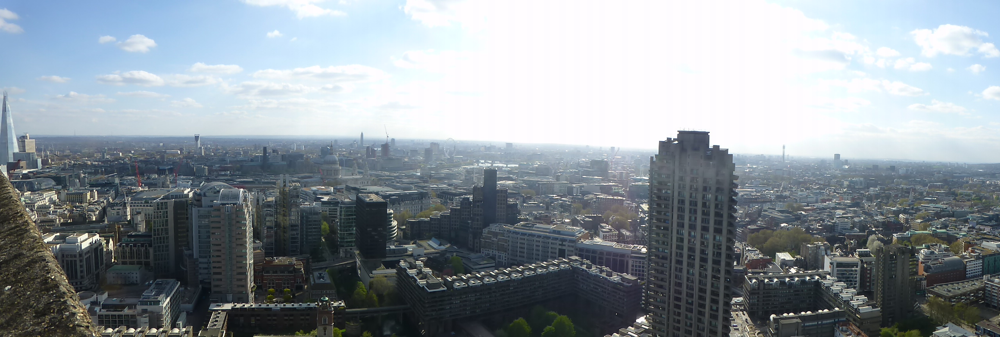
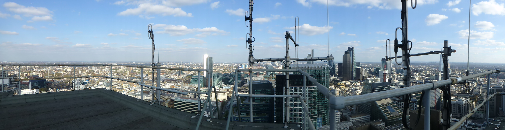
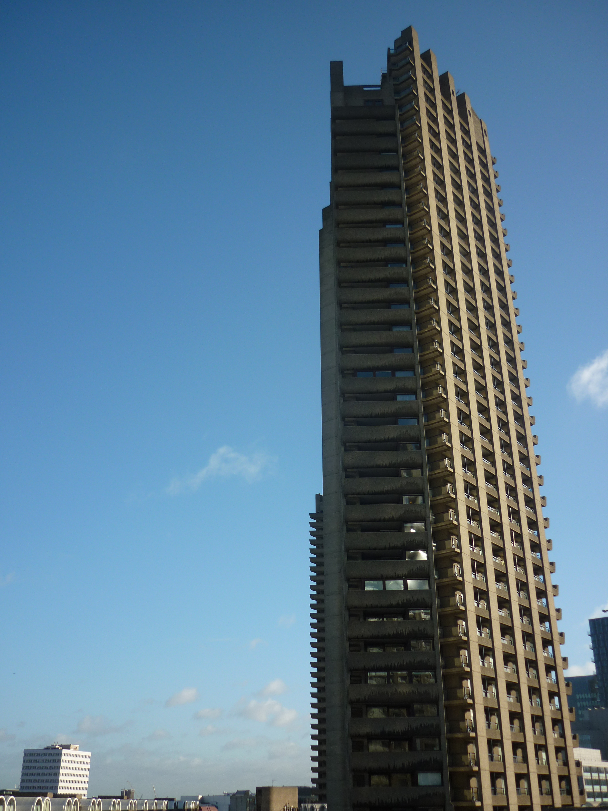
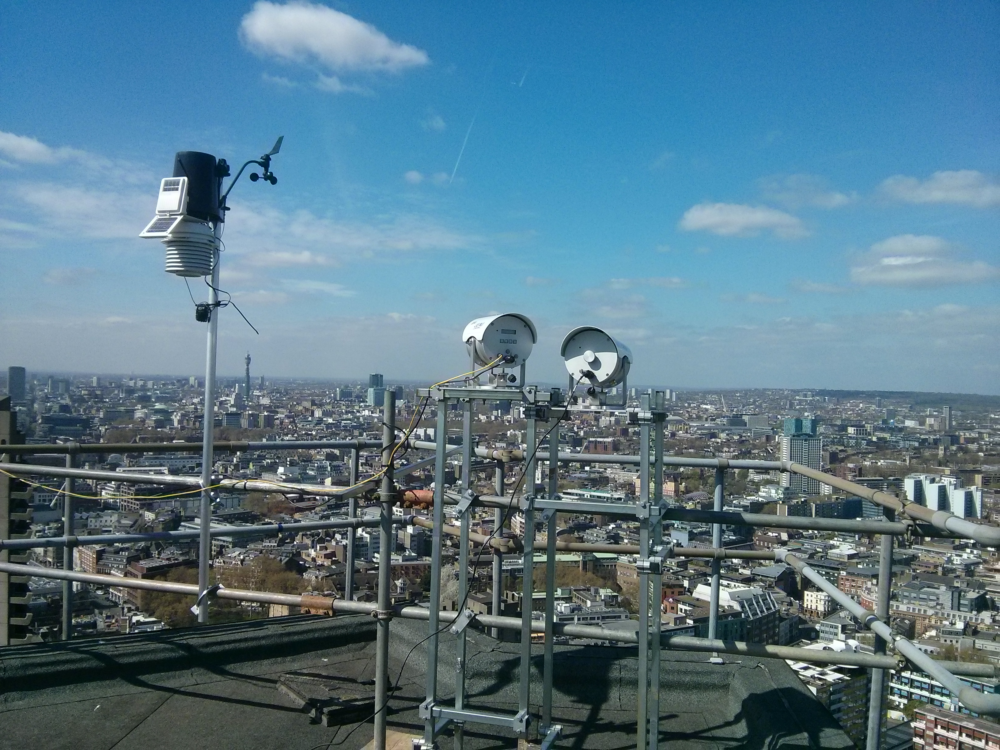
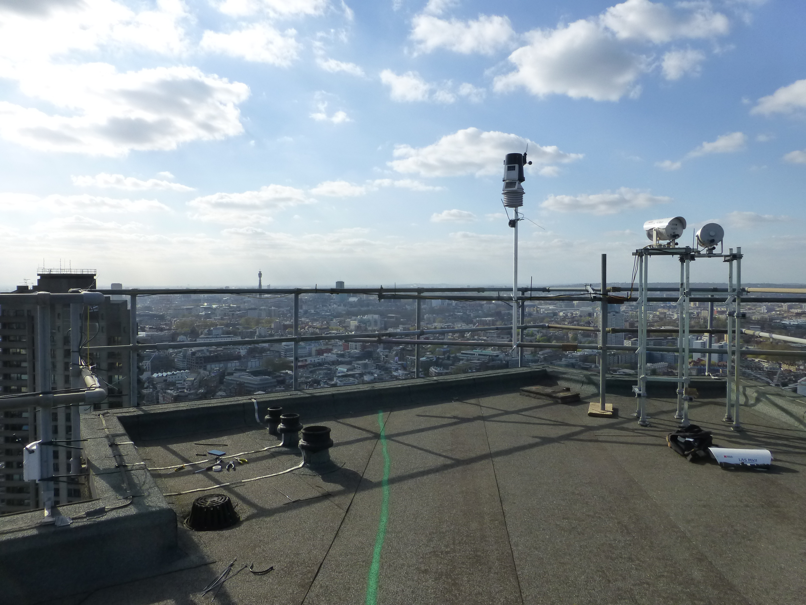

.. _BCT:

***
BCT
***

Introduction
############

.. include:: intros/BCT_intro.rst

Site metadata
#############

.. csv-table:: 
   :file: meta/BCT_meta.csv
   :stub-columns: 1

.. raw:: html

   

   

    

Deployments at site
###################

.. csv-table:: All site deployments
   :file: deployments/dates/BCT_deployment_dates.csv
   :header-rows: 2

.. csv-table:: Position of deployments
   :file: deployments/positions/BCT_deployment_positions.csv
   :header-rows: 2

.. csv-table:: Metadata specific to scintillometers
   :file: deployments/scint_deployments/BCT_scint_deployments.csv
   :header-rows: 2

Photos
######

   Panoramic view facing west 09-04-2014.

   Panoramic view facing west 09-04-2014.

   View the tower from the ground 14-11-2013.

   :ref:`DAVIS` station, :ref:`LASMKII` reciever from :ref:`BTT` (left) and :ref:`LASMKII` transmitter to :ref:`IMU` (right) 09-04-2014.

   :ref:`DAVIS` and :ref:`LASMKII` on the roof 09-04-2014.

Data acquisition
################

.. include:: ../../../data_acquisition/data_acquisition_default.rst

References
##########

#. Morrison, W., Yin, T., Lauret, N., Guilleux, J., Kotthaus, S., Gastellu-Etchegorry, J.-P., Norford, L. and Grimmond, S. (2020) Atmospheric and emissivity corrections for ground-based thermography using 3D radiative transfer modelling. Remote Sensing of Environment, 237. 111524. ISSN 00344257 doi: https://doi.org/10.1016/j.rse.2019.111524
#. Crawford, B., Grimmond, S. B., Gabey, A., Marconcini, M., Ward, H. C. and Kent, C. W. (2018) Variability of urban surface temperatures and implications for aerodynamic energy exchange in unstable conditions. Quarterly Journal of the Royal Meteorological Society, 144 (715). pp. 1719-1741. ISSN 1477-870X doi: https://doi.org/10.1002/qj.3325
#. Warren, E., Charlton-Perez, C., Kotthaus, S., Lean, H., Ballard, S., Hopkin, E. and Grimmond, S. (2018) Evaluation of forward-modelled attenuated backscatter using an urban ceilometer network in London under clear-sky conditions. Atmospheric Environment, 191. pp. 532-547. ISSN 1352-2310 doi: https://doi.org/10.1016/j.atmosenv.2018.04.045
#. Crawford, B., Grimmond, C. S. B., Ward, H. C., Morrison, W. and Kotthaus, S. (2017) Spatial and temporal patterns of surface-atmosphere energy exchange in a dense urban environment using scintillometry. Quarterly Journal of the Royal Meteorological Society, 143 (703). pp. 817-833. ISSN 1477-870X doi: https://doi.org/10.1002/qj.2967

Acknowledgements
################

We thank Barbican for site access.

