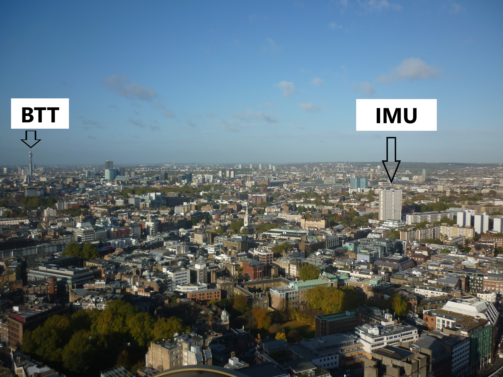
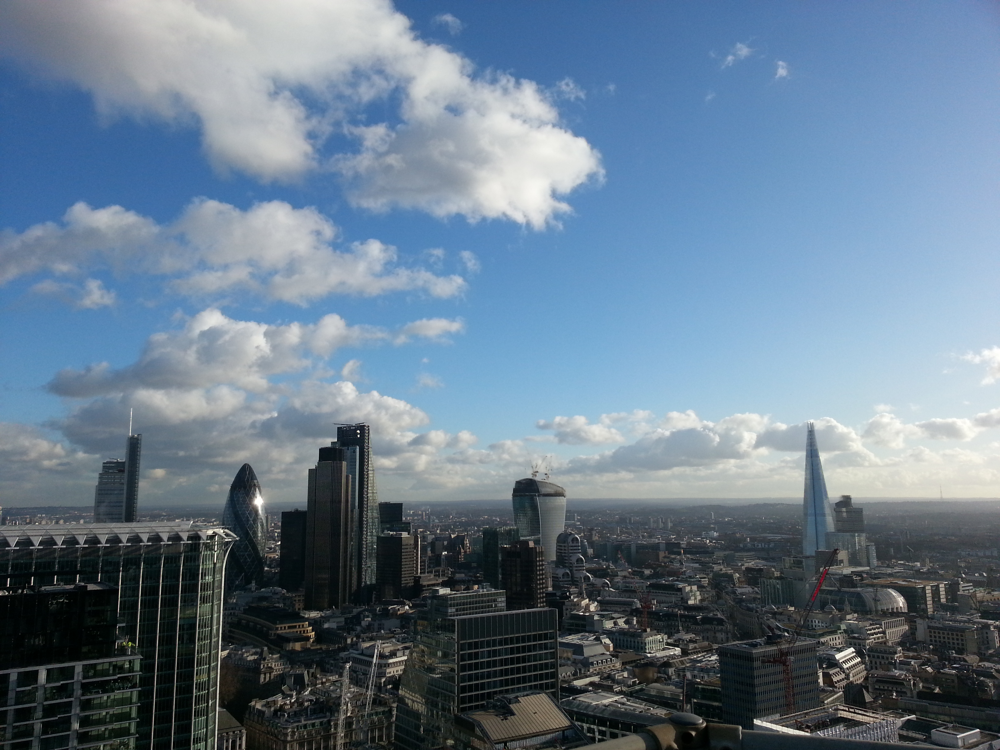
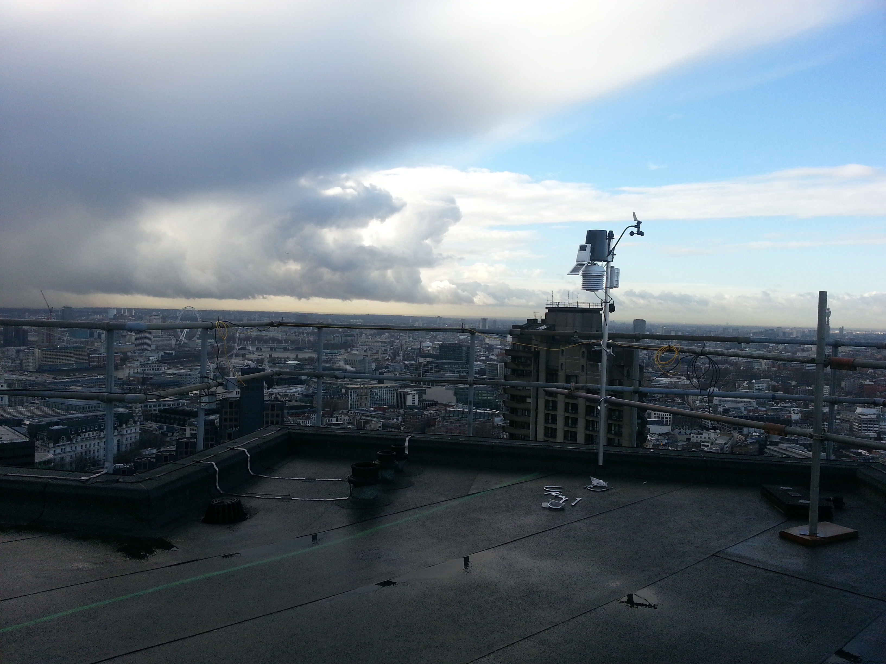
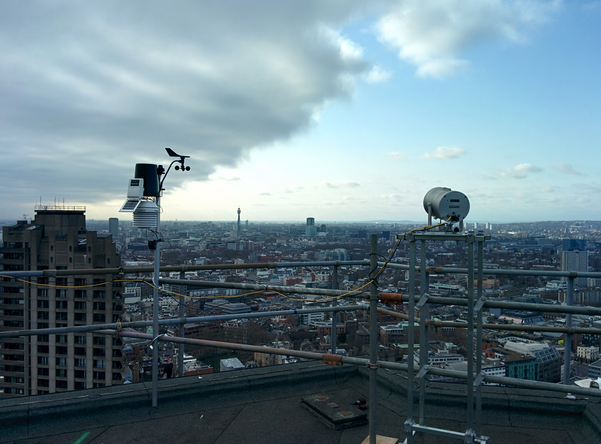

.. _BCTW:

****
BCTW
****

Introduction
############

.. include:: intros/BCTW_intro.rst

Site metadata
#############

.. csv-table:: 
   :file: meta/BCTW_meta.csv
   :stub-columns: 1

.. raw:: html

   

   

    

Deployments at site
###################

.. csv-table:: All site deployments
   :file: deployments/dates/BCTW_deployment_dates.csv
   :header-rows: 2

.. csv-table:: Position of deployments
   :file: deployments/positions/BCTW_deployment_positions.csv
   :header-rows: 2

Photos
######

   View facing North West. The sites :ref:`IMU` and :ref:`BTT` are indicated.  14-11-2013.

   View of City of London skyline looking towards the South East 23-01-2014.

   :ref:`DAVIS` station looking towards the West 23-01-2014.

   :ref:`DAVIS` station and :ref:`LASMKII` receiver from :ref:`BTT` 10-03-2014.

Data acquisition
################

.. include:: ../../../data_acquisition/data_acquisition_default.rst

Data availability
#################

.. raw:: html

   <iframe src="../../../_static/availability_plots/BCTW_availability.html" height="600px" width="1200px" allowfullscreen=true style="border:0px;"></iframe>
*Double click on legend to isolate instruments.*

Acknowledgements
################

We thank Barbican for site access.

