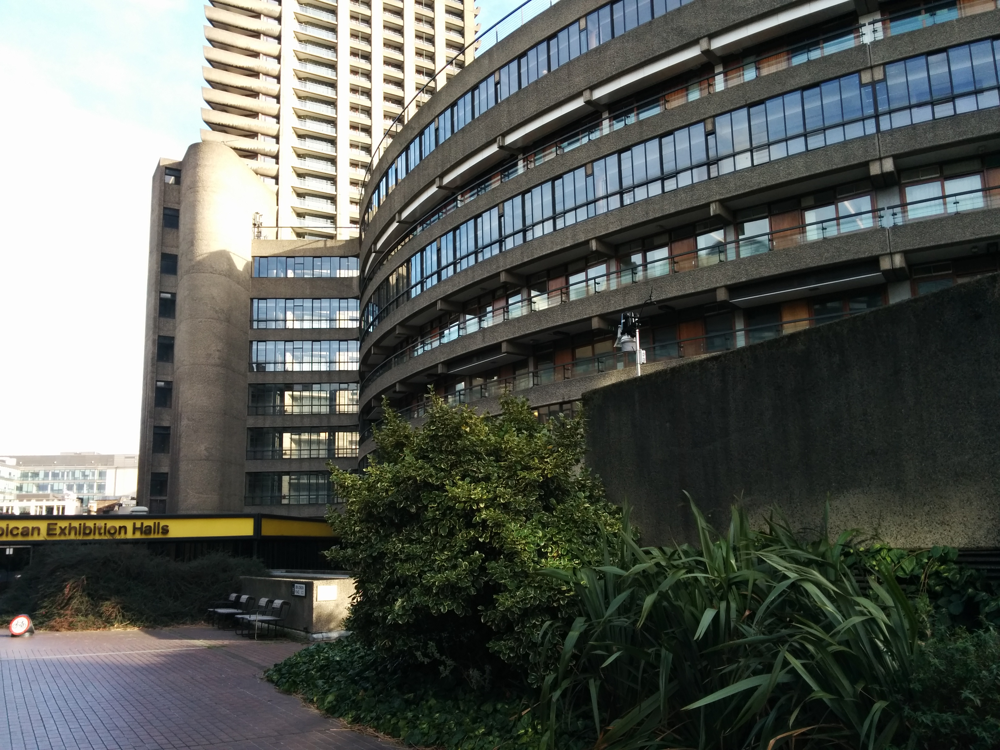
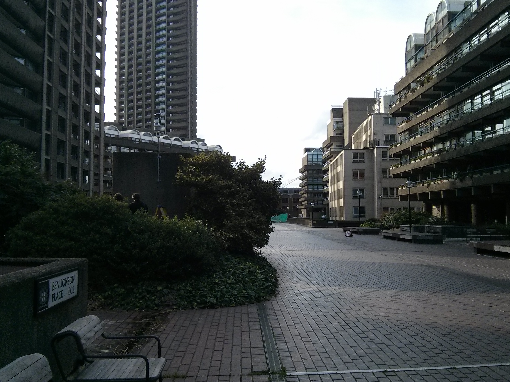

.. _BFCL:

****
BFCL
****

Introduction
############

.. include:: intros/BFCL_intro.rst

Site metadata
#############

.. csv-table:: 
   :file: meta/BFCL_meta.csv
   :stub-columns: 1

.. raw:: html

   

   

    

Deployments at site
###################

.. csv-table:: All site deployments
   :file: deployments/dates/BFCL_deployment_dates.csv
   :header-rows: 2

.. csv-table:: Position of deployments
   :file: deployments/positions/BFCL_deployment_positions.csv
   :header-rows: 2

.. csv-table:: Raw files of deployments
   :file: deployments/raw_files/BFCL_deployment_raw_files.csv
   :header-rows: 2

Photos
######

   :ref:`DAVIS` station looking towards the South East 03-02-2014.

   :ref:`DAVIS` station seen looking towards the West 03-02-2014.

.. figure:: photos/BFCL/sort-kjell-2_23143313334_o.jpg
   :width: 50 %

   :ref:`SM300` nodes 22-10-2015.

Supplementary information
#########################

Data acquisition
################

.. include:: ../../../data_acquisition/data_acquisition_default.rst

References
##########

#. Warren, E., Charlton-Perez, C., Kotthaus, S., Lean, H., Ballard, S., Hopkin, E. and Grimmond, S. (2018) Evaluation of forward-modelled attenuated backscatter using an urban ceilometer network in London under clear-sky conditions. Atmospheric Environment, 191. pp. 532-547. ISSN 1352-2310 doi: https://doi.org/10.1016/j.atmosenv.2018.04.045

Acknowledgements
################

We thank Barbican for site access.

