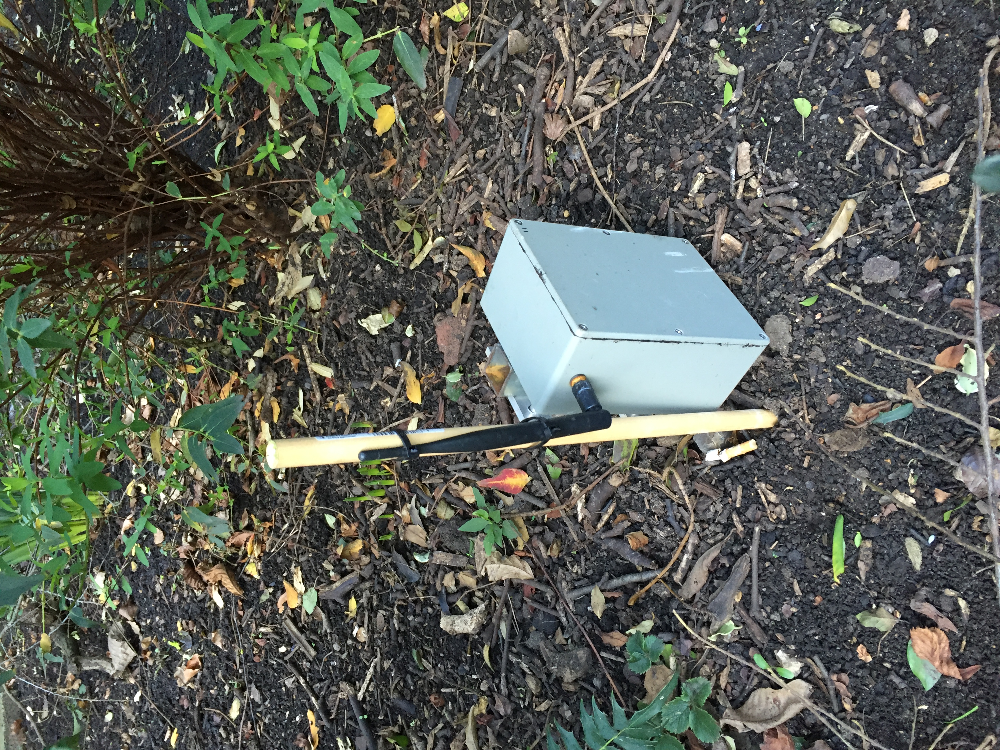

.. _BTM:

***
BTM
***

Introduction
############

.. include:: intros/BTM_intro.rst

Site metadata
#############

.. csv-table:: 
   :file: meta/BTM_meta.csv
   :stub-columns: 1

.. raw:: html

   

   

    

Deployments at site
###################

.. csv-table:: All site deployments
   :file: deployments/dates/BTM_deployment_dates.csv
   :header-rows: 2

.. csv-table:: Position of deployments
   :file: deployments/positions/BTM_deployment_positions.csv
   :header-rows: 2

Photos
######

   :ref:`SM300` node 02-02-2016.

   :ref:`SM300` node 02-02-2016.

   :ref:`SM300` node 02-10-2015.

Data acquisition
################

.. include:: ../../../data_acquisition/data_acquisition_default.rst

Data availability
#################

.. raw:: html

   <iframe src="../../../_static/availability_plots/BTM_availability.html" height="600px" width="1200px" allowfullscreen=true style="border:0px;"></iframe>
*Double click on legend to isolate instruments.*

Acknowledgements
################

We thank Barbican and Indoor site residents for site access.

