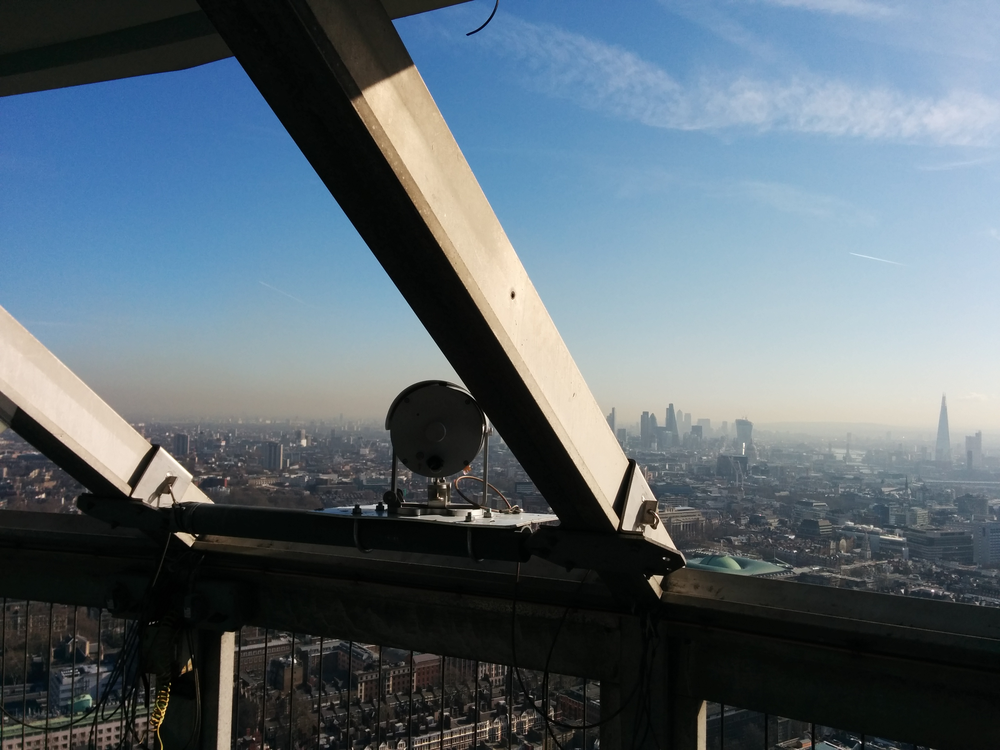
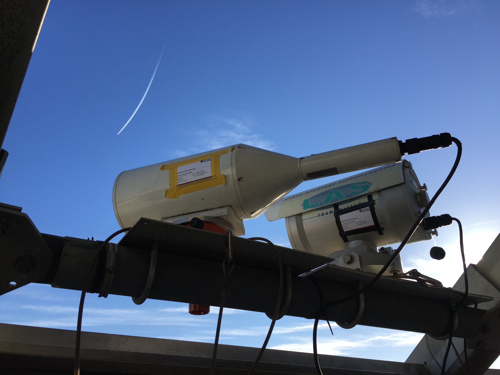
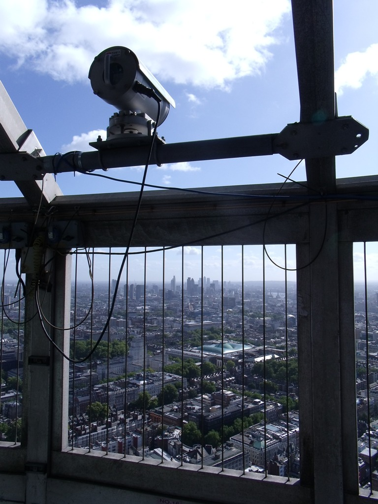

.. _BTT:

***
BTT
***

Introduction
############

.. include:: intros/BTT_intro.rst

Site metadata
#############

.. csv-table:: 
   :file: meta/BTT_meta.csv
   :stub-columns: 1

.. raw:: html

   

   

    

Deployments at site
###################

.. csv-table:: All site deployments
   :file: deployments/dates/BTT_deployment_dates.csv
   :header-rows: 2

.. csv-table:: Position of deployments
   :file: deployments/positions/BTT_deployment_positions.csv
   :header-rows: 2

.. csv-table:: Raw files of deployments
   :file: deployments/raw_files/BTT_deployment_raw_files.csv
   :header-rows: 2

.. csv-table:: Metadata specific to scintillometers
   :file: deployments/scint_deployments/BTT_scint_deployments.csv
   :header-rows: 2

Photos
######

   :ref:`LASMKII` transmitter to :ref:`BCT`. Looking South West 05-03-2014.

   :ref:`BLS` and :ref:`LASMKII` 30-11-2016.

   :ref:`LAS150` reciever from :ref:`KGG` 13-09-2011.

Supplementary information
#########################

Data acquisition
################

.. include:: ../../../data_acquisition/data_acquisition_default.rst

References
##########

#. Crawford, B., Grimmond, C. S. B., Ward, H. C., Morrison, W. and Kotthaus, S. (2017) Spatial and temporal patterns of surface-atmosphere energy exchange in a dense urban environment using scintillometry. Quarterly Journal of the Royal Meteorological Society, 143 (703). pp. 817-833. ISSN 1477-870X doi: https://doi.org/10.1002/qj.2967

Acknowledgements
################

We thank BT tower for site access.

