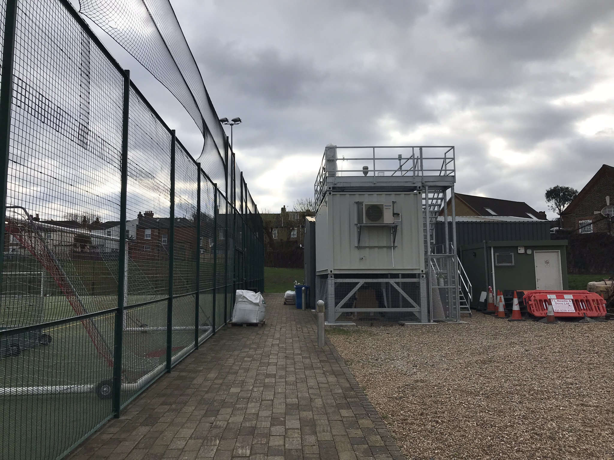
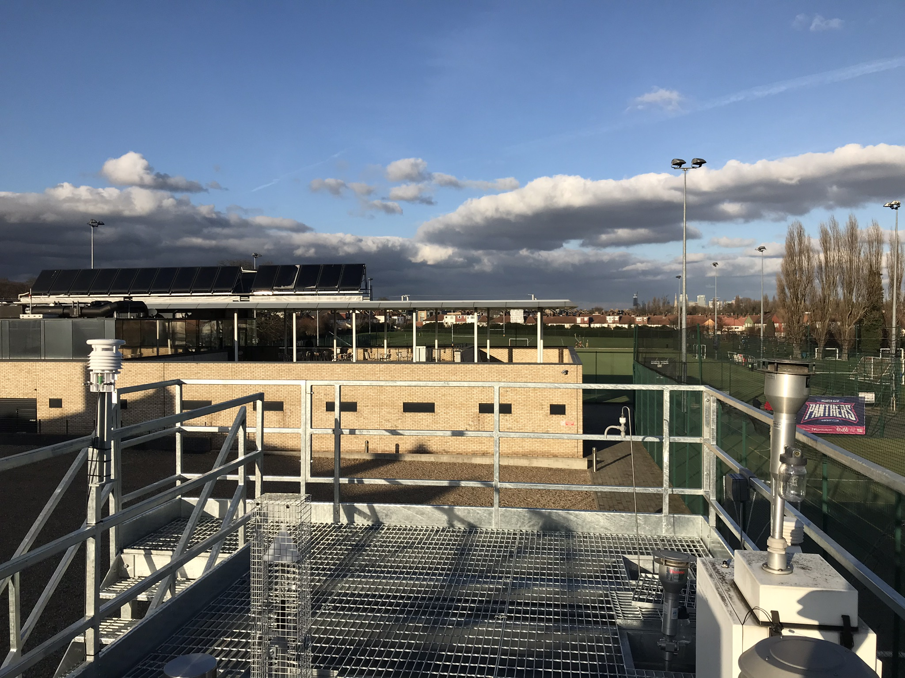
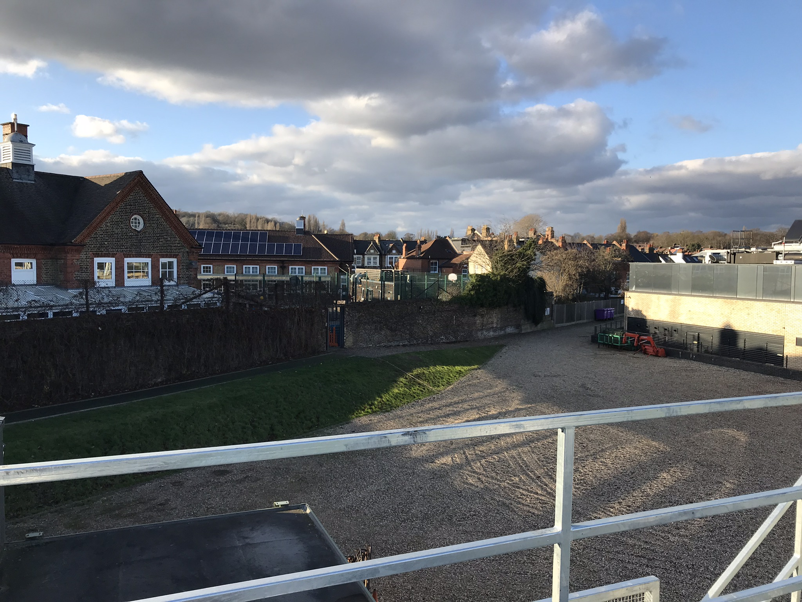
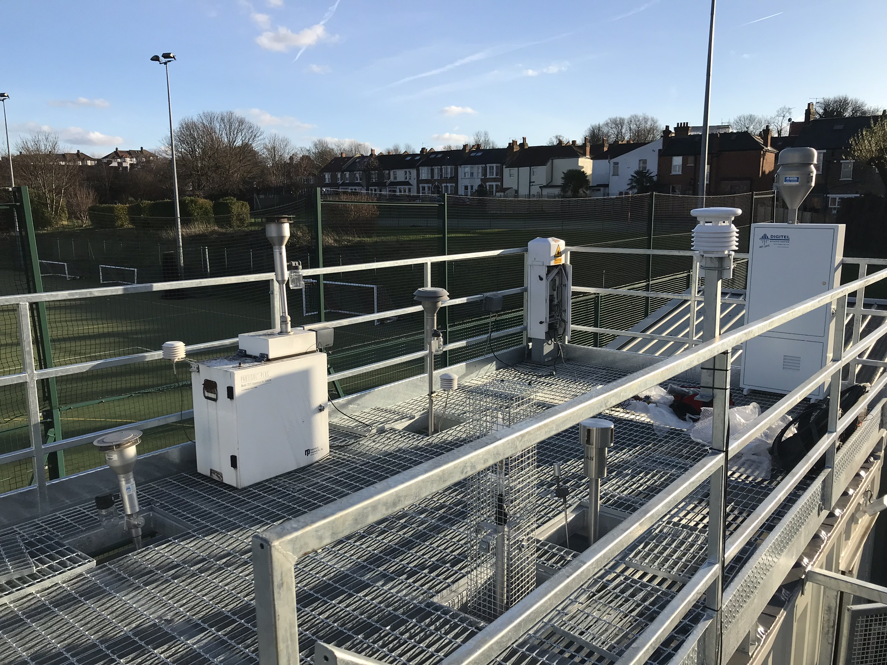
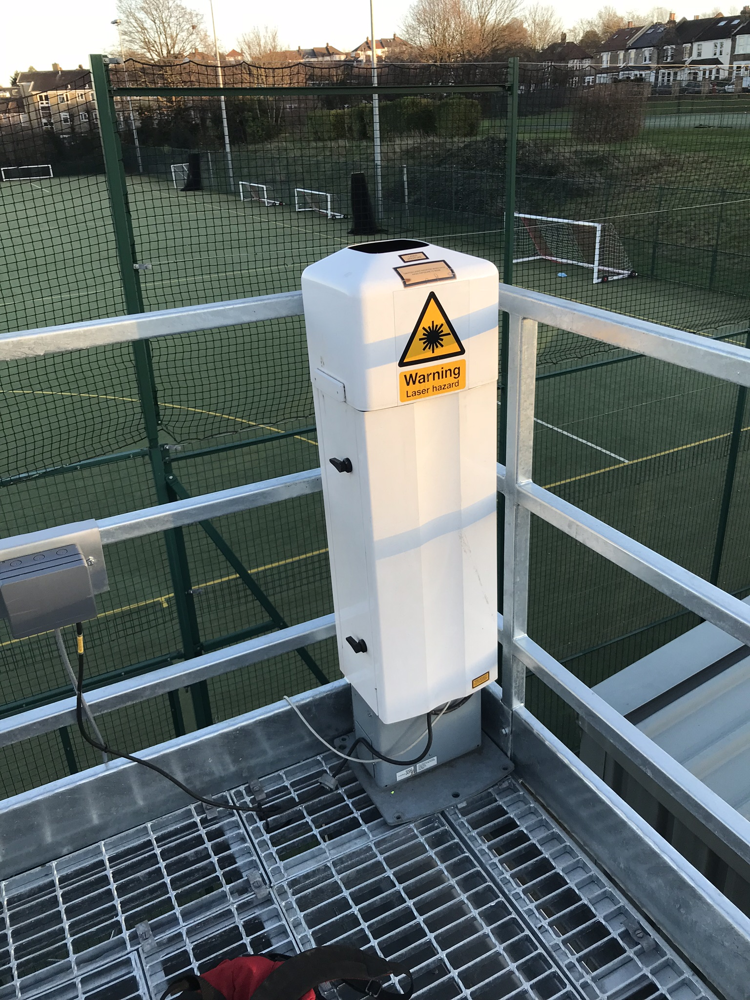

.. _HOP:

***
HOP
***

Introduction
############

.. include:: intros/HOP_intro.rst

Site metadata
#############

.. csv-table:: 
   :file: meta/HOP_meta.csv
   :stub-columns: 1

.. raw:: html

   

   

    

Deployments at site
###################

.. csv-table:: All site deployments
   :file: deployments/dates/HOP_deployment_dates.csv
   :header-rows: 2

.. csv-table:: Position of deployments
   :file: deployments/positions/HOP_deployment_positions.csv
   :header-rows: 2

.. csv-table:: Metadata specific to profiles
   :file: deployments/profile_deployments/HOP_profile_deployments.csv
   :header-rows: 2

Photos
######

   View of cabin looking South 12-12-2018.

   View from top of cabin looking North 12-12-2018.

   View from cabin roof looking North East 12-12-2018.

   Cabin roof and :ref:`CL31`with door open 12-12-2018.

   :ref:`CL31` 12-12-2018.

Data acquisition
################

.. include:: ../../../data_acquisition/data_acquisition_default.rst

Data availability
#################

.. raw:: html

   <iframe src="../../../_static/availability_plots/HOP_availability.html" height="600px" width="100%" allowfullscreen=true style="border:0px;"></iframe>
*Double click on legend to isolate instruments.*

