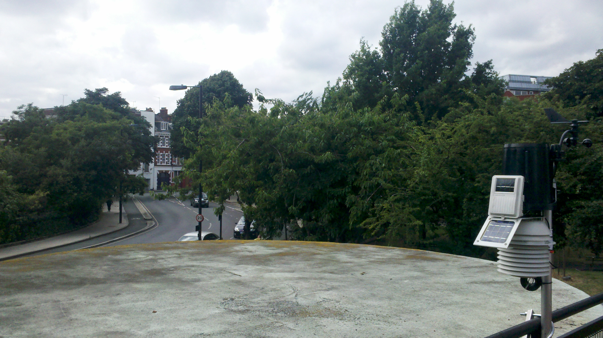
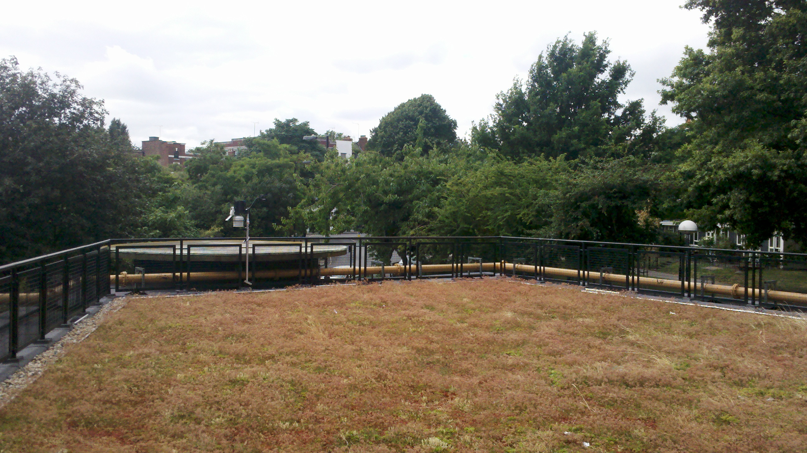

.. _IML:

***
IML
***

Introduction
############

.. include:: intros/IML_intro.rst

Site metadata
#############

.. csv-table:: 
   :file: meta/IML_meta.csv
   :stub-columns: 1

.. raw:: html

   

   

    

Deployments at site
###################

.. csv-table:: All site deployments
   :file: deployments/dates/IML_deployment_dates.csv
   :header-rows: 2

.. csv-table:: Position of deployments
   :file: deployments/positions/IML_deployment_positions.csv
   :header-rows: 2

Photos
######

   :ref:`DAVIS` station looking East 31-07-2013.

   Wider view of :ref:`DAVIS` station looking East 31-07-2013.

Data acquisition
################

.. include:: ../../../data_acquisition/data_acquisition_default.rst

Data availability
#################

.. raw:: html

   <iframe src="../../../_static/availability_plots/IML_availability.html" height="600px" width="1200px" allowfullscreen=true style="border:0px;"></iframe>
*Double click on legend to isolate instruments.*

References
##########

#. Warren, E., Charlton-Perez, C., Kotthaus, S., Lean, H., Ballard, S., Hopkin, E. and Grimmond, S. (2018) Evaluation of forward-modelled attenuated backscatter using an urban ceilometer network in London under clear-sky conditions. Atmospheric Environment, 191. pp. 532-547. ISSN 1352-2310 doi: https://doi.org/10.1016/j.atmosenv.2018.04.045

Acknowledgements
################

We thank Borough of Islington for site access.

