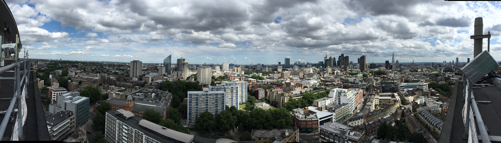
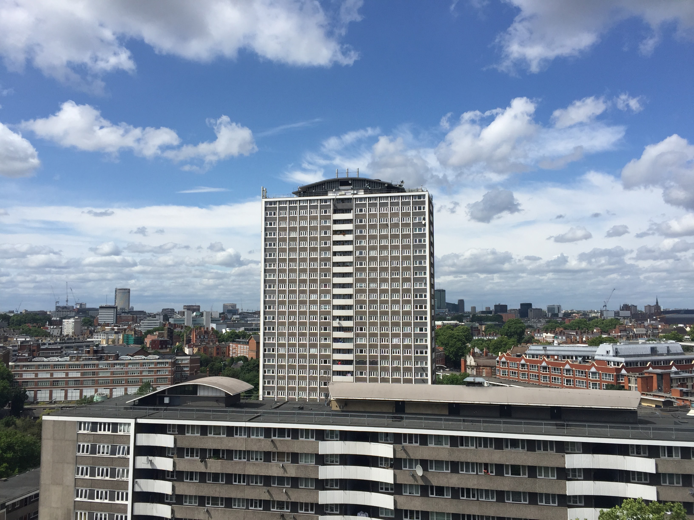
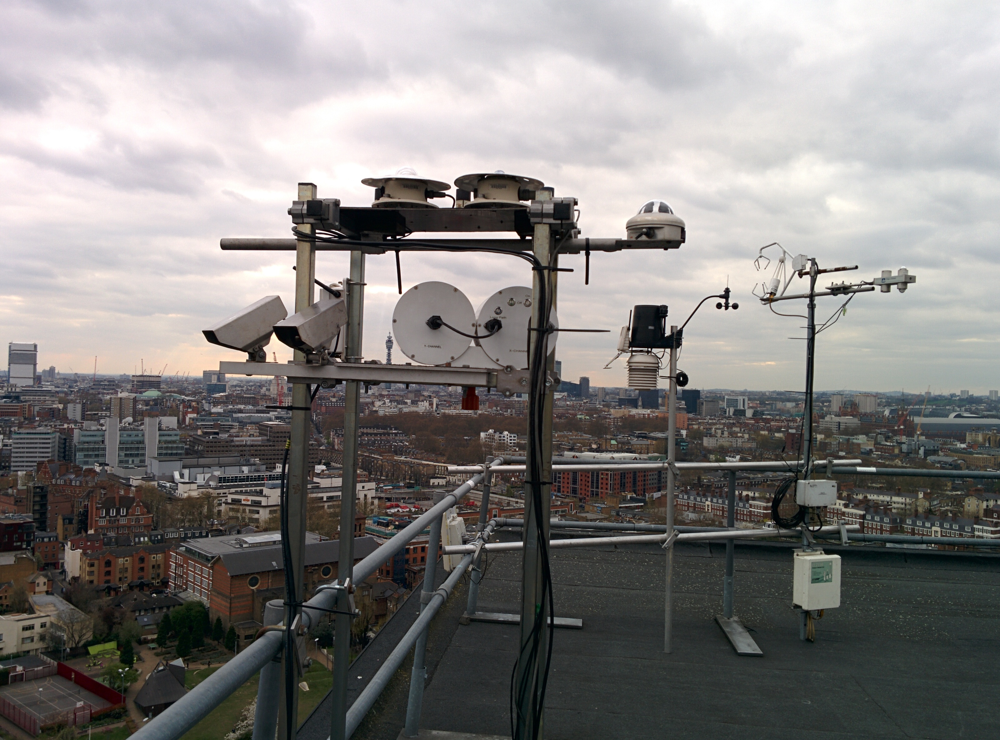
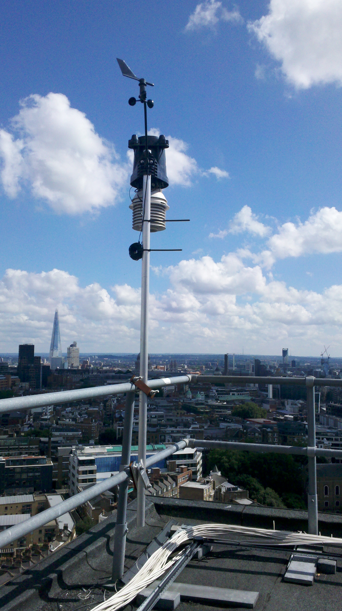
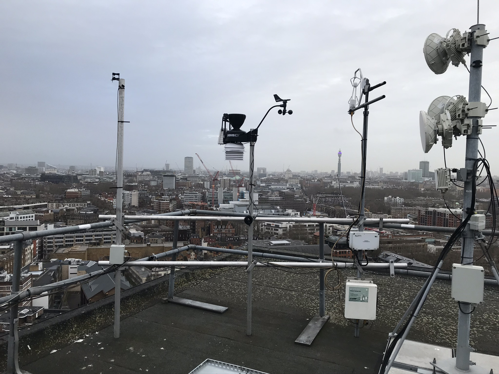
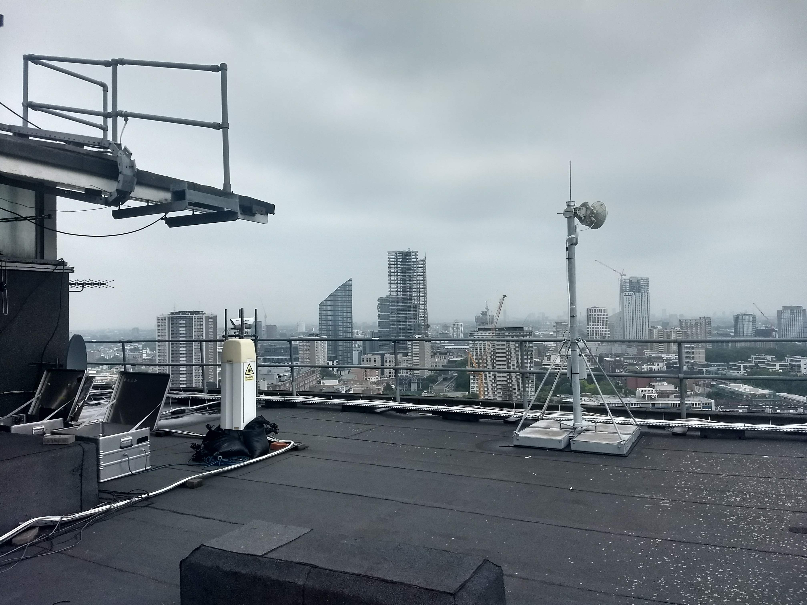
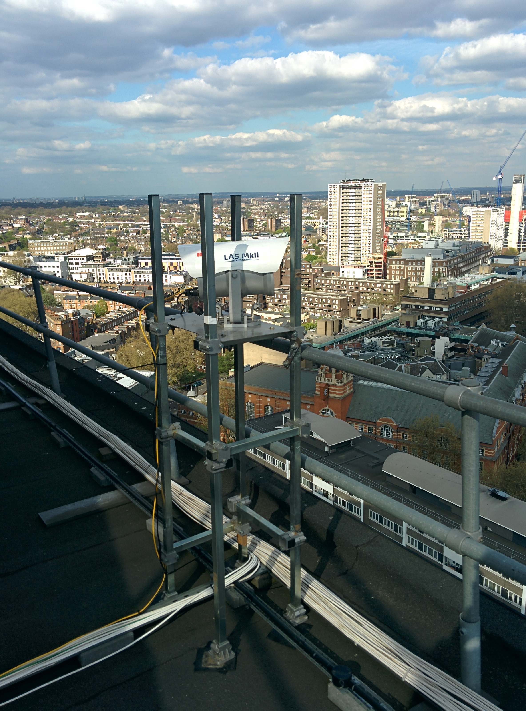

.. note::
   Check the supplementary info below for important information on the data. 

.. _IMU:

***
IMU
***

Introduction
############

.. include:: intros/IMU_intro.rst

Site metadata
#############

.. csv-table:: 
   :file: meta/IMU_meta.csv
   :stub-columns: 1

.. raw:: html

   

   

    

Deployments at site
###################

.. csv-table:: All site deployments
   :file: deployments/dates/IMU_deployment_dates.csv
   :header-rows: 2

.. csv-table:: Position of deployments
   :file: deployments/positions/IMU_deployment_positions.csv
   :header-rows: 2

.. csv-table:: Metadata specific to profiles
   :file: deployments/profile_deployments/IMU_profile_deployments.csv
   :header-rows: 2

.. csv-table:: Metadata specific to scintillometers
   :file: deployments/scint_deployments/IMU_scint_deployments.csv
   :header-rows: 2

Photos
######

   Panoramic facing East 21-07-2017.

   View of Michael Cliffe House from :ref:`WCT` 21-07-2017.

   :ref:`BLS` transmitter, :ref:`PI160`, :ref:`PAR`, :ref:`UVA`, :ref:`UVB`, :ref:`PIR`, :ref:`PSP`, :ref:`DAVIS`, :ref:`CNR1`, :ref:`CSAT3` and :ref:`LI7500A` looking West 18-04-2016.

   :ref:`DAVIS` looking South West 25-07-2013.

   :ref:`TRISONICAWS`, :ref:`DAVIS`, :ref:`CSAT3` and :ref:`LI7500A` 08-01-2020.

   :ref:`CL31` looking  North East 30-05-2018.

   :ref:`LASMKII` reciever from :ref:`BCT` 10-04-2014.

Supplementary information
#########################

.. list-table:: 
   :header-rows: 1

   * - Link
     - Title
     - Description
   * - :download:`IMU PSP and SPN1 radiation sensor blocking <../../../supplementary_info/imu_psp_spn1_blocking/IMU_PSP_and_SPN1_radiation_sensor_blocking.pdf>`
     - IMU PSP and SPN1 radiation sensor blocking
     - Details of suspected interference of measurements by PSP and SPN1 at IMU by telecommunications equipment.

Data acquisition
################

.. include:: ../../../data_acquisition/data_acquisition_default.rst

Data availability
#################

.. raw:: html

   <iframe src="../../../_static/availability_plots/IMU_availability.html" height="600px" width="1200px" allowfullscreen=true style="border:0px;"></iframe>
*Double click on legend to isolate instruments.*

References
##########

#. Morrison, W., Kotthaus, S. and Grimmond, S. (2021) Urban surface temperature observations from ground-based thermography: intra- and inter-facet variability. Urban Climate, 35. 100748. ISSN 2212-0955 doi: https://doi.org/10.1016/j.uclim.2020.100748
#. Morrison, W., Yin, T., Lauret, N., Guilleux, J., Kotthaus, S., Gastellu-Etchegorry, J.-P., Norford, L. and Grimmond, S. (2020) Atmospheric and emissivity corrections for ground-based thermography using 3D radiative transfer modelling. Remote Sensing of Environment, 237. 111524. ISSN 00344257 doi: https://doi.org/10.1016/j.rse.2019.111524
#. Crawford, B., Grimmond, S. B., Gabey, A., Marconcini, M., Ward, H. C. and Kent, C. W. (2018) Variability of urban surface temperatures and implications for aerodynamic energy exchange in unstable conditions. Quarterly Journal of the Royal Meteorological Society, 144 (715). pp. 1719-1741. ISSN 1477-870X doi: https://doi.org/10.1002/qj.3325
#. Warren, E., Charlton-Perez, C., Kotthaus, S., Lean, H., Ballard, S., Hopkin, E. and Grimmond, S. (2018) Evaluation of forward-modelled attenuated backscatter using an urban ceilometer network in London under clear-sky conditions. Atmospheric Environment, 191. pp. 532-547. ISSN 1352-2310 doi: https://doi.org/10.1016/j.atmosenv.2018.04.045
#. Crawford, B., Grimmond, C. S. B., Ward, H. C., Morrison, W. and Kotthaus, S. (2017) Spatial and temporal patterns of surface-atmosphere energy exchange in a dense urban environment using scintillometry. Quarterly Journal of the Royal Meteorological Society, 143 (703). pp. 817-833. ISSN 1477-870X doi: https://doi.org/10.1002/qj.2967

Acknowledgements
################

We thank Borough of Islington for site access.

