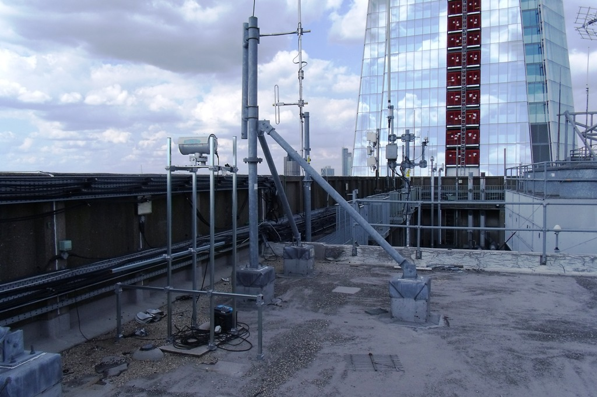

.. _KGG:

***
KGG
***

Introduction
############

.. include:: intros/KGG_intro.rst

Site metadata
#############

.. csv-table:: 
   :file: meta/KGG_meta.csv
   :stub-columns: 1

.. raw:: html

   

   

    

Deployments at site
###################

.. csv-table:: All site deployments
   :file: deployments/dates/KGG_deployment_dates.csv
   :header-rows: 2

.. csv-table:: Position of deployments
   :file: deployments/positions/KGG_deployment_positions.csv
   :header-rows: 2

.. csv-table:: Raw files of deployments
   :file: deployments/raw_files/KGG_deployment_raw_files.csv
   :header-rows: 2

Photos
######

   :ref:`LAS150`transmitter to :ref:`BTT` 05-08-2011.

Supplementary information
#########################

Data acquisition
################

.. include:: ../../../data_acquisition/data_acquisition_default.rst

References
##########

Acknowledgements
################

