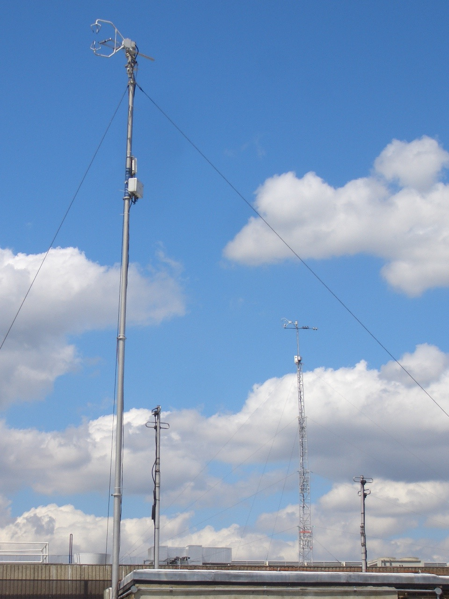
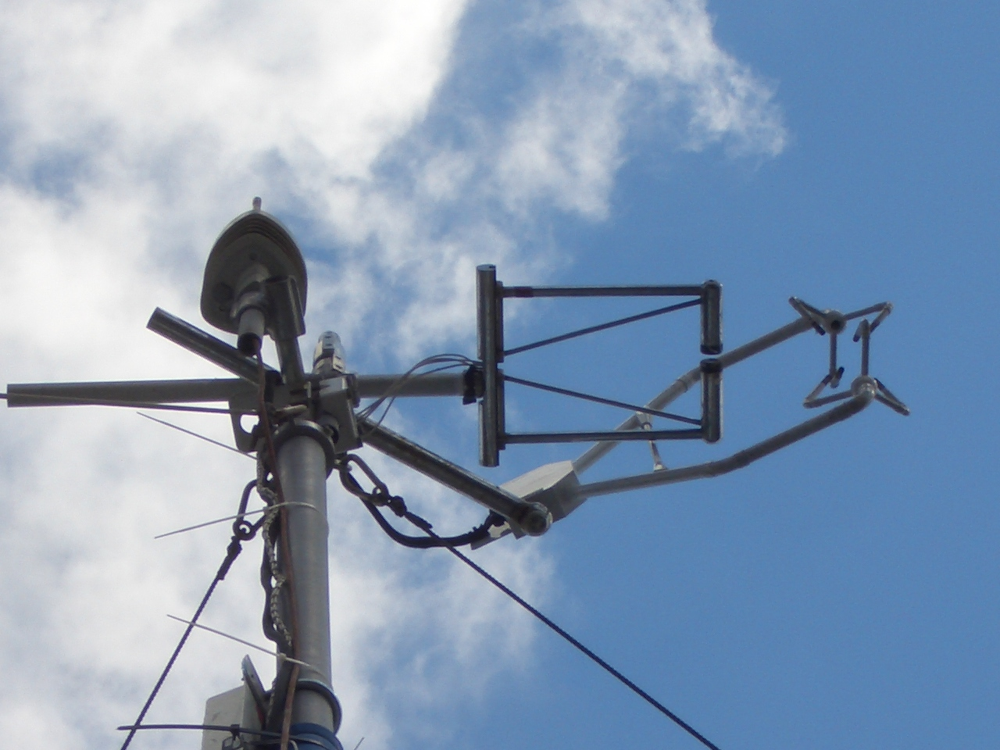
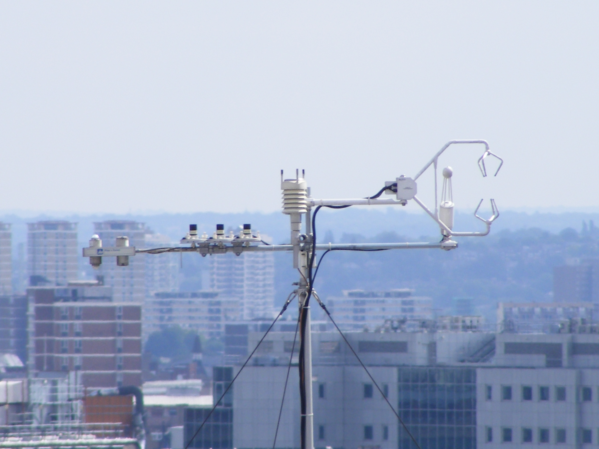
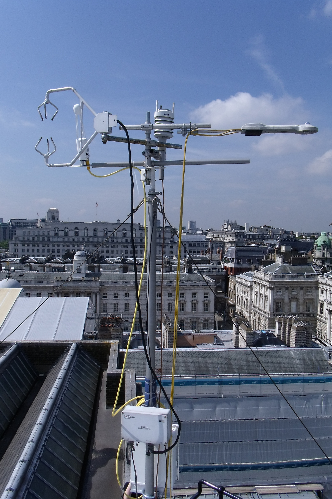

.. _KSK:

***
KSK
***

Introduction
############

.. include:: intros/KSK_intro.rst

Site metadata
#############

.. csv-table:: 
   :file: meta/KSK_meta.csv
   :stub-columns: 1

.. raw:: html

   

   

    

Deployments at site
###################

.. csv-table:: All site deployments
   :file: deployments/dates/KSK_deployment_dates.csv
   :header-rows: 2

.. csv-table:: Position of deployments
   :file: deployments/positions/KSK_deployment_positions.csv
   :header-rows: 2

.. csv-table:: Raw files of deployments
   :file: deployments/raw_files/KSK_deployment_raw_files.csv
   :header-rows: 2

Photos
######

   :ref:`CSAT3`, :ref:`KH20` and :ref:`WXT510` atop mast. :ref:`KSS` tower can be seen in the background. 20-07-2010.

   :ref:`CSAT3`, :ref:`KH20` and :ref:`WXT510` atop mast 20-07-2010.

   :ref:`CSAT3`, :ref:`LI7500A`, :ref:`PAR`, :ref:`UVA`, :ref:`UVB`, :ref:`CNR1` and :ref:`WXT510` atop tower 18-08-2009.

   :ref:`CSAT3`, :ref:`LI7500A`, :ref:`CNR4` and :ref:`WXT510` 19-08-2011.

Supplementary information
#########################

Data acquisition
################

.. include:: ../../../data_acquisition/data_acquisition_default.rst

References
##########

#. Dou, J., Grimmond, S., Cheng, Z., Miao, S., Feng, D. and Liao, M. (2019) Summertime surface energy balance fluxes at two Beijing sites. International Journal of Climatology, 39 (5). pp. 2793-2810. ISSN 08998418 doi: https://doi.org/10.1002/joc.5989
#. Kent, C. W. (2018) Surface roughness parameters in cities: improvements and implications for windspeed estimation. PhD thesis, University of Reading.
#. Warren, E., Charlton-Perez, C., Kotthaus, S., Lean, H., Ballard, S., Hopkin, E. and Grimmond, S. (2018) Evaluation of forward-modelled attenuated backscatter using an urban ceilometer network in London under clear-sky conditions. Atmospheric Environment, 191. pp. 532-547. ISSN 1352-2310 doi: https://doi.org/10.1016/j.atmosenv.2018.04.045
#. Kent, C. W., Grimmond, S., Barlow, J., Gatey, D., Kotthaus, S., Lindberg, F. and Halios, C. H. (2017) Evaluation of urban local-scale aerodynamic parameters: implications for the vertical profile of wind speed and for source areas. Boundary-Layer Meteorology, 164 (2). pp. 183-213. ISSN 0006-8314 doi: https://doi.org/10.1007/s10546-017-0248-z
#. Font, A., Grimmond, C. S. B., Kotthaus, S., Morgu�, J. -A., Stockdale, C., O'Connor, E., Priestman, M. and Barratt, B. (2015) Daytime CO2 urban surface fluxes from airborne measurements, eddy-covariance observations and emissions inventory in Greater London. Environmental Pollution, 196. pp. 98-106. ISSN 0269-7491 doi: https://doi.org/10.1016/j.envpol.2014.10.001
#. Kotthaus, S. and Grimmond, C. S. B. (2014) Energy exchange in a dense urban environment Part II: impact of spatial heterogeneity of the surface. Urban Climate, 10 (2). pp. 281-307. ISSN 2212-0955 doi: https://doi.org/10.1016/j.uclim.2013.10.001
#. Kotthaus, S. and Grimmond, C. S. B. (2014) Energy exchange in a dense urban environment – part I: temporal variability of long-term observations in central London. Urban Climate, 10 (2). pp. 261-280. ISSN 2212-0955 doi: https://doi.org/10.1016/j.uclim.2013.10.002
#. Magliulo, V., Toscano, P., Grimmond, C. S. B., Kotthaus, S., J�rvi, L., Set�l�, H., Lindberg, F., Vogt, R., Staszewski, T., Bubak, A., Synnefa, A. and Santamouris, M. (2014) Environmental measurements in BRIDGE case studies. In: Chrysoulakis, N., de Castro, E. A. and Moors, E. J. (eds.) Understanding Urban Metabolism. Routledge, pp. 45-57. ISBN 9780415835114
#. Wood, C. R., Pauscher, L., Ward, H. C., Kotthaus, S., Barlow, J., Gouvea, M., Lane, S. E. and Grimmond, C. S. B. (2013) Wind observations above an urban river using a new lidar technique, scintillometry and anemometry. Science of the Total Environment, 442. pp. 527-533. ISSN 0048-9697 doi: https://doi.org/10.1016/j.scitotenv.2012.10.061
#. Loridan, T., Grimmond, C.S.B., Offerle, B. D., Young, D. T., Smith, T. E. L., J�rvi, L. and Lindberg, F. (2011) Local-scale urban meteorological parameterization scheme (LUMPS): longwave radiation parameterization and seasonality-related developments. Journal of Applied Meteorology and Climatology, 50 (1). pp. 185-202. ISSN 1558-8424 doi: https://doi.org/10.1175/2010JAMC2474.1

Acknowledgements
################

