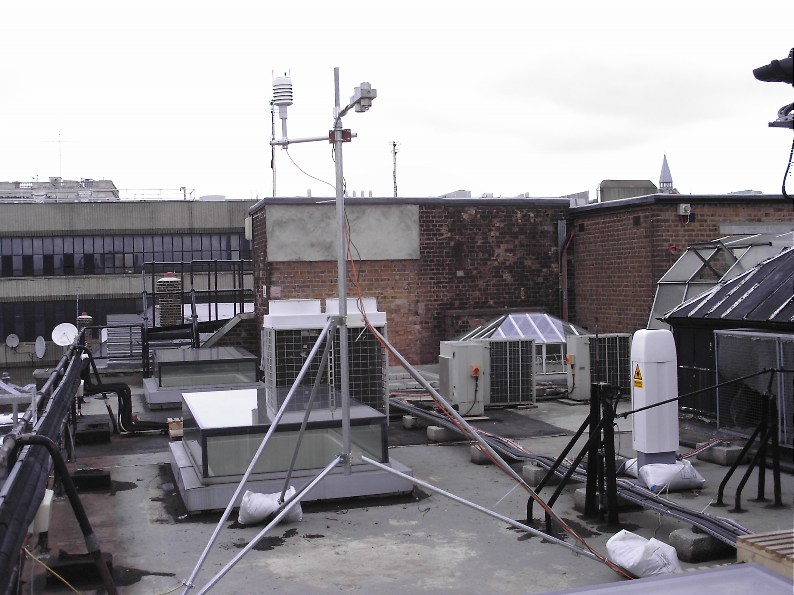
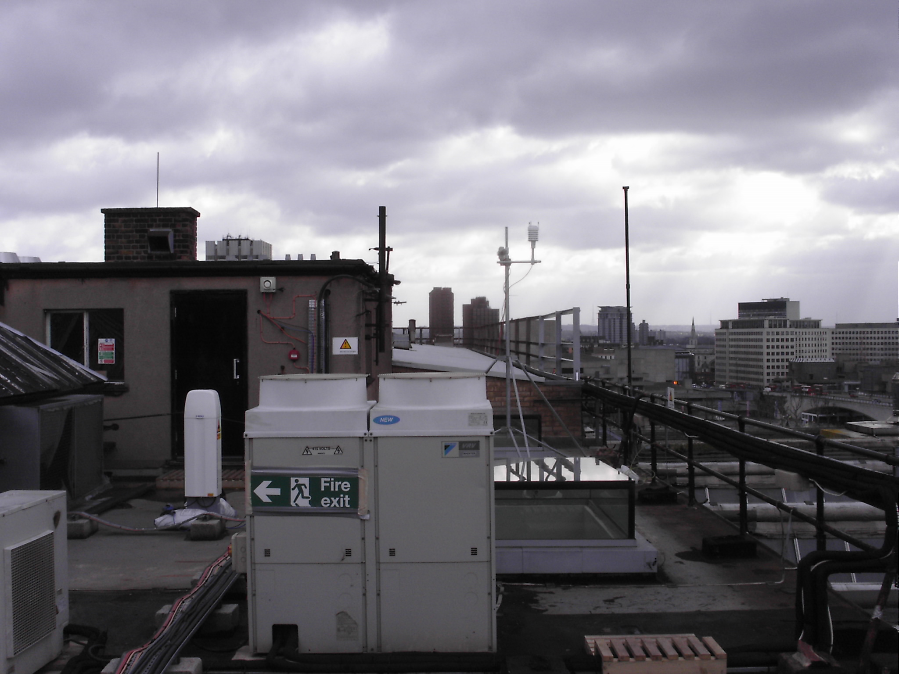
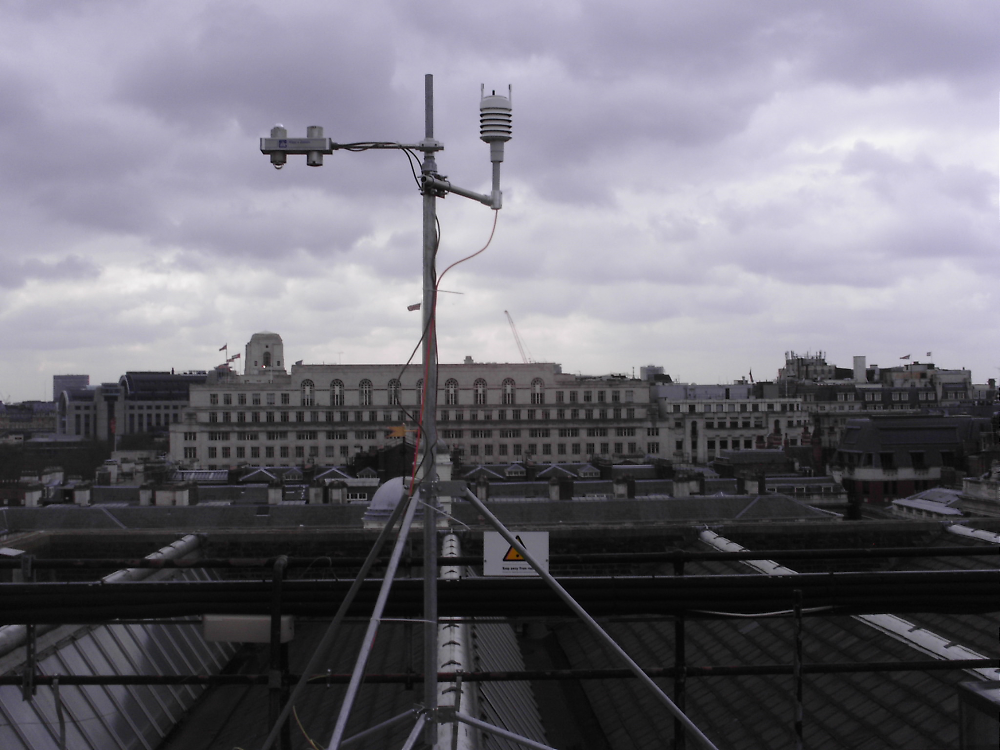

.. _KSK15S:

******
KSK15S
******

Introduction
############

.. include:: intros/KSK15S_intro.rst

Site metadata
#############

.. csv-table:: 
   :file: meta/KSK15S_meta.csv
   :stub-columns: 1

.. raw:: html

   

   

    

Deployments at site
###################

.. csv-table:: All site deployments
   :file: deployments/dates/KSK15S_deployment_dates.csv
   :header-rows: 2

.. csv-table:: Position of deployments
   :file: deployments/positions/KSK15S_deployment_positions.csv
   :header-rows: 2

.. csv-table:: Raw files of deployments
   :file: deployments/raw_files/KSK15S_deployment_raw_files.csv
   :header-rows: 2

.. csv-table:: Metadata specific to profiles
   :file: deployments/profile_deployments/KSK15S_profile_deployments.csv
   :header-rows: 2

Photos
######

   :ref:`CNR1` and :ref:`CL31`.

   :ref:`CNR1` and :ref:`CL31`.

   :ref:`CNR1`.

Supplementary information
#########################

Data acquisition
################

.. include:: ../../../data_acquisition/data_acquisition_default.rst

References
##########

Acknowledgements
################

We thank King College London Directorate of Estates Facilities for site access.

