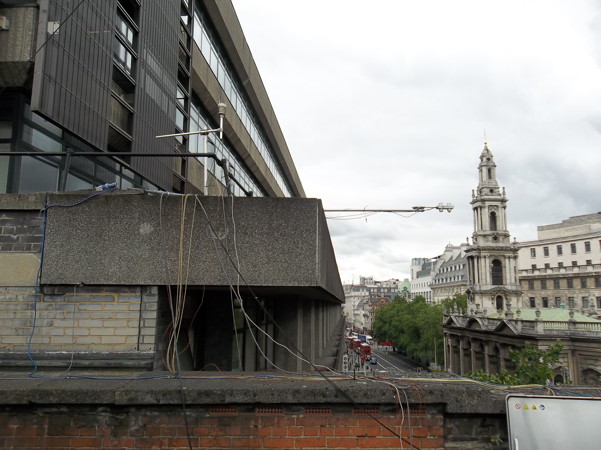
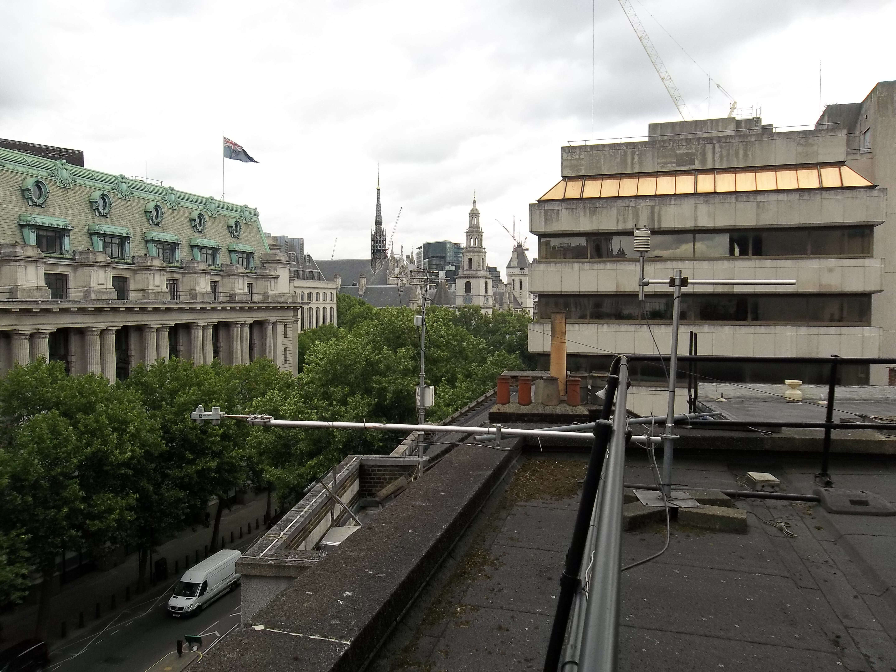
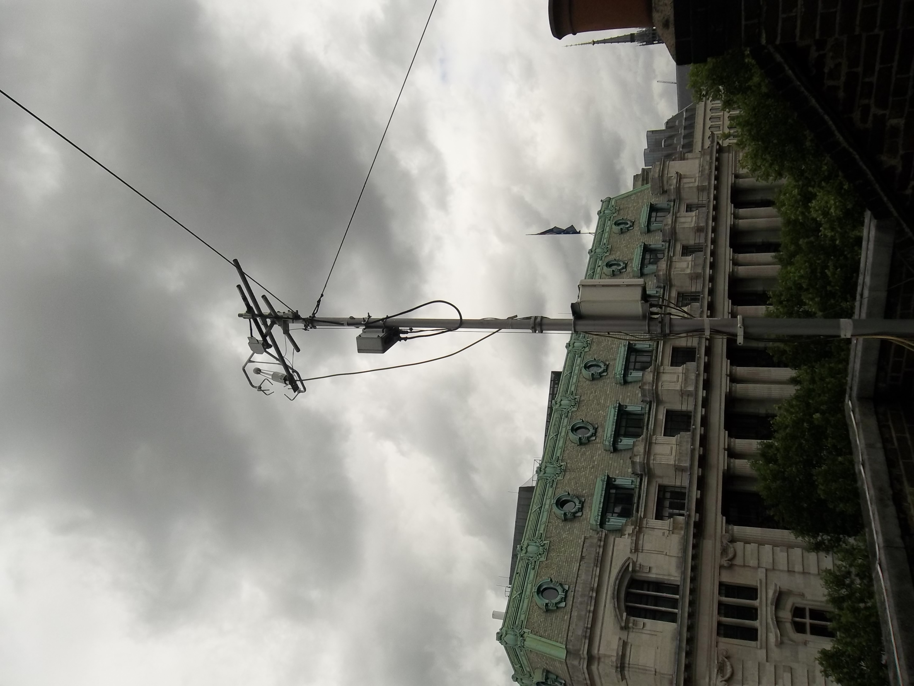
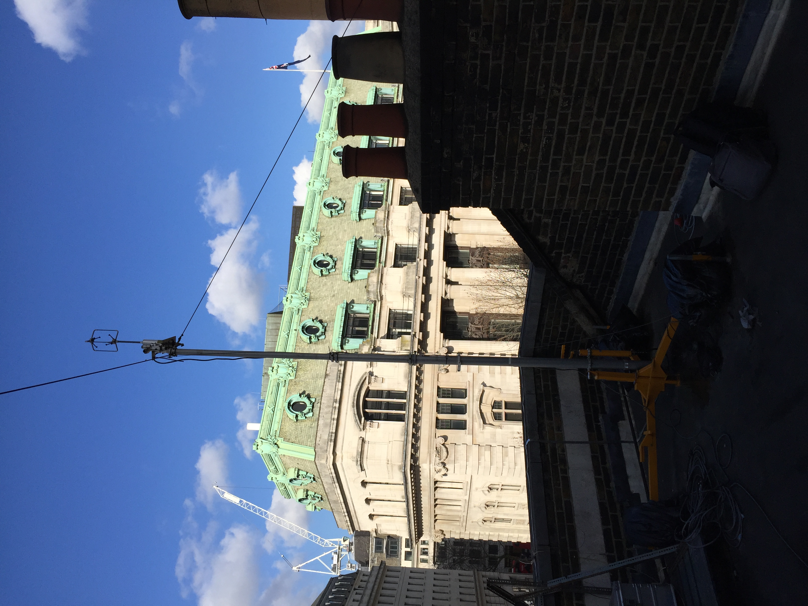
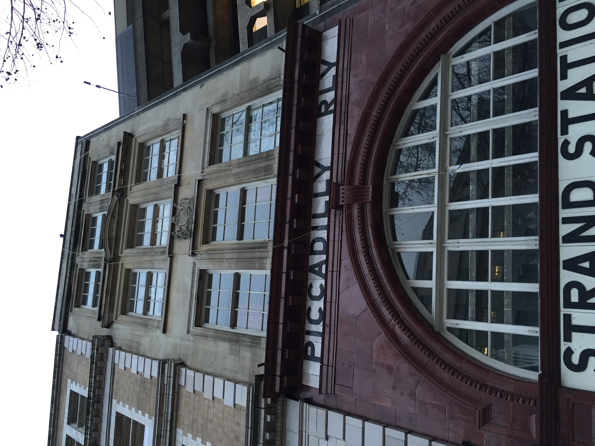

.. _KSNW:

****
KSNW
****

Introduction
############

.. include:: intros/KSNW_intro.rst

Site metadata
#############

.. csv-table:: 
   :file: meta/KSNW_meta.csv
   :stub-columns: 1

.. raw:: html

   

   

    

Deployments at site
###################

.. csv-table:: All site deployments
   :file: deployments/dates/KSNW_deployment_dates.csv
   :header-rows: 2

.. csv-table:: Position of deployments
   :file: deployments/positions/KSNW_deployment_positions.csv
   :header-rows: 2

.. csv-table:: Raw files of deployments
   :file: deployments/raw_files/KSNW_deployment_raw_files.csv
   :header-rows: 2

Photos
######

   :ref:`CNR1` and :ref:`WXT510` looking towards the West 05-07-2015.

   :ref:`LI7500A`, :ref:`CSAT3`, :ref:`CNR1` and :ref:`WXT510` looking towards the East 05-07-2015.

   :ref:`CSAT3` and :ref:`LI7500A` 05-07-2015.

   :ref:`GILL121R03` 18-02-2016.

   :ref:`LI840` pipe coming down the side of the building 17-12-2015.

Supplementary information
#########################

Data acquisition
################

.. include:: ../../../data_acquisition/data_acquisition_default.rst

References
##########

#. Warren, E., Charlton-Perez, C., Kotthaus, S., Lean, H., Ballard, S., Hopkin, E. and Grimmond, S. (2018) Evaluation of forward-modelled attenuated backscatter using an urban ceilometer network in London under clear-sky conditions. Atmospheric Environment, 191. pp. 532-547. ISSN 1352-2310 doi: https://doi.org/10.1016/j.atmosenv.2018.04.045
#. Bjorkegren, A. and Grimmond, C. S. B., (2017) Net carbon dioxide emissions from central London. Urban Climate, 23. pp. 131-158. ISSN 2212-0955 doi: https://doi.org/10.1016/j.uclim.2016.10.002
#. Bjorkeren, A. B., Grimmond, C. S. B., Kotthaus, S. and Malamud, B. D. (2015) CO2 emission estimation in the urban environment: measurement of the CO2 storage term. Atmospheric Environment, 122. pp. 775-790. ISSN 1352-2310 doi: https://doi.org/10.1016/j.atmosenv.2015.10.012

Acknowledgements
################

We thank King College London Directorate of Estates Facilities for site access.

