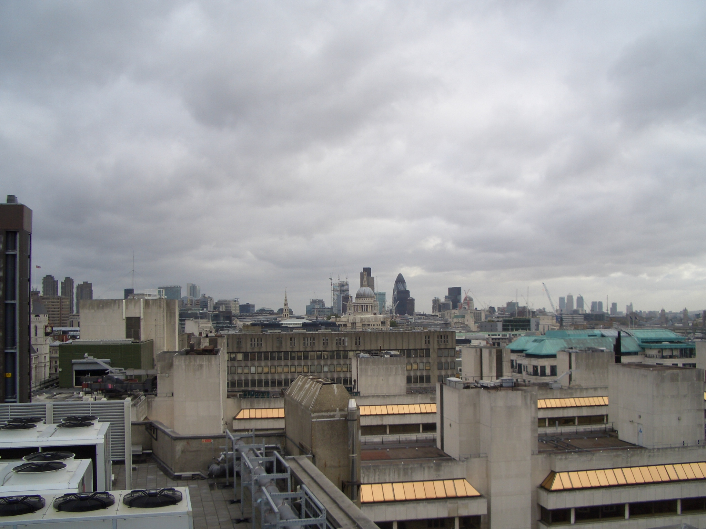
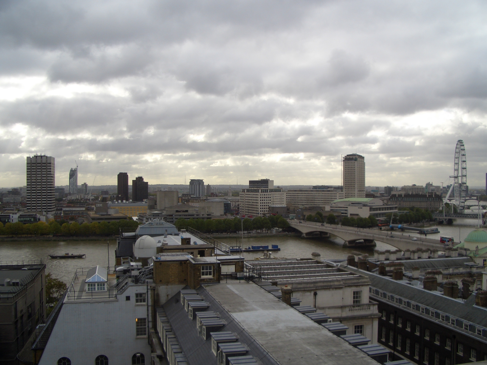
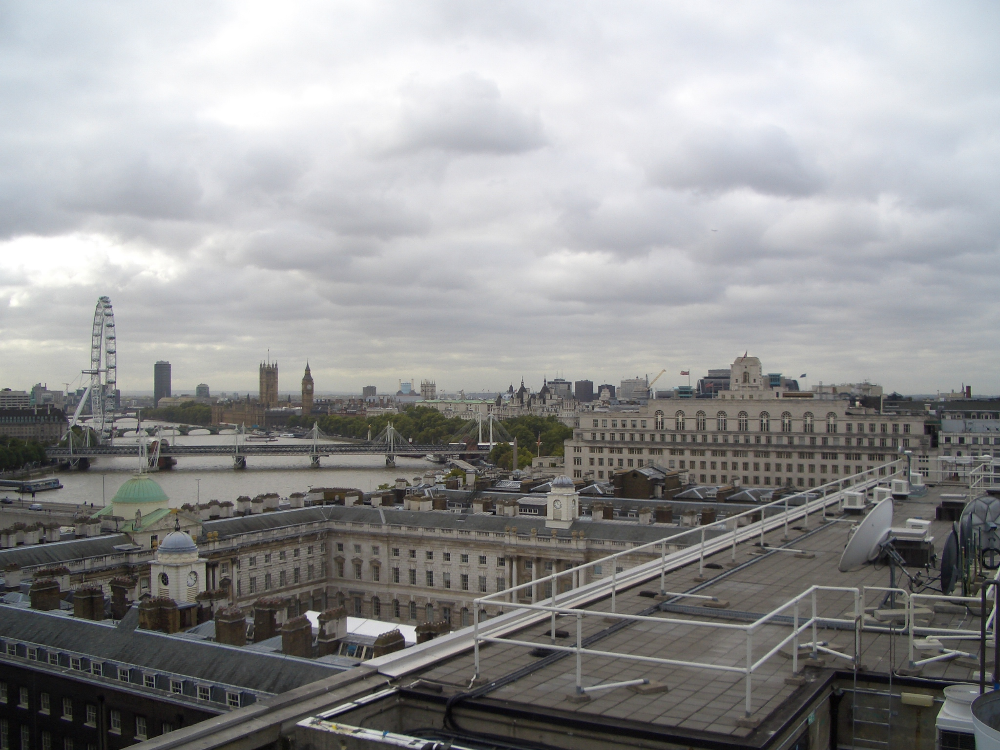
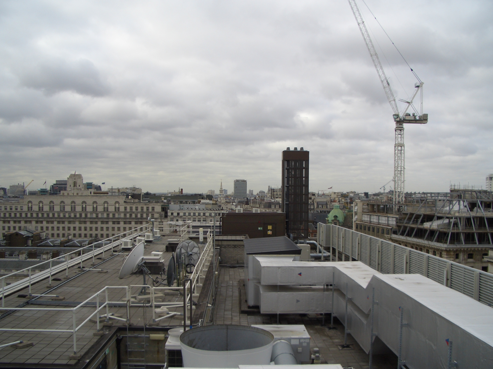
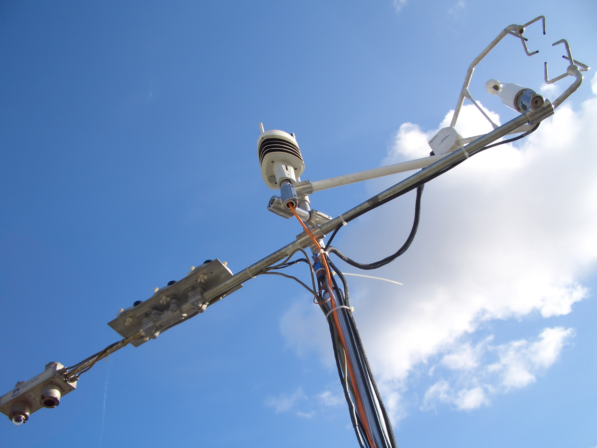
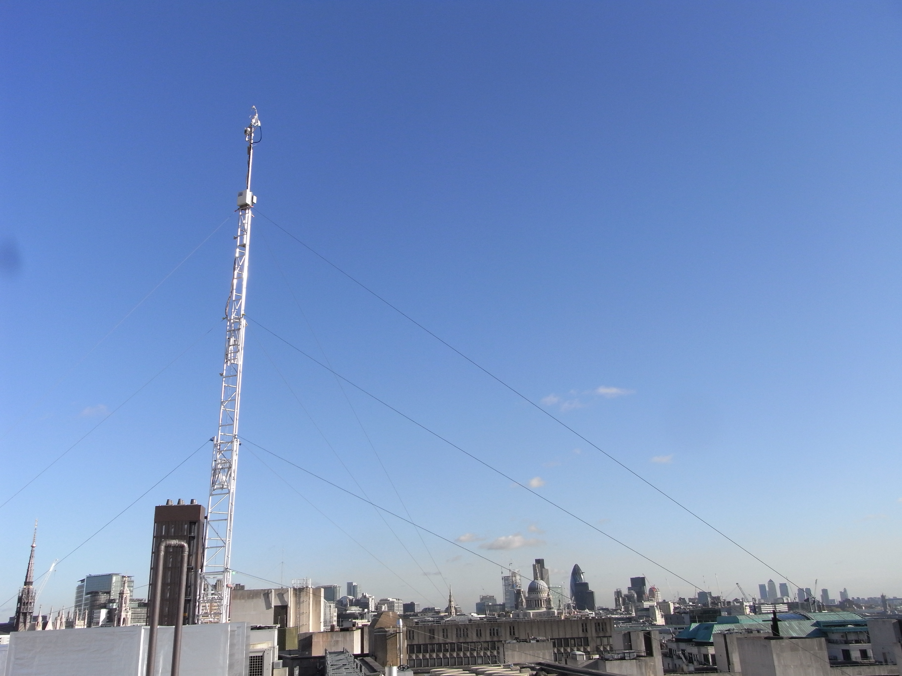

.. _KSS:

***
KSS
***

Introduction
############

.. include:: intros/KSS_intro.rst

Site metadata
#############

.. csv-table:: 
   :file: meta/KSS_meta.csv
   :stub-columns: 1

.. raw:: html

   

   

    

Deployments at site
###################

.. csv-table:: All site deployments
   :file: deployments/dates/KSS_deployment_dates.csv
   :header-rows: 2

.. csv-table:: Position of deployments
   :file: deployments/positions/KSS_deployment_positions.csv
   :header-rows: 2

Photos
######

   View looking to the South 16-10-2009.

   View looking to the East 16-10-2009.

   View looking South West 16-10-2009.

   View looking West 16-10-2009.

   :ref:`CNR1`, :ref:`PAR`, :ref:`UVA`, :ref:`UVB`, :ref:`WXT510`, :ref:`CSAT3` and :ref:`LI7500A` atop tower 16-10-2009.  

   Tower fullly extended 07-11-2009.

Data acquisition
################

.. include:: ../../../data_acquisition/data_acquisition_default.rst

References
##########

#. Tsiringakis, A., Steeneveld, G.‐J., Holtslag, A. A. M., Kotthaus, S. and Grimmond, S. (2019) On‐ and off‐line evaluation of the single‐layer urban canopy model in London summertime conditions. Quarterly Journal of the Royal Meteorological Society, 145 (721). pp. 1474-1489. ISSN 1477-870X doi: https://doi.org/10.1002/qj.3505
#. Dou, J., Grimmond, S., Cheng, Z., Miao, S., Feng, D. and Liao, M. (2019) Summertime surface energy balance fluxes at two Beijing sites. International Journal of Climatology, 39 (5). pp. 2793-2810. ISSN 08998418 doi: https://doi.org/10.1002/joc.5989
#. Kent, C. W., Grimmond, C. S. B., Gatey, D. and Barlow, J. F. (2018) Assessing methods to extrapolate the vertical wind-speed profile from surface observations in a city centre during strong winds. Journal of Wind Engineering and Industrial Aerodynamics, 173. pp. 100-111. ISSN 0167-6105 doi: https://doi.org/10.1016/j.jweia.2017.09.007
#. Kent, C. W. (2018) Surface roughness parameters in cities: improvements and implications for windspeed estimation. PhD thesis, University of Reading.
#. Kent, C. W., Grimmond, S., Barlow, J., Gatey, D., Kotthaus, S., Lindberg, F. and Halios, C. H. (2017) Evaluation of urban local-scale aerodynamic parameters: implications for the vertical profile of wind speed and for source areas. Boundary-Layer Meteorology, 164 (2). pp. 183-213. ISSN 0006-8314 doi: https://doi.org/10.1007/s10546-017-0248-z
#. Ward, H. C., Kotthaus, S., J�rvi, L. and Grimmond, C. S. B. (2016) Surface Urban Energy and Water Balance Scheme (SUEWS): development and evaluation at two UK sites. Urban Climate, 18. pp. 1-32. ISSN 2212-0955 doi: https://doi.org/10.1016/j.uclim.2016.05.001
#. Font, A., Grimmond, C. S. B., Kotthaus, S., Morgu�, J. -A., Stockdale, C., O'Connor, E., Priestman, M. and Barratt, B. (2015) Daytime CO2 urban surface fluxes from airborne measurements, eddy-covariance observations and emissions inventory in Greater London. Environmental Pollution, 196. pp. 98-106. ISSN 0269-7491 doi: https://doi.org/10.1016/j.envpol.2014.10.001
#. Ward, H. C., Kotthaus, S., Grimmond, C. S. B., Bjorkegren, A., Wilkinson, M., Morrison, W. T. J., Evans, J. G., Morison, J. I. L. and Iamarino, M. (2015) Effects of urban density on carbon dioxide exchanges: observations of dense urban, suburban and woodland areas of southern England. Environmental Pollution, 198. pp. 186-200. ISSN 0269-7491 doi: https://doi.org/10.1016/j.envpol.2014.12.031
#. Bjorkeren, A. B., Grimmond, C. S. B., Kotthaus, S. and Malamud, B. D. (2015) CO2 emission estimation in the urban environment: measurement of the CO2 storage term. Atmospheric Environment, 122. pp. 775-790. ISSN 1352-2310 doi: https://doi.org/10.1016/j.atmosenv.2015.10.012
#. Kotthaus, S. and Grimmond, C. S. B. (2014) Energy exchange in a dense urban environment Part II: impact of spatial heterogeneity of the surface. Urban Climate, 10 (2). pp. 281-307. ISSN 2212-0955 doi: https://doi.org/10.1016/j.uclim.2013.10.001
#. Kotthaus, S. and Grimmond, C. S. B. (2014) Energy exchange in a dense urban environment – part I: temporal variability of long-term observations in central London. Urban Climate, 10 (2). pp. 261-280. ISSN 2212-0955 doi: https://doi.org/10.1016/j.uclim.2013.10.002
#. Magliulo, V., Toscano, P., Grimmond, C. S. B., Kotthaus, S., J�rvi, L., Set�l�, H., Lindberg, F., Vogt, R., Staszewski, T., Bubak, A., Synnefa, A. and Santamouris, M. (2014) Environmental measurements in BRIDGE case studies. In: Chrysoulakis, N., de Castro, E. A. and Moors, E. J. (eds.) Understanding Urban Metabolism. Routledge, pp. 45-57. ISBN 9780415835114
#. Wood, C. R., Pauscher, L., Ward, H. C., Kotthaus, S., Barlow, J., Gouvea, M., Lane, S. E. and Grimmond, C. S. B. (2013) Wind observations above an urban river using a new lidar technique, scintillometry and anemometry. Science of the Total Environment, 442. pp. 527-533. ISSN 0048-9697 doi: https://doi.org/10.1016/j.scitotenv.2012.10.061

Acknowledgements
################

We thank King College London Directorate of Estates Facilities for site access.

