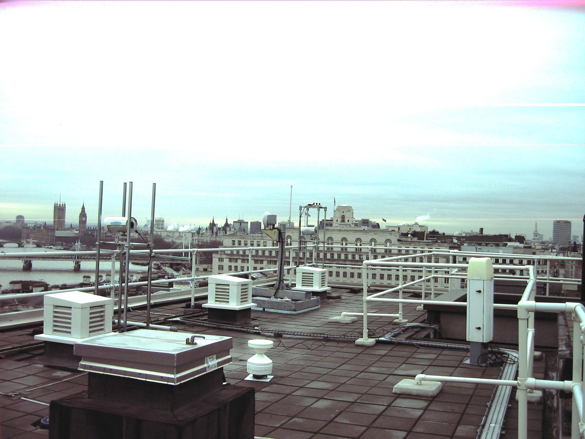
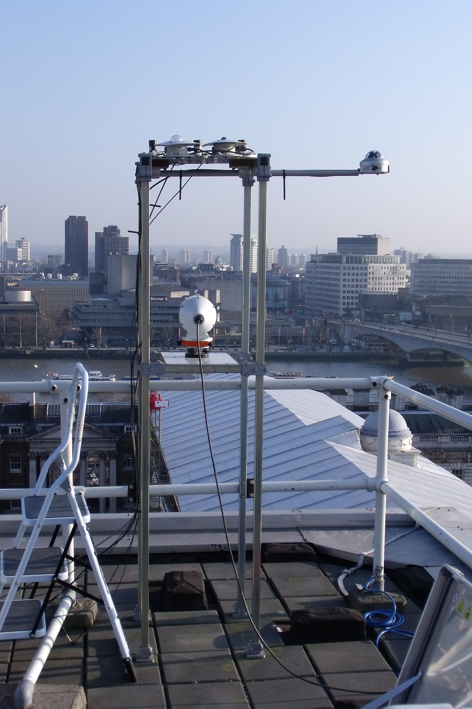

.. _KSS45W:

******
KSS45W
******

Introduction
############

.. include:: intros/KSS45W_intro.rst

Site metadata
#############

.. csv-table:: 
   :file: meta/KSS45W_meta.csv
   :stub-columns: 1

.. raw:: html

   

   

    

Deployments at site
###################

.. csv-table:: All site deployments
   :file: deployments/dates/KSS45W_deployment_dates.csv
   :header-rows: 2

.. csv-table:: Position of deployments
   :file: deployments/positions/KSS45W_deployment_positions.csv
   :header-rows: 2

.. csv-table:: Raw files of deployments
   :file: deployments/raw_files/KSS45W_deployment_raw_files.csv
   :header-rows: 2

.. csv-table:: Metadata specific to profiles
   :file: deployments/profile_deployments/KSS45W_profile_deployments.csv
   :header-rows: 2

Photos
######

   :ref:`ARG100` and :ref:`CL31` 10-02-2010.

   :ref:`PAR`, :ref:`UVA`, :ref:`UVB`, :ref:`SPN1`, :ref:`PIR`, :ref:`PSP` on top of structure 04-03-2011.

   :ref:`CL31` and :ref:`PAR`, :ref:`UVA`, :ref:`UVB`, :ref:`SPN1`, :ref:`PIR`, :ref:`PSP` on top of structure.

Supplementary information
#########################

Data acquisition
################

.. include:: ../../../data_acquisition/data_acquisition_default.rst

References
##########

#. Warren, E., Charlton-Perez, C., Kotthaus, S., Lean, H., Ballard, S., Hopkin, E. and Grimmond, S. (2018) Evaluation of forward-modelled attenuated backscatter using an urban ceilometer network in London under clear-sky conditions. Atmospheric Environment, 191. pp. 532-547. ISSN 1352-2310 doi: https://doi.org/10.1016/j.atmosenv.2018.04.045
#. Bjorkegren, A. and Grimmond, C. S. B., (2017) Net carbon dioxide emissions from central London. Urban Climate, 23. pp. 131-158. ISSN 2212-0955 doi: https://doi.org/10.1016/j.uclim.2016.10.002

Acknowledgements
################

We thank King College London Directorate of Estates Facilities for site access.

