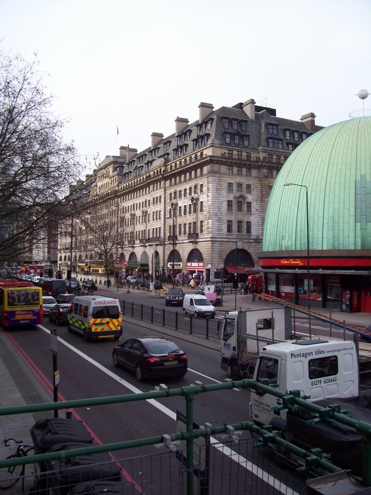
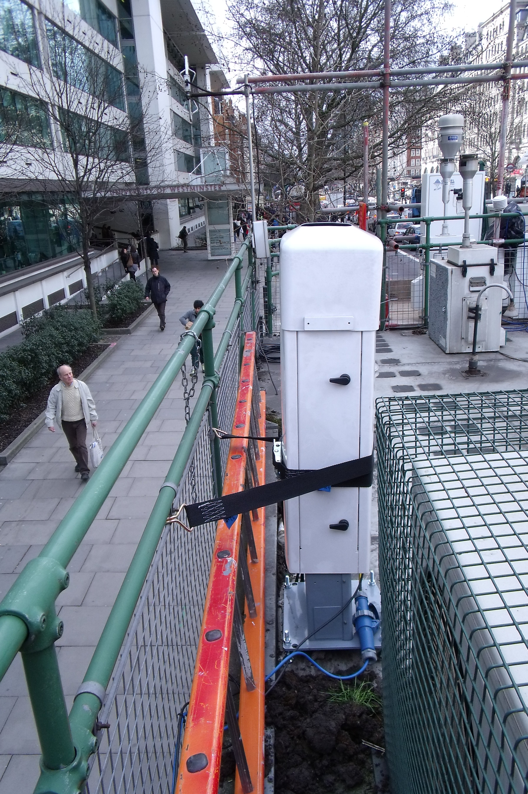
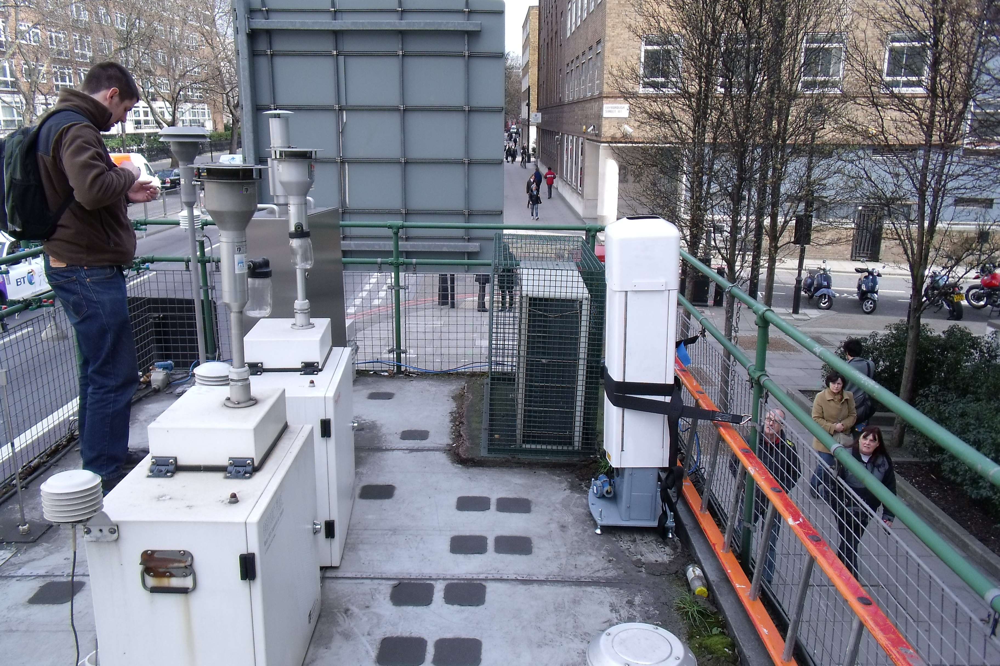

.. _MR:

**
MR
**

Introduction
############

.. include:: intros/MR_intro.rst

Site metadata
#############

.. csv-table:: 
   :file: meta/MR_meta.csv
   :stub-columns: 1

.. raw:: html

   

   

    

Deployments at site
###################

.. csv-table:: All site deployments
   :file: deployments/dates/MR_deployment_dates.csv
   :header-rows: 2

.. csv-table:: Position of deployments
   :file: deployments/positions/MR_deployment_positions.csv
   :header-rows: 2

.. csv-table:: Metadata specific to profiles
   :file: deployments/profile_deployments/MR_profile_deployments.csv
   :header-rows: 2

Photos
######

   View facing NW 03-03-2010.

   :ref:`CL31` looking towards the West 03-09-2011.

   :ref:`CL31` looking towards the East 03-09-2011.

Data acquisition
################

.. include:: ../../../data_acquisition/data_acquisition_default.rst

Data availability
#################

.. raw:: html

   <iframe src="../../../_static/availability_plots/MR_availability.html" height="600px" width="1200px" allowfullscreen=true style="border:0px;"></iframe>
*Double click on legend to isolate instruments.*

References
##########

#. Hertwig, D., Grimmond, S., Kotthaus, S., Vanderwel, C., Gough, H., Haeffelin, M. and Robins, A. (2020) Variability of physical meteorology in urban areas at different scales: implications for air quality. Faraday Discussions. ISSN 1364-5498 doi: https://doi.org/10.1039/D0FD00098A (In Press)
#. Harrison, R. M., Beddows, D. C. S., Alam, M. S., Singh, A., Brean, J., Xu, R., Kotthaus, S. and Grimmond, S. (2019) Interpretation of particle number size distributions measured across an urban area during the FASTER campaign. Atmospheric Chemistry and Physics, 19 (1). pp. 39-55. ISSN 1680-7324 doi: https://doi.org/10.5194/acp-19-39-2019
#. Theeuwes, N. E., Barlow, J. F., Teuling, A. J., Grimmond, C. S. B. and Kotthaus, S. (2019) Persistent cloud cover over mega-cities linked to surface heat release. npj Climate and Atmospheric Science, 2. 15. ISSN 2397-3722 doi: https://doi.org/10.1038/s41612-019-0072-x
#. Tsiringakis, A., Steeneveld, G.‐J., Holtslag, A. A. M., Kotthaus, S. and Grimmond, S. (2019) On‐ and off‐line evaluation of the single‐layer urban canopy model in London summertime conditions. Quarterly Journal of the Royal Meteorological Society, 145 (721). pp. 1474-1489. ISSN 1477-870X doi: https://doi.org/10.1002/qj.3505
#. Kotthaus, S., Halios, C. H., Barlow, J. F. and Grimmond, C. S. B. (2018) Volume for pollution dispersion: London’s atmospheric boundary layer during ClearfLo observed with two ground-based lidar types. Atmospheric Environment, 190. pp. 401-414. ISSN 1352-2310 doi: https://doi.org/10.1016/j.atmosenv.2018.06.042
#. Kotthaus, S. and Grimmond, C. S. B. (2018) Atmospheric boundary layer characteristics from Ceilometer measurements part 2: application to London’s urban boundary layer. Quarterly Journal of the Royal Meteorological Society, 144 (714). pp. 1511-1524. ISSN 1477-870X doi: https://doi.org/10.1002/qj.3298
#. Kotthaus, S. and Grimmond, C. S. B. (2018) Atmospheric boundary layer characteristics from ceilometer measurements. Part 1: a new method to track mixed layer height and classify clouds. Quarterly Journal of the Royal Meteorological Society, 144 (714). pp. 1525-1538. ISSN 1477-870X doi: https://doi.org/10.1002/qj.3299

