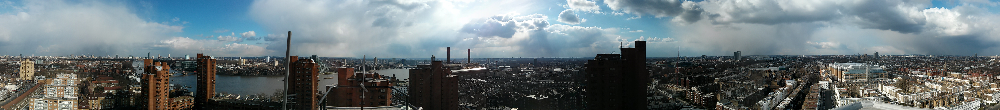
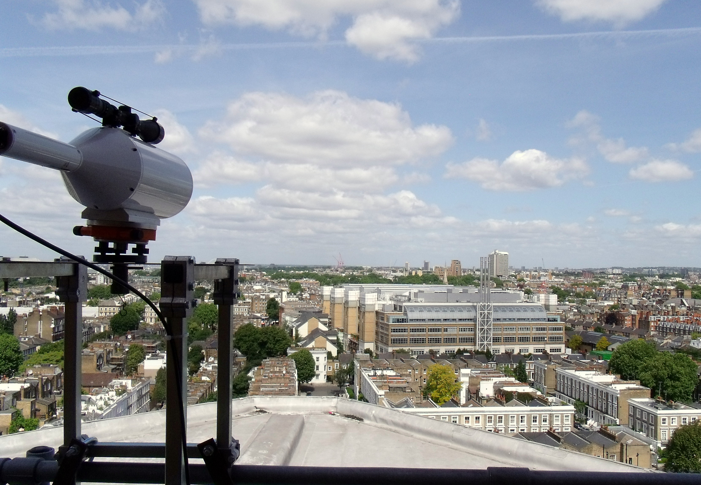
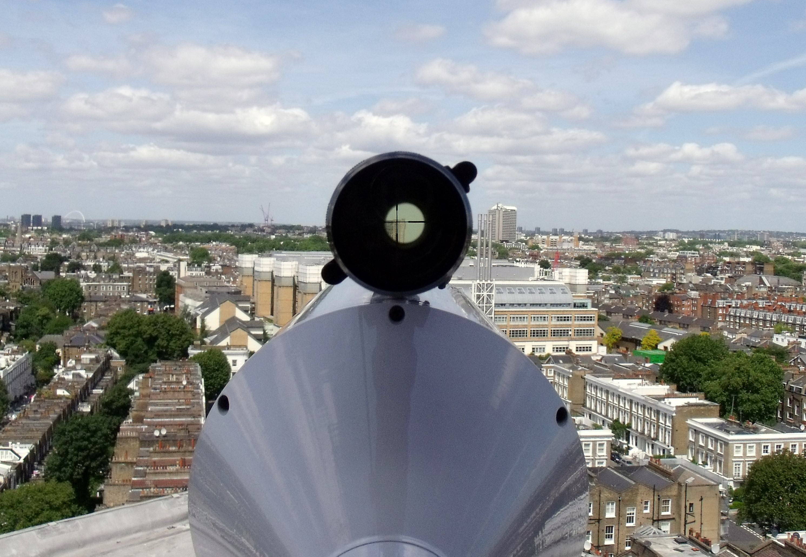
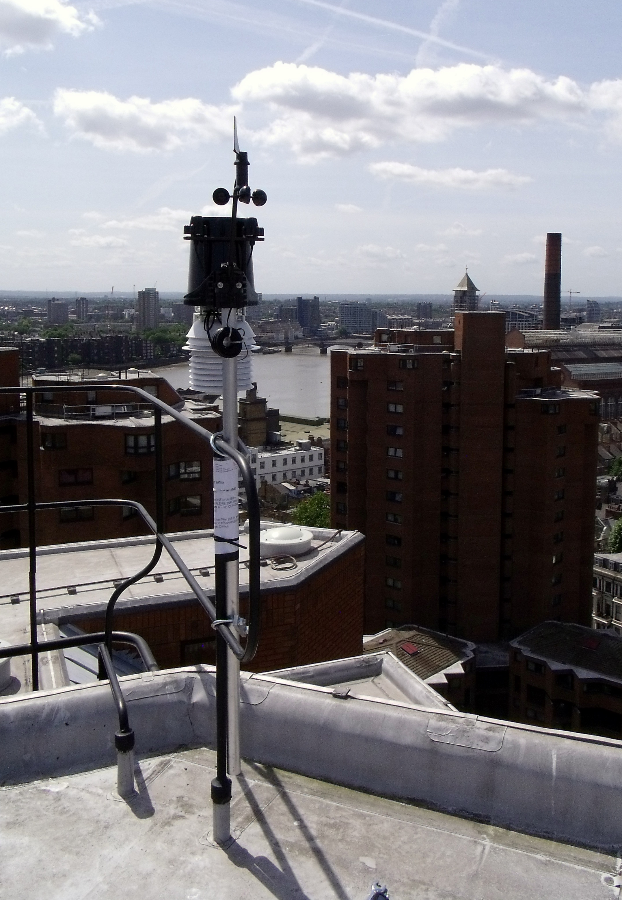

.. _NDT:

***
NDT
***

Introduction
############

.. include:: intros/NDT_intro.rst

Site metadata
#############

.. csv-table:: 
   :file: meta/NDT_meta.csv
   :stub-columns: 1

.. raw:: html

   

   

    

Deployments at site
###################

.. csv-table:: All site deployments
   :file: deployments/dates/NDT_deployment_dates.csv
   :header-rows: 2

.. csv-table:: Position of deployments
   :file: deployments/positions/NDT_deployment_positions.csv
   :header-rows: 2

.. csv-table:: Raw files of deployments
   :file: deployments/raw_files/NDT_deployment_raw_files.csv
   :header-rows: 2

.. csv-table:: Metadata specific to scintillometers
   :file: deployments/scint_deployments/NDT_scint_deployments.csv
   :header-rows: 2

Photos
######

   Panoramic 13-03-2013.

.. figure:: photos/NDT/dartrey_tower_las_cityscan_bls_23161439553_o.jpg
   :width: 50 %

   :ref:`BLS` reciever from :ref:`NTT` and :ref:`LAS150` transmitter to :ref:`NGT` 11-01-2012. 

   :ref:`BLS` view to :ref:`NTT` 24-05-2011.

   :ref:`BLS` view to :ref:`NTT` 24-05-2011.

   :ref:`DAVIS` station 24-05-2011.

Supplementary information
#########################

Data acquisition
################

.. include:: ../../../data_acquisition/data_acquisition_default.rst

References
##########

Acknowledgements
################

We thank Adrian Bowmann at Royal Borough of Kensington and Chelsea  for site access.

