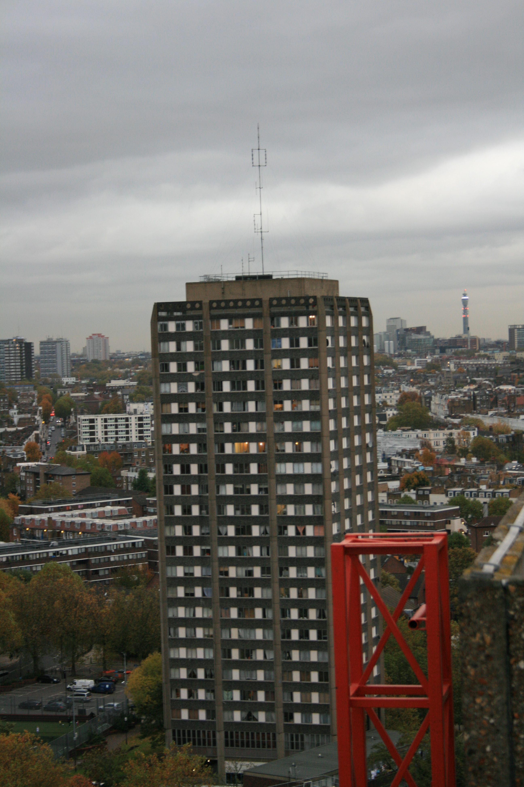
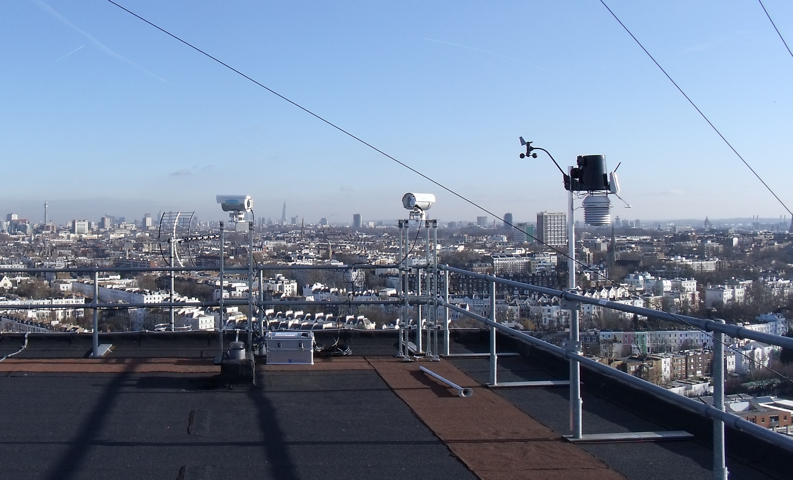
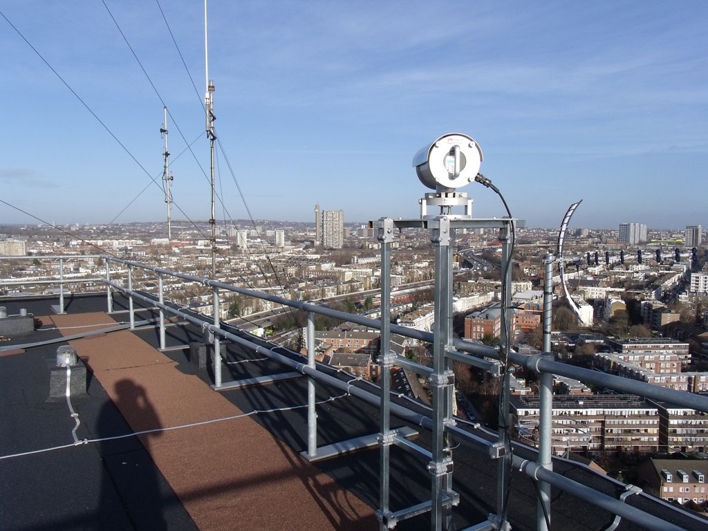
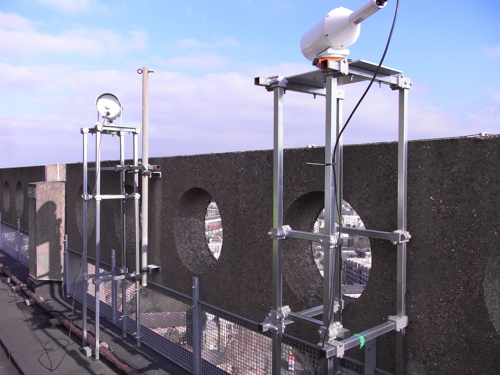
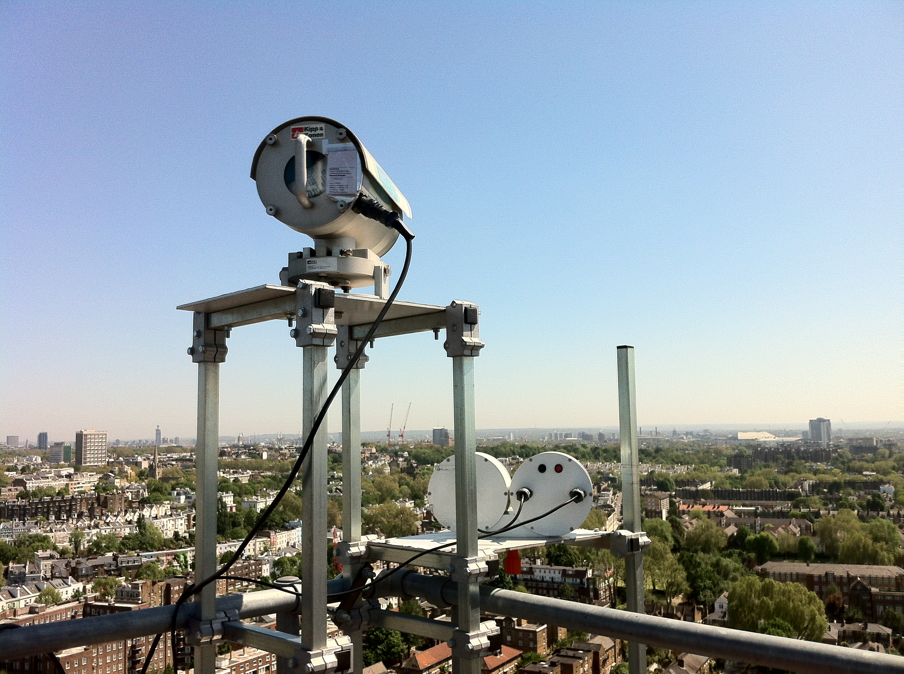

.. _NGT:

***
NGT
***

Introduction
############

.. include:: intros/NGT_intro.rst

Site metadata
#############

.. csv-table:: 
   :file: meta/NGT_meta.csv
   :stub-columns: 1

.. raw:: html

   

   

    

Deployments at site
###################

.. csv-table:: All site deployments
   :file: deployments/dates/NGT_deployment_dates.csv
   :header-rows: 2

.. csv-table:: Position of deployments
   :file: deployments/positions/NGT_deployment_positions.csv
   :header-rows: 2

.. csv-table:: Raw files of deployments
   :file: deployments/raw_files/NGT_deployment_raw_files.csv
   :header-rows: 2

.. csv-table:: Metadata specific to scintillometers
   :file: deployments/scint_deployments/NGT_scint_deployments.csv
   :header-rows: 2

Photos
######

   View of tower. Unknown date between 11-10-2011 and 27-02-2013.

   :ref:`DAVIS`, :ref:`LAS150` reciever from :ref:`NDT` and :ref:`LASMKII` transmitter to :ref:`NTT` 11-01-2012. 

   :ref:`LAS150` view to :ref:`NTT` 06-01-2012.

   :ref:`BLS` reciever and :ref:`LASMKII` unknown date between 2012-09-21 and 2013-02-26.

   :ref:`BLS` transmitter to :ref:`NDT` and :ref:`LAS150` reciever from :ref:`NDT` 25-05-2011.

Supplementary information
#########################

Data acquisition
################

.. include:: ../../../data_acquisition/data_acquisition_default.rst

References
##########

Acknowledgements
################

We thank Adrian Bowmann from Royal Borough of Kensington and Chelsea  for site access.

