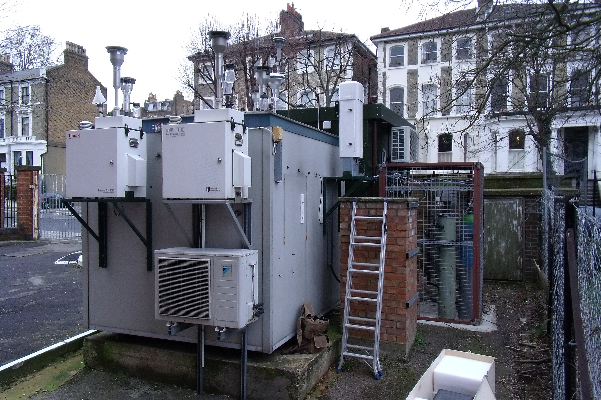

.. _NK:

**
NK
**

Introduction
############

.. include:: intros/NK_intro.rst

Site metadata
#############

.. csv-table:: 
   :file: meta/NK_meta.csv
   :stub-columns: 1

.. raw:: html

   

   

    

Deployments at site
###################

.. csv-table:: All site deployments
   :file: deployments/dates/NK_deployment_dates.csv
   :header-rows: 2

.. csv-table:: Position of deployments
   :file: deployments/positions/NK_deployment_positions.csv
   :header-rows: 2

.. csv-table:: Metadata specific to profiles
   :file: deployments/profile_deployments/NK_profile_deployments.csv
   :header-rows: 2

Photos
######

   :ref:`CL31` 02-02-2011

Data acquisition
################

.. include:: ../../../data_acquisition/data_acquisition_default.rst

Data availability
#################

.. raw:: html

   <iframe src="../../../_static/availability_plots/NK_availability.html" height="600px" width="1200px" allowfullscreen=true style="border:0px;"></iframe>
*Double click on legend to isolate instruments.*

References
##########

#. Warren, E., Charlton-Perez, C., Kotthaus, S., Marenco, F., Ryder, C., Johnson, B., Green, D., Lean, H., Ballard, S. and Grimmond, S. (2020) Observed aerosol characteristics to improve forward-modelled attenuated backscatter in urban areas. Atmospheric Environment, 224. 117177. ISSN 13522310 doi: https://doi.org/10.1016/j.atmosenv.2019.117177
#. Tsiringakis, A., Steeneveld, G.‐J., Holtslag, A. A. M., Kotthaus, S. and Grimmond, S. (2019) On‐ and off‐line evaluation of the single‐layer urban canopy model in London summertime conditions. Quarterly Journal of the Royal Meteorological Society, 145 (721). pp. 1474-1489. ISSN 1477-870X doi: https://doi.org/10.1002/qj.3505
#. Kotthaus, S., Halios, C. H., Barlow, J. F. and Grimmond, C. S. B. (2018) Volume for pollution dispersion: London’s atmospheric boundary layer during ClearfLo observed with two ground-based lidar types. Atmospheric Environment, 190. pp. 401-414. ISSN 1352-2310 doi: https://doi.org/10.1016/j.atmosenv.2018.06.042
#. Warren, E., Charlton-Perez, C., Kotthaus, S., Lean, H., Ballard, S., Hopkin, E. and Grimmond, S. (2018) Evaluation of forward-modelled attenuated backscatter using an urban ceilometer network in London under clear-sky conditions. Atmospheric Environment, 191. pp. 532-547. ISSN 1352-2310 doi: https://doi.org/10.1016/j.atmosenv.2018.04.045

