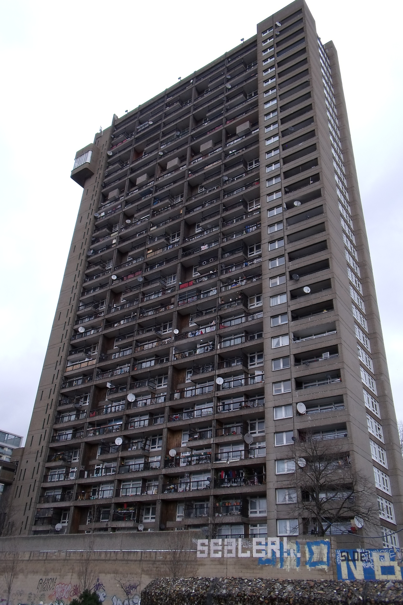
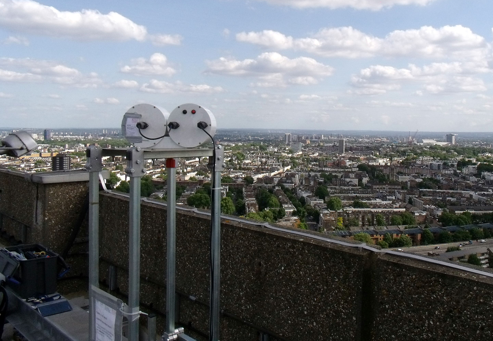
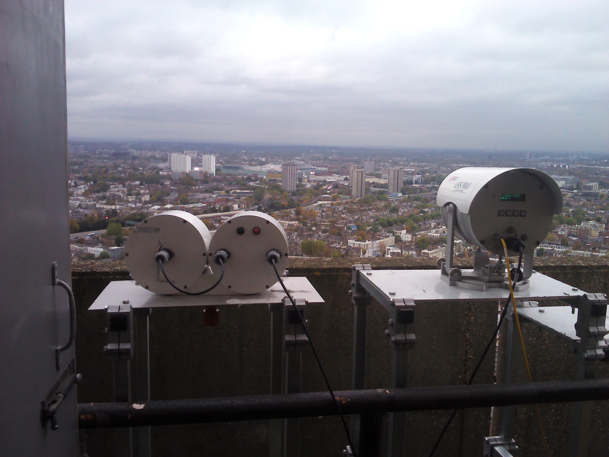
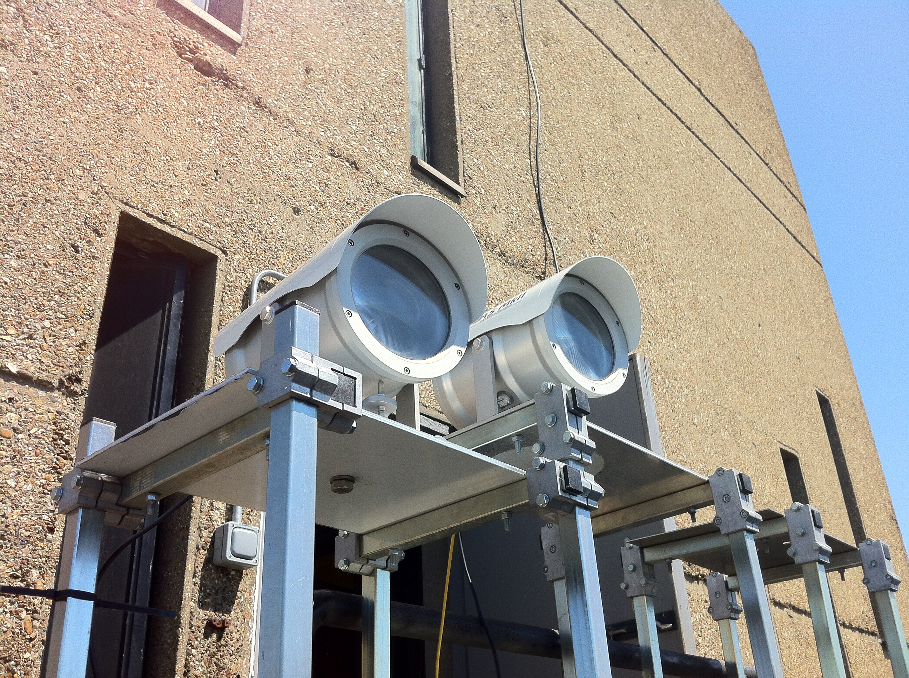
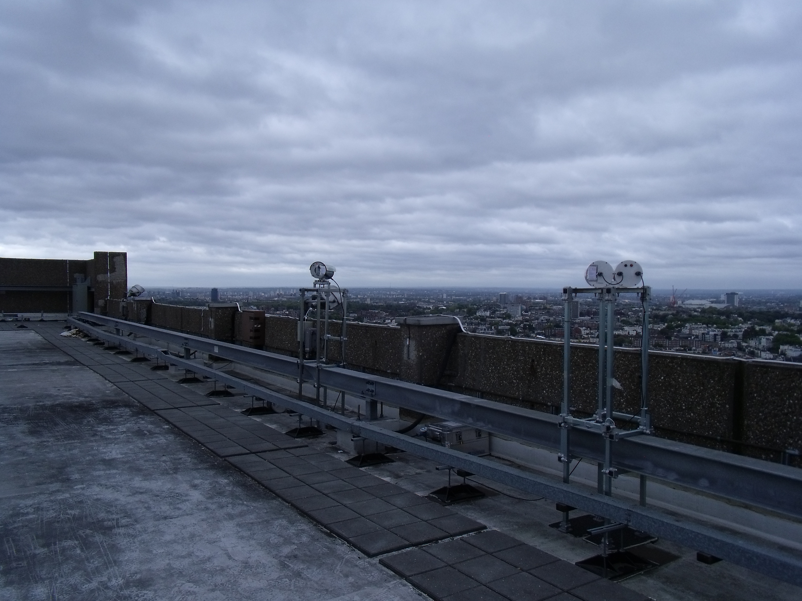

.. _NTT:

***
NTT
***

Introduction
############

.. include:: intros/NTT_intro.rst

Site metadata
#############

.. csv-table:: 
   :file: meta/NTT_meta.csv
   :stub-columns: 1

.. raw:: html

   

   

    

Deployments at site
###################

.. csv-table:: All site deployments
   :file: deployments/dates/NTT_deployment_dates.csv
   :header-rows: 2

.. csv-table:: Position of deployments
   :file: deployments/positions/NTT_deployment_positions.csv
   :header-rows: 2

.. csv-table:: Metadata specific to scintillometers
   :file: deployments/scint_deployments/NTT_scint_deployments.csv
   :header-rows: 2

Photos
######

   View of tower from the ground 04-02-2011.

   :ref:`BLS` transmitter to :ref:`NDT` 24-05-2011.

   :ref:`BLS` transmitter to :ref:`NGT` and :ref:`LASMKII` reciever from :ref:`NGT` 25-10-2012.

   :ref:`LASMKII` transmitter to :ref:`NGT` and :ref:`LASMKII` reciever from :ref:`NGT` 25-05-2012.

   :ref:`BLS` transmitter to :ref:`NDT` and :ref:`LAS150` reciever from :ref:`NDT` 05-10-2011.

Data acquisition
################

.. include:: ../../../data_acquisition/data_acquisition_default.rst

References
##########

Acknowledgements
################

We thank Adrian Bowmann at Royal Borough of Kensington and Chelsea  for site access.

