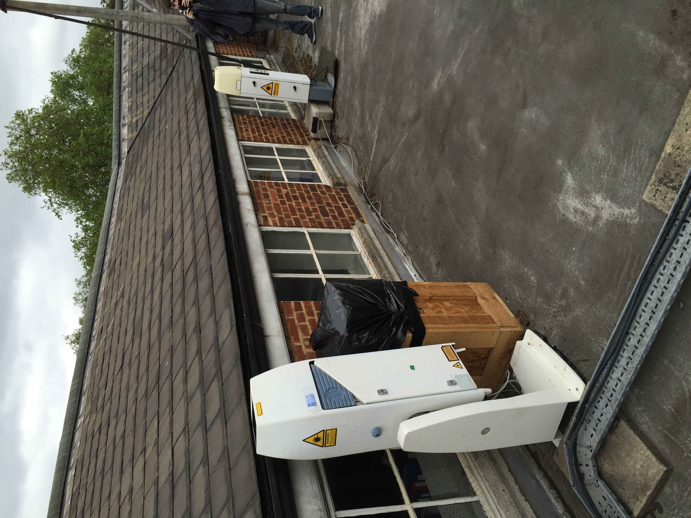
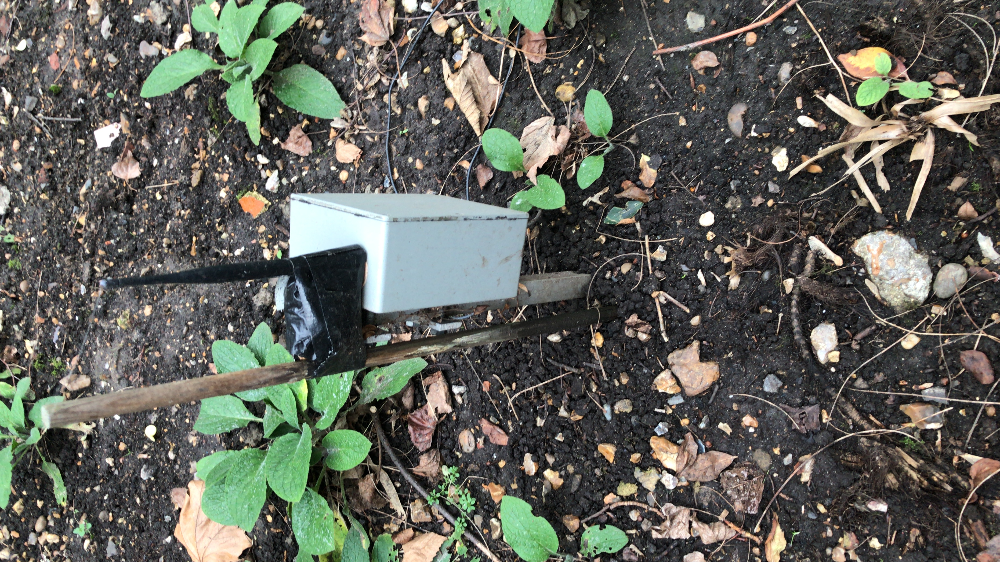
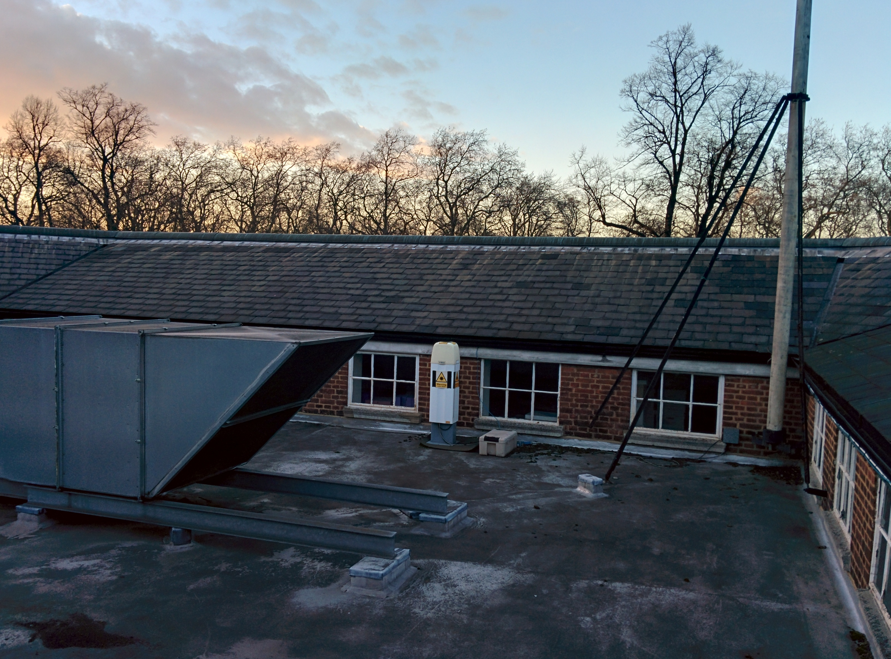
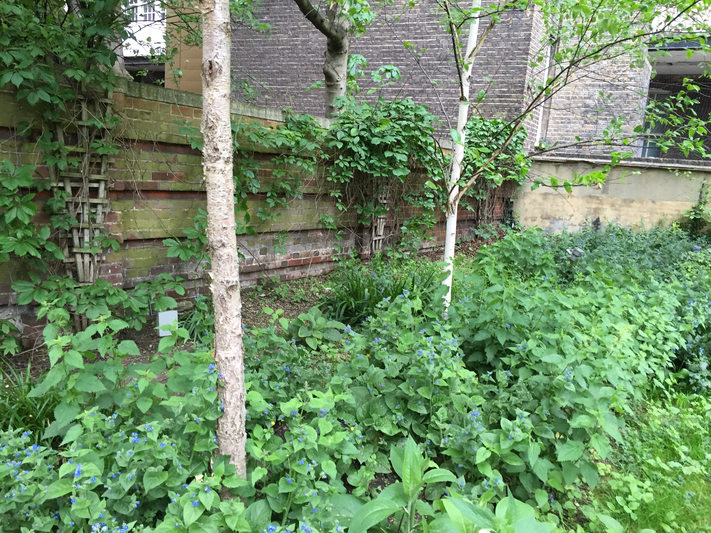

.. _RGS:

***
RGS
***

Introduction
############

.. include:: intros/RGS_intro.rst

Site metadata
#############

.. csv-table:: 
   :file: meta/RGS_meta.csv
   :stub-columns: 1

.. raw:: html

   

   

    

Deployments at site
###################

.. csv-table:: All site deployments
   :file: deployments/dates/RGS_deployment_dates.csv
   :header-rows: 2

.. csv-table:: Position of deployments
   :file: deployments/positions/RGS_deployment_positions.csv
   :header-rows: 2

.. csv-table:: Raw files of deployments
   :file: deployments/raw_files/RGS_deployment_raw_files.csv
   :header-rows: 2

.. csv-table:: Metadata specific to profiles
   :file: deployments/profile_deployments/RGS_profile_deployments.csv
   :header-rows: 2

.. csv-table:: Metadata specific to indoor sensors
   :file: deployments/indoor_deployments/RGS_indoor_deployments.csv
   :header-rows: 2

Photos
######

   :ref:`CT25K` and :ref:`CL31` 25-05-2016.

   Soil moisture probe node 18-02-2020.

   :ref:`CL31` 26-02-2014.

   Soil moisture nodes in flower bed 25-05-2016.

Supplementary information
#########################

Data acquisition
################

.. include:: ../../../data_acquisition/data_acquisition_default.rst

References
##########

#. Kotthaus, S., Halios, C. H., Barlow, J. F. and Grimmond, C. S. B. (2018) Volume for pollution dispersion: London’s atmospheric boundary layer during ClearfLo observed with two ground-based lidar types. Atmospheric Environment, 190. pp. 401-414. ISSN 1352-2310 doi: https://doi.org/10.1016/j.atmosenv.2018.06.042
#. Warren, E., Charlton-Perez, C., Kotthaus, S., Lean, H., Ballard, S., Hopkin, E. and Grimmond, S. (2018) Evaluation of forward-modelled attenuated backscatter using an urban ceilometer network in London under clear-sky conditions. Atmospheric Environment, 191. pp. 532-547. ISSN 1352-2310 doi: https://doi.org/10.1016/j.atmosenv.2018.04.045
#. Kotthaus, S., O'Connor, E., M�nkel, C., Charlton-Perez, C., Haeffelin, M., Gabey, A. M. and Grimmond, C. S. B. (2016) Recommendations for processing atmospheric attenuated backscatter profiles from Vaisala CL31 ceilometers. Atmospheric Measurement Techniques, 9. pp. 3769-3791. ISSN 1867-8548 doi: https://doi.org/10.5194/amt-9-3769-2016

Acknowledgements
################

We thank Catherine Souch from Royal Geographical Society for site access.

