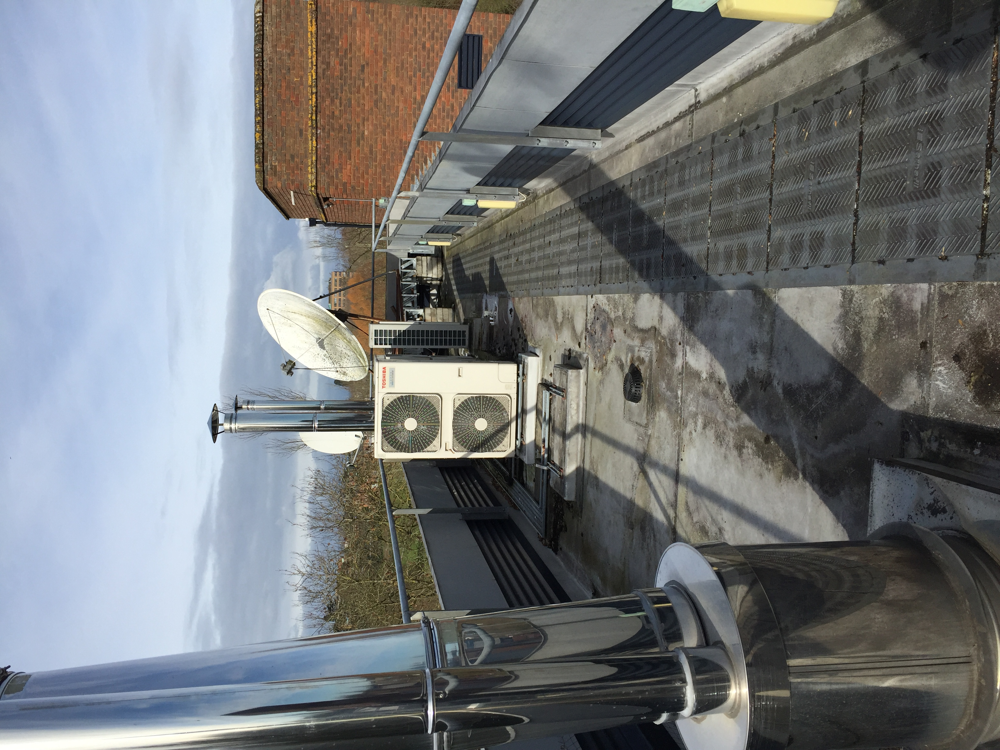
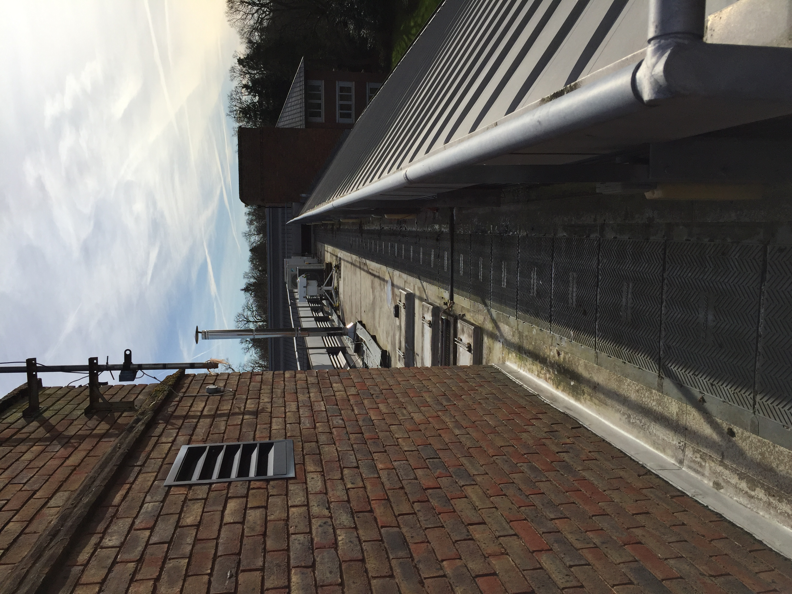

.. _RMR:

***
RMR
***

Introduction
############

.. include:: intros/RMR_intro.rst

Site metadata
#############

.. csv-table:: 
   :file: meta/RMR_meta.csv
   :stub-columns: 1

.. raw:: html

   

   

    

Deployments at site
###################

.. csv-table:: All site deployments
   :file: deployments/dates/RMR_deployment_dates.csv
   :header-rows: 2

.. csv-table:: Position of deployments
   :file: deployments/positions/RMR_deployment_positions.csv
   :header-rows: 2

.. csv-table:: Metadata specific to profiles
   :file: deployments/profile_deployments/RMR_profile_deployments.csv
   :header-rows: 2

Photos
######

   View facing North West 03-03-2016.

   View facing South East 03-03-2016.

Data acquisition
################

.. include:: ../../../data_acquisition/data_acquisition_default.rst

References
##########

