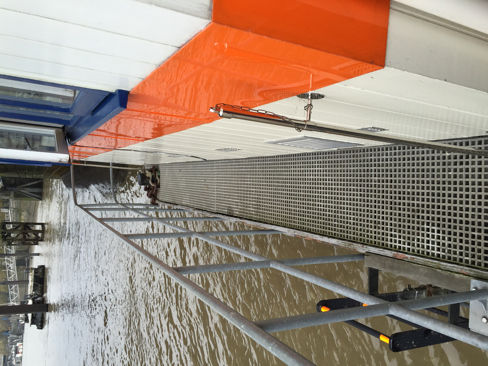
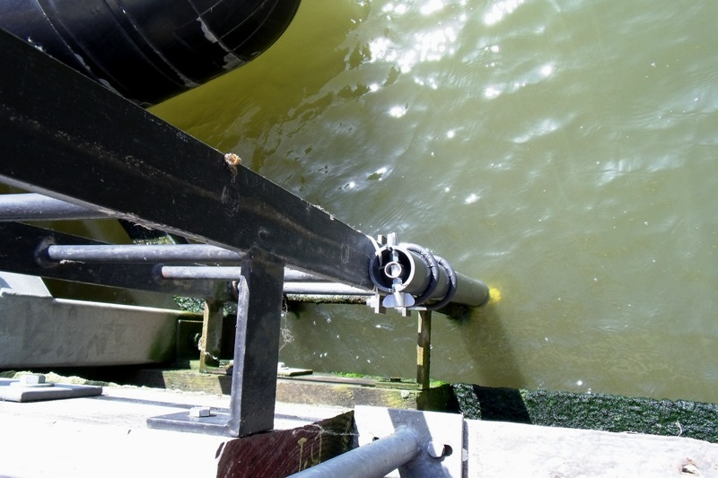

.. _TLI:

***
TLI
***

Introduction
############

.. include:: intros/TLI_intro.rst

Site metadata
#############

.. csv-table:: 
   :file: meta/TLI_meta.csv
   :stub-columns: 1

.. raw:: html

   

   

    

Deployments at site
###################

.. csv-table:: All site deployments
   :file: deployments/dates/TLI_deployment_dates.csv
   :header-rows: 2

.. csv-table:: Position of deployments
   :file: deployments/positions/TLI_deployment_positions.csv
   :header-rows: 2

Photos
######

   Gangway from which water temperature sensors are deployed 03-11-2015.

   Pole on which :ref:`TINYTAG` were deployed 27-04-2011.

Data acquisition
################

.. include:: ../../../data_acquisition/data_acquisition_default.rst

References
##########

