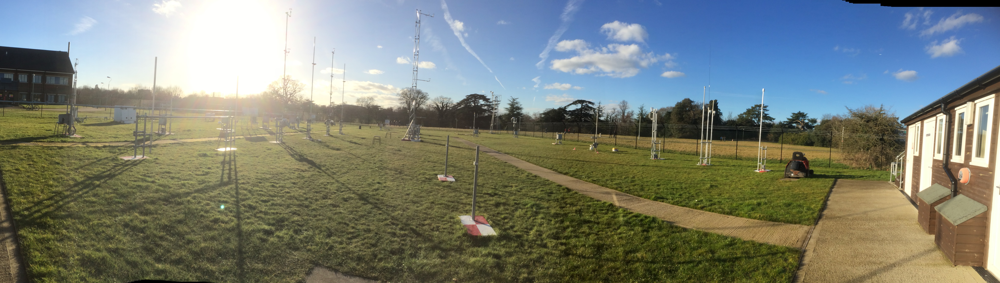
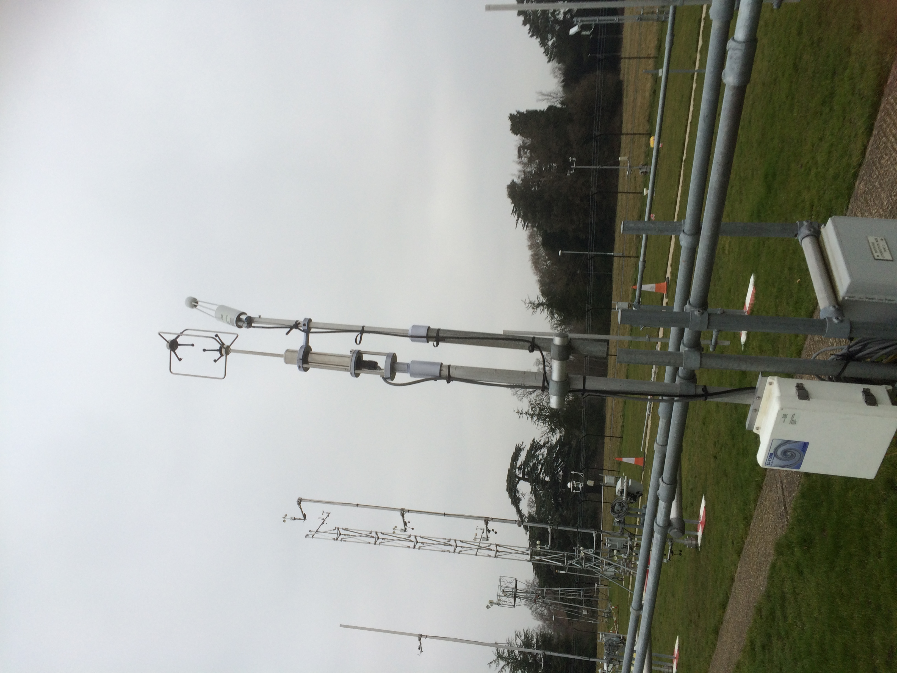
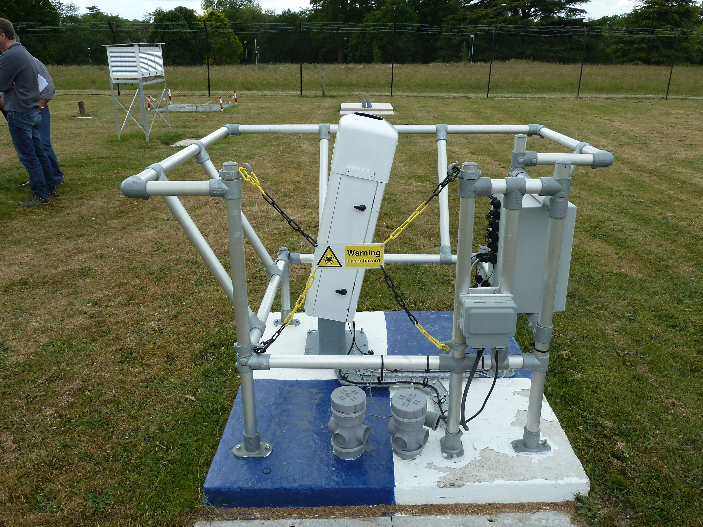

.. _URAO:

****
URAO
****

Introduction
############

.. include:: intros/URAO_intro.rst

Site metadata
#############

.. csv-table:: 
   :file: meta/URAO_meta.csv
   :stub-columns: 1

.. raw:: html

   

   

    

Deployments at site
###################

.. csv-table:: All site deployments
   :file: deployments/dates/URAO_deployment_dates.csv
   :header-rows: 2

.. csv-table:: Position of deployments
   :file: deployments/positions/URAO_deployment_positions.csv
   :header-rows: 2

.. csv-table:: Raw files of deployments
   :file: deployments/raw_files/URAO_deployment_raw_files.csv
   :header-rows: 2

.. csv-table:: Metadata specific to profiles
   :file: deployments/profile_deployments/URAO_profile_deployments.csv
   :header-rows: 2

Photos
######

   Panoramic facing North West 17-02-2015.

   Eddy covariance set up 11-02-2015.

   :ref:`CL31` 08-06-2015.

Supplementary information
#########################

.. list-table:: 
   :header-rows: 1

   * - Link
     - Title
     - Description
   * - https://research.reading.ac.uk/meteorology/atmospheric-observatory/
     - Atmospheric observatory webpage. 
     - Univeristy of Reading site page for atmospheric observatory. 

Data acquisition
################

.. include:: ../../../data_acquisition/data_acquisition_default.rst

References
##########

Acknowledgements
################

