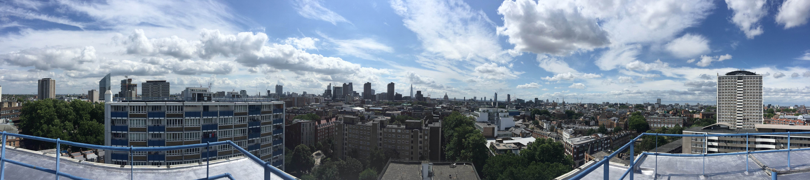
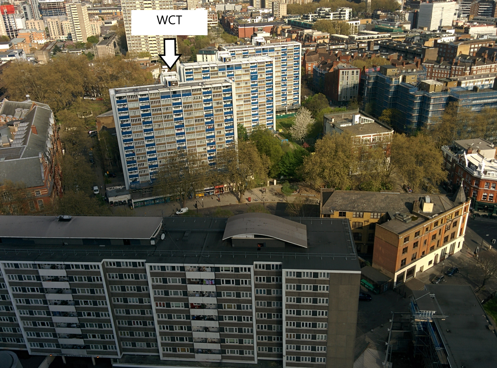
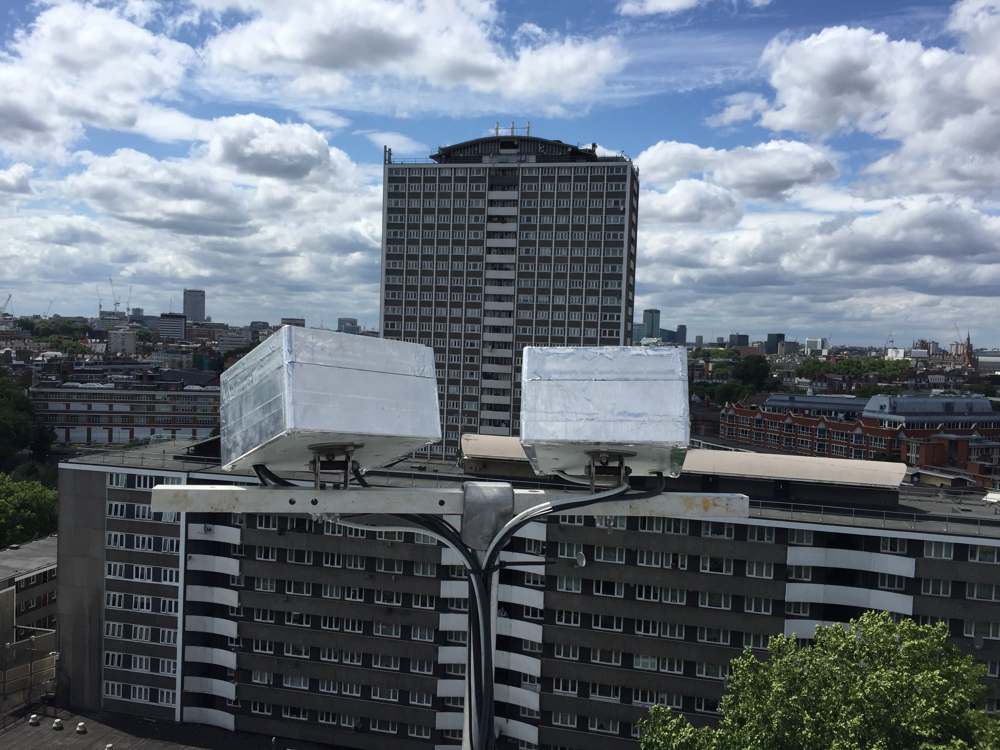

.. _WCT:

***
WCT
***

Introduction
############

.. include:: intros/WCT_intro.rst

Site metadata
#############

.. csv-table:: 
   :file: meta/WCT_meta.csv
   :stub-columns: 1

.. raw:: html

   

   

    

Deployments at site
###################

.. csv-table:: All site deployments
   :file: deployments/dates/WCT_deployment_dates.csv
   :header-rows: 2

.. csv-table:: Position of deployments
   :file: deployments/positions/WCT_deployment_positions.csv
   :header-rows: 2

Photos
######

   Panoramic facing South 21-07-2017.

   Seen from :ref:`IMU` 10-04-2014.

   :ref:`PI160` 21-07-2017.

Data acquisition
################

.. include:: ../../../data_acquisition/data_acquisition_default.rst

References
##########

#. Morrison, W., Kotthaus, S. and Grimmond, S. (2021) Urban surface temperature observations from ground-based thermography: intra- and inter-facet variability. Urban Climate, 35. 100748. ISSN 2212-0955 doi: https://doi.org/10.1016/j.uclim.2020.100748
#. Morrison, W., Yin, T., Lauret, N., Guilleux, J., Kotthaus, S., Gastellu-Etchegorry, J.-P., Norford, L. and Grimmond, S. (2020) Atmospheric and emissivity corrections for ground-based thermography using 3D radiative transfer modelling. Remote Sensing of Environment, 237. 111524. ISSN 00344257 doi: https://doi.org/10.1016/j.rse.2019.111524

